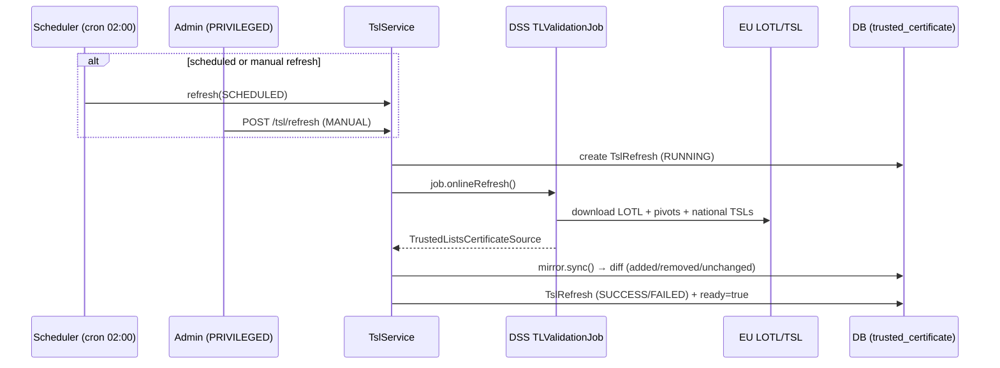

# 3. Trusted Certificates API (TSL)

← [3. Authentication](03-authentication.md) · [Index](README.md) · → [5. Signature verification](05-signature-verification.md)

Certificate trust is rooted in the **EU Trusted Lists**: the service loads the
European **LOTL** (List of the Lists) and the national TSLs through the DSS
library, and **mirrors** their trust-anchor certificates into its own database
so they are queryable via API.

## 3.1 Refresh model



- **Scheduled**: cron `0 0 2 * * *` (timezone `Europe/Rome`).
- **Startup**: `app.tsl.refresh.startup-mode` = `BACKGROUND` (load at start,
  non-blocking) or `SKIP` (for dev/offline).
- **Manual**: `POST /api/v1/tsl/refresh` (`PRIVILEGED` only).

Each refresh records a `TslRefresh` row with outcome and diff (certificates
added / removed / unchanged). Certificates no longer present in the lists are
not deleted but **flagged as removed** (`removedAt`): they remain queryable with
`includeRemoved=true`.

## 3.2 TSL status

`GET /api/v1/tsl/status` — available to any authenticated user.

```bash
curl -sS http://localhost:8080/api/v1/tsl/status -H "X-API-Key: $KEY"
```

```json
{
  "lastRefresh": {
    "id": "…", "trigger": "SCHEDULED",
    "startedAt": "…", "completedAt": "…", "status": "SUCCESS",
    "certificatesAdded": 12, "certificatesRemoved": 3, "certificatesUnchanged": 240
  },
  "currentCertificateCount": 252,
  "ready": true
}
```

`ready` reflects whether the Trusted Lists have been loaded successfully at least
once; it also drives `/actuator/health/readiness`.

## 3.3 Force a refresh

`POST /api/v1/tsl/refresh` — **requires `PRIVILEGED`**.

```bash
curl -sS -X POST http://localhost:8080/api/v1/tsl/refresh -H "X-API-Key: $ADMIN_KEY"
```

```json
{ "refreshId": "…", "status": "SUCCESS" }
```

## 3.4 List trusted certificates

`GET /api/v1/tsl/certificates` — supports many filters and pagination.

| Parameter | Type | Description |
|-----------|------|-------------|
| `ski` | string | Subject Key Identifier (exact match) |
| `aki` | string | Authority Key Identifier (exact match) |
| `subjectCn` / `subjectDn` | string | Subject CN/DN (partial, case-insensitive) |
| `issuerCn` / `issuerDn` | string | Issuer CN/DN (partial match) |
| `country` | string | Country code (exact match) |
| `tspName` | string | Trust Service Provider name (partial match) |
| `tspServiceType` | string | TSP service type (exact match) |
| `tspServiceStatus` | string | TSP service status (exact match) |
| `serialNumber` | string | Serial number (exact match) |
| `validAt` | date-time | Only certificates valid at that instant |
| `includeRemoved` | boolean | Include removed certificates (default `false`) |
| `page` / `size` | integer | Pagination (default `0` / `50`) |

```bash
curl -sS "http://localhost:8080/api/v1/tsl/certificates?country=IT&tspName=Aruba&size=20" \
  -H "X-API-Key: $KEY"
```

Each item contains (`certToMap`): `id`, `ski`, `aki`, `subjectDn`, `subjectCn`,
`issuerDn`, `issuerCn`, `serialNumber`, `country`, `tspName`, `tspServiceType`,
`tspServiceStatus`, `validFrom`, `validTo`, `lastSeenAt`, `removedAt`,
`certificateDerB64` (DER certificate, base64), `tslUrl`.

## 3.5 Certificate detail

`GET /api/v1/tsl/certificates/{id}` — returns the same object as above for the
certificate with that `id`.

```bash
curl -sS http://localhost:8080/api/v1/tsl/certificates/<uuid> -H "X-API-Key: $KEY"
```

## 3.6 Permissions summary

| Endpoint | Required role |
|----------|---------------|
| `GET /api/v1/tsl/status` | authenticated |
| `GET /api/v1/tsl/certificates` | authenticated |
| `GET /api/v1/tsl/certificates/{id}` | authenticated |
| `POST /api/v1/tsl/refresh` | **PRIVILEGED** |

## 3.7 OJ keystore (LOTL trust anchor)

To validate the **LOTL signature**, DSS needs the signing certificates
**announced in the EU Official Journal (OJ)**. They are loaded from a PKCS#12
keystore configured in `application.yaml`:

```yaml
app:
  tsl:
    sources:
      - id: eu-lotl
        type: LOTL
        oj-keystore-path: classpath:keystore/oj-keystore.p12
        oj-keystore-password-env: APP_OJ_KEYSTORE_PASSWORD
        oj-url: https://eur-lex.europa.eu/legal-content/EN/TXT/?uri=uriserv:OJ.C_.2019.276.01.0001.01.ENG
```

> ⚠️ **Symptom of a missing/placeholder keystore**: if the keystore holds no
> real OJ certificate, every pivot fails with
> `INDETERMINATE/NO_CERTIFICATE_CHAIN_FOUND` and **no Trusted List is loaded**.
> At startup the service logs an explicit WARN:
> `OJ keystore '...' contains no X.509 certificate ...`. In normal conditions it
> logs `Loaded N OJ signing certificate(s) ...` instead.

### Rebuilding the keystore

1. Obtain the LOTL signing certificates as `*.pem`/`*.crt`/`*.der` files.
   The authoritative source is the DSS page
   <https://ec.europa.eu/digital-building-blocks/DSS/webapp-demo/oj-certificates>,
   which lists the current OJ certificates with their **SHA256** and the OJ they
   are synchronized with (currently `OJ C/2026/1944`). The bytes are extracted
   from the **LOTL pivot chain** (`eu-lotl.xml` + `eu-lotl-pivot-*.xml`,
   `<ds:X509Certificate>` field), keeping only those whose SHA256 **matches** the
   fingerprints published on that page (tamper check).
   > The keystore versioned in the repo has already been populated this way
   > (6 certificates, OJ C/2026/1944); repeat it whenever the OJ is updated.
2. Drop them in a directory (default `./oj-certs`) and run the script:

   ```bash
   OJ_KEYSTORE_PASSWORD=changeit \
   scripts/update-oj-keystore.sh ./oj-certs src/main/resources/keystore/oj-keystore.p12
   ```

   The script imports every certificate into `oj-keystore.p12` (as
   `TrustedCertificateEntry`) and prints the final contents. The password must
   match `APP_OJ_KEYSTORE_PASSWORD` used at runtime.
3. **Rebuild the image / restart** the service and force a refresh
   (`POST /api/v1/tsl/refresh`); check `GET /api/v1/tsl/status` shows
   `ready=true`.

> Note: legacy **A-Trust** certificates with a non-standard RSA encoding are
> loaded thanks to the **BouncyCastle** provider, registered automatically at
> startup.

### National TSLs failing with `PKIX path building failed`

Some national TSL endpoints (e.g. `eidas.gov.ie`) serve **only the leaf
certificate** over HTTPS, without the intermediate: the JVM cannot build the
trust path and DSS fails to download that list. The **root** is already in the
truststore (e.g. *DigiCert Global Root G2*); only the **intermediate** is
missing.

The fix is to import the missing public intermediates into the JRE truststore.
Known ones are versioned under **`docker/tls-certs/`** and imported into
`cacerts` at build time by the `Dockerfile`. To add a new one:

```bash
host=new.tsl.host
# 1. find the leaf's "CA Issuers" (AIA) URL
openssl s_client -connect $host:443 -servername $host </dev/null 2>/dev/null \
  | openssl x509 -noout -ext authorityInfoAccess
# 2. download the intermediate and save it as PEM under docker/tls-certs/
curl -s http://.../intermediate.crt | openssl x509 -inform DER \
  -out docker/tls-certs/<name>.pem
# 3. rebuild the image
```

> The JVM flag `-Dcom.sun.security.enableAIAcaIssuers=true` is **not** reliable
> here: it does not engage in the TLS trust manager during the handshake, so the
> explicit intermediate import is preferred.
