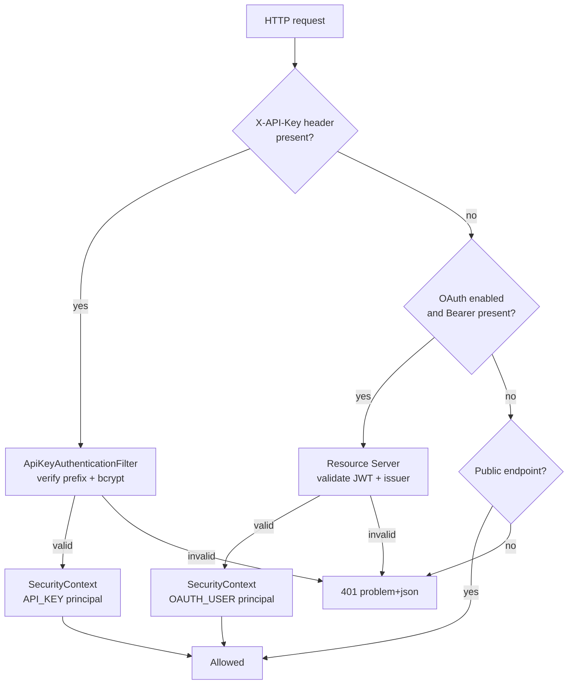
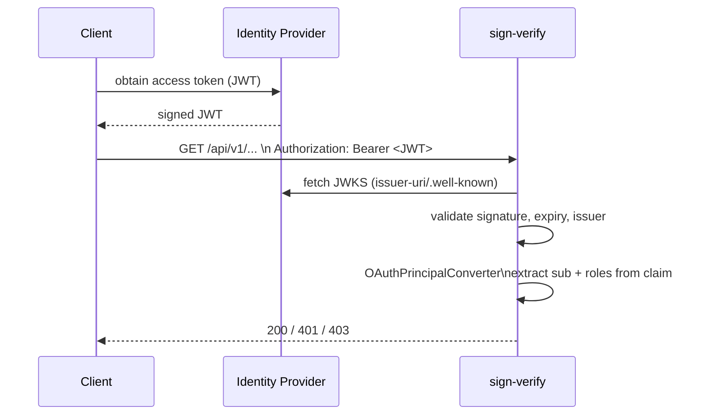

# 2. Authentication and authorization

← [2. Docker](02-docker.md) · [Index](README.md) · → [4. Trusted Certificates](04-trusted-certificates.md)

- [2.1 Overview](#21-overview)
- [2.2 Using API keys](#22-using-api-keys)
- [2.3 OAuth configuration and usage](#23-oauth-configuration-and-usage)

## 2.1 Overview

The service is **stateless** (no sessions, CSRF disabled since it is a pure
API). It supports **two authentication mechanisms**, applied in the same filter
chain:

1. **API key** — header `X-API-Key: sv_<prefix>_<body>` (always active).
2. **OAuth2 JWT** — header `Authorization: Bearer <jwt>` (toggled via
   `app.security.oauth.enabled`).



### Public endpoints (no authentication)

- `/actuator/health/**`, `/actuator/info`, `/actuator/prometheus`
- `/v3/api-docs/**`, `/swagger-ui/**`

Everything else requires authentication (`anyRequest().authenticated()`).
A failure produces **401** with an `application/problem+json` body.

### Roles and Principal

Each authenticated request yields a `Principal` with a role:

| Role | Spring authority | Meaning |
|------|------------------|---------|
| `PRIVILEGED` | `ROLE_PRIVILEGED` | Administrative access (key management, audit, TSL refresh) |
| `STANDARD` | `ROLE_STANDARD` | Verification/extraction operations |

Administrative endpoints are protected via `@EnableMethodSecurity` +
`@PreAuthorize("hasRole('PRIVILEGED')")`. Examples: `/api/v1/audit-log`,
`POST /api/v1/tsl/refresh`.

Principal types (`PrincipalType`): `API_KEY`, `OAUTH_USER`, `SYSTEM`.

## 2.2 Using API keys

### Format

```
sv_<prefix>_<body>
   └─8 chars┘ └─ random body (base64url, 36 bytes) ─┘
```

- The **prefix** (8 chars) is indexed and **unique**: it locates the key without
  scanning the whole table.
- The full **body** is verified with **bcrypt**: only the hash is stored, never
  the plaintext.
- A key can have an optional **expiry** (`expiresAt`).

### Bootstrap key (first boot)

On first boot, if no **enabled** `PRIVILEGED` key exists, a bootstrap key is
generated (`name = bootstrap-<epoch>`, `role = PRIVILEGED`, `bootstrap = true`)
and written to `APP_SECURITY_BOOTSTRAP_KEY_FILE` (`0600` permissions).

```bash
# In the dev compose container:
docker compose exec app cat /var/lib/sign-verify/bootstrap-api-key.txt
```

Retrieve the key, create your operational keys, then **delete the bootstrap
file**.

### "Last privileged key" invariant

You cannot delete **or disable** the last enabled `PRIVILEGED` key: the
operation fails with **409 Conflict**
(`cannot remove last enabled privileged api key`). This prevents lock-out. The
check uses a pessimistic lock to avoid a TOCTOU race.

### Key management (API)

All `/api/v1/api-keys` endpoints require the `PRIVILEGED` role.

| Method | Path | Operation |
|--------|------|-----------|
| `GET` | `/api/v1/api-keys?page=&size=` | List (paginated) |
| `POST` | `/api/v1/api-keys` | Create a key |
| `PATCH` | `/api/v1/api-keys/{id}` | Enable/disable (`{"enabled": false}`) |
| `DELETE` | `/api/v1/api-keys/{id}` | Delete |

**Creation:**

```bash
curl -sS -X POST http://localhost:8080/api/v1/api-keys \
  -H "X-API-Key: $BOOTSTRAP_KEY" \
  -H "Content-Type: application/json" \
  -d '{"name":"ci-pipeline","role":"STANDARD","expiresAt":"2027-01-01T00:00:00Z"}'
```

`201` response — the plaintext `plaintextKey` is returned **only once**:

```json
{
  "id": "…", "name": "ci-pipeline", "keyPrefix": "Ab3xY9_z",
  "role": "STANDARD", "enabled": true, "bootstrap": false,
  "createdAt": "…", "expiresAt": "2027-01-01T00:00:00Z",
  "plaintextKey": "sv_Ab3xY9_z_…"
}
```

`ApiKeyCreateRequest` fields: `name` (1–120 chars, unique), `role`
(`PRIVILEGED`/`STANDARD`), `expiresAt` (optional).

### Using a key in a request

```bash
curl -sS -X POST http://localhost:8080/api/v1/verifications \
  -H "X-API-Key: sv_Ab3xY9_z_…" \
  -F file=@document.pdf.p7m
```

The filter rejects the key (401, `auth.invalid-token`) if: invalid format,
unknown prefix, disabled key, expired key, or hash mismatch.

## 2.3 OAuth configuration and usage

> ✅ OAuth2 (JWT resource server) is **implemented**. It is controlled by the
> `app.security.oauth.enabled` flag (default `true` in the production profile,
> `false` in the `dev`/`docker` profiles).

### How it works

When enabled, the service acts as an **OAuth2 Resource Server**: it validates
incoming JWTs against the configured **issuer** and derives the `Principal`.



### Configuration

| Parameter | Env | Default | Description |
|-----------|-----|---------|-------------|
| `app.security.oauth.enabled` | `APP_SECURITY_OAUTH_ENABLED` | `true` | Enable the resource server |
| `spring…jwt.issuer-uri` | `APP_SECURITY_OAUTH_ISSUER_URI` | _(empty)_ | Issuer URI (for JWKS/metadata discovery) |
| `app.security.oauth.role-claim` | `APP_SECURITY_OAUTH_ROLE_CLAIM` | `roles` | JWT claim holding the roles |
| `app.security.oauth.privileged-values` | `APP_SECURITY_OAUTH_PRIVILEGED_VALUES` | `admin,privileged` | Claim values that grant `PRIVILEGED` |

Example (Keycloak / generic OIDC):

```bash
APP_SECURITY_OAUTH_ENABLED=true
APP_SECURITY_OAUTH_ISSUER_URI=https://idp.example.org/realms/sign
APP_SECURITY_OAUTH_ROLE_CLAIM=roles
APP_SECURITY_OAUTH_PRIVILEGED_VALUES=admin,sign-admin
```

### Mapping the Principal from the JWT

`OAuthPrincipalConverter`:

- principal **id** = the token `sub`.
- **displayName** = `preferred_username` claim (falls back to `sub`).
- **role** = `PRIVILEGED` if the `role-claim` contains at least one of the
  `privileged-values`, otherwise `STANDARD`.
- The roles claim may be a **list** (e.g. `["admin","user"]`) or a
  space/comma-separated **string** (e.g. `"admin user"`).

### Usage

```bash
curl -sS -X POST http://localhost:8080/api/v1/verifications \
  -H "Authorization: Bearer eyJhbGciOi…" \
  -F file=@document.pdf
```

### API key and OAuth together

Both mechanisms coexist. The API-key filter runs **before** the OAuth chain: if
a valid `X-API-Key` is present, the principal is of type `API_KEY`; otherwise,
if OAuth is enabled and a valid Bearer arrives, the principal is `OAUTH_USER`.
Role checks (`PRIVILEGED`/`STANDARD`) behave identically for both.
