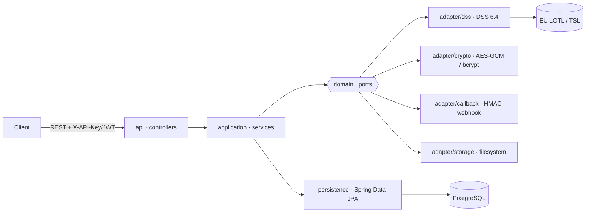

# sign-verify

> 🇮🇹 **Questo documento è in italiano.** · 🇬🇧 [Read this in English](README.md)

> Servizio REST per la **verifica di firme elettroniche eIDAS** (PAdES, CAdES, XAdES, JAdES, ASiC) basato su Spring Boot 3.4 e sulla libreria europea **DSS 6.4**, con gestione delle Trusted List UE (LOTL/TSL).

---

## 1. Descrizione dell'applicazione

`sign-verify` espone API REST per validare documenti firmati digitalmente secondo gli
standard eIDAS, restituendo l'esito (`indication`/`subIndication`) e i report di
validazione DSS (Simple, Detailed, Diagnostic, ETSI).

**Funzionalità principali**

- **Verifica firma** sincrona e **asincrona** (job + callback HTTP firmato in HMAC).
- **Profili di verifica** configurabili (preset `BASIC` / `STANDARD` / `STRICT`) con
  override di policy per singola richiesta.
- **Estrazione** del documento originale da un contenitore firmato.
- **Gestione TSL**: scaricamento e mirror della European List of Trusted Lists (LOTL),
  refresh schedulato, consultazione dei certificati di fiducia.
- **Autenticazione** via API key (`X-API-Key`) e/o OAuth2 JWT; ruoli `STANDARD` e
  `PRIVILEGED`.
- **Audit log**, **observability** (health/readiness, metriche Prometheus, log JSON),
  retention e cleanup automatici dei job.

**Formati di firma supportati:** PAdES (PDF), CAdES (CMS), XAdES (XML), JAdES (JSON),
ASiC-S/ASiC-E.

### Architettura

Architettura esagonale (ports & adapters), verificata da ArchUnit.



| Layer | Pacchetto | Responsabilità |
|---|---|---|
| API | `api/` | Controller REST sottili + handler errori RFC 9457 (`problem+json`) |
| Application | `application/` | Logica dei casi d'uso (verifica, profili, job async, TSL, audit) |
| Domain | `domain/` | Modello, enum, **ports** (interfacce), eccezioni |
| Adapter | `adapter/` | Implementazioni dei ports (DSS, crypto, callback, storage) |
| Persistence | `persistence/` | Repository Spring Data JPA |

---

## 2. Configurazione

La configurazione segue lo standard Spring Boot: `application.yaml` (base, orientato alla
**produzione**) più profili specifici. Tutte le chiavi sono sovrascrivibili da variabili
d'ambiente.

### Profili Spring

| Profilo | Uso | Caratteristiche |
|---|---|---|
| *(nessuno)* | **Produzione** | OAuth abilitato, dati in `/var/lib/sign-verify`, TSL attiva |
| `dev` | Sviluppo su host | H2 in-memory, OAuth off, master-key di sviluppo, dati in `./target` |
| `docker` | Sviluppo in container | OAuth off, TSL skip, dati in `/var/lib/sign-verify`, datasource via env |

Attivazione: `-Dspring.profiles.active=dev` (host) oppure `SPRING_PROFILES_ACTIVE=docker`
(container).

### Variabili d'ambiente principali

| Variabile | Descrizione | Default |
|---|---|---|
| `SPRING_DATASOURCE_URL` | URL JDBC del database | H2 in-memory |
| `SPRING_DATASOURCE_USERNAME` / `_PASSWORD` | Credenziali DB | `sa` / *(vuoto)* |
| `APP_SECRET_MASTER_KEY` | **Chiave di cifratura dei segreti**, base64 di 32 byte (256 bit) | *(obbligatoria)* |
| `APP_SECURITY_OAUTH_ENABLED` | Abilita il resource server OAuth2 JWT | `true` |
| `APP_SECURITY_OAUTH_ISSUER_URI` | Issuer OIDC (obbligatorio se OAuth attivo) | *(vuoto)* |
| `APP_SECURITY_OAUTH_ROLE_CLAIM` | Claim JWT con i ruoli | `roles` |
| `APP_SECURITY_OAUTH_PRIVILEGED_VALUES` | Valori del claim che danno ruolo `PRIVILEGED` | `admin,privileged` |
| `APP_SECURITY_BOOTSTRAP_KEY_FILE` | Path dove scrivere la bootstrap key al primo avvio | `/var/lib/sign-verify/bootstrap-api-key.txt` |
| `APP_STORAGE_JOBS_DIR` | Directory dei job asincroni | `/var/lib/sign-verify/jobs` |
| `APP_DSS_CACHE_DIR` | Cache DSS (TSL, CRL/OCSP) | `/var/lib/sign-verify/dss-cache` |
| `APP_OJ_KEYSTORE_PASSWORD` | Password del keystore della Gazzetta Ufficiale UE (verifica LOTL) | *(vuoto)* |
| `SERVER_PORT` | Porta HTTP | `8080` |
| `JAVA_TOOL_OPTIONS` | Flag JVM aggiuntivi | ergonomia container |

> **Generare la master key**
> ```bash
> openssl rand -base64 32
> ```

Senza `APP_SECRET_MASTER_KEY` valida (32 byte) e — con OAuth attivo — senza
`APP_SECURITY_OAUTH_ISSUER_URI`, l'applicazione **si arresta all'avvio** (fail-fast).
Il database è gestito da Flyway (`db/migration`), con Hibernate in `ddl-auto: validate`.

### Autenticazione

- **API key**: header `X-API-Key: sv_<prefix>_<body>` (hash bcrypt a riposo).
  Al primo avvio, se non esiste alcuna chiave `PRIVILEGED`, ne viene generata una di
  *bootstrap* e scritta nel file indicato da `APP_SECURITY_BOOTSTRAP_KEY_FILE`
  (permessi `0600`) — **va letta e poi rimossa**.
- **OAuth2 JWT**: abilitabile con `APP_SECURITY_OAUTH_ENABLED=true` + issuer OIDC.

---

## 3. Esecuzione

### Prerequisiti

- JDK 21 (es. via SDKMAN) e Maven 3.9+
- Docker / Docker Compose (per gli stack containerizzati)

### a) Sviluppo su host (H2 in-memory)

```bash
mvn clean package
java -Dspring.profiles.active=dev -jar target/sign-verify-2.jar
# bootstrap key → ./target/bootstrap-api-key.txt
```

### b) Sviluppo con Docker (app + PostgreSQL)

```bash
docker compose up --build
```

Avvia l'applicazione (profilo `docker`) e un PostgreSQL 16. Swagger UI su
<http://localhost:8080/swagger-ui/index.html>.

### c) Produzione (immagine hardened)

```bash
cp .env.example .env      # compila DB, master key, issuer OAuth, password keystore
docker compose -f docker-compose.prod.yml up -d
```

L'immagine è multi-stage, runtime **JRE-only non-root** (uid 10001); il compose di
produzione applica `read_only`, `cap_drop: ALL`, `no-new-privileges`, tmpfs `/tmp`,
limiti di risorse e healthcheck di readiness. Richiede un PostgreSQL gestito esterno.

---

## 4. Prima prova (quick start)

Esempio end-to-end con lo stack Docker di sviluppo e il PDF firmato di esempio incluso
nel repository (`src/test/resources/signatures/sample-pades-valid.pdf`).

**1. Avvia lo stack**

```bash
docker compose up --build -d
```

**2. Recupera la bootstrap API key** (ruolo `PRIVILEGED`, generata al primo avvio)

```bash
KEY=$(docker compose exec -T app cat /var/lib/sign-verify/bootstrap-api-key.txt)
echo "API key: $KEY"
```

**3. Verifica che il servizio sia attivo**

```bash
curl -s http://localhost:8080/actuator/health/readiness
# {"status":"UP"}
```

**4. Verifica una firma (sincrona)**

Invio multipart: parte `file` (obbligatoria) e parte opzionale `metadata` (JSON).
Senza `metadata` viene usato il profilo di default e i report `simple` + `etsi`.

```bash
curl -s -X POST http://localhost:8080/api/v1/verifications \
  -H "X-API-Key: $KEY" \
  -F "file=@src/test/resources/signatures/sample-pades-valid.pdf" | jq
```

Risposta (estratto):

```json
{
  "verifiedAt": "2026-06-08T10:15:30Z",
  "profileUsed": "STANDARD",
  "overridesApplied": false,
  "signatureFormat": "PAdES-BASELINE-B",
  "indication": "TOTAL_PASSED",
  "subIndication": null,
  "signatureCount": 1,
  "reports": { "simple": { }, "etsi": { } }
}
```

Il campo chiave è **`indication`**: `TOTAL_PASSED` (valida), `TOTAL_FAILED` (non valida),
`INDETERMINATE` (non determinabile, es. TSL non caricata in profilo `docker`).

**5. (Opzionale) Scegli un profilo o i report**

Elenca i profili disponibili e ripeti la verifica indicandone l'id:

```bash
curl -s http://localhost:8080/api/v1/profiles -H "X-API-Key: $KEY" | jq '.[].id,.[].name'

curl -s -X POST http://localhost:8080/api/v1/verifications \
  -H "X-API-Key: $KEY" \
  -F "file=@src/test/resources/signatures/sample-pades-valid.pdf" \
  -F 'metadata={"profileId":"<UUID>","reports":["simple","detailed"]};type=application/json' | jq
```

> **Nota sulla verifica reale dei certificati**: nel profilo `docker` la TSL è
> disattivata (`startup-mode: SKIP`), quindi l'affidabilità della catena può risultare
> `INDETERMINATE`. Per una verifica completa usare la configurazione di produzione con TSL
> attiva (`APP_OJ_KEYSTORE_PASSWORD` impostata).

**Pulizia**

```bash
docker compose down -v
```

---

## 5. Test

```bash
mvn clean verify        # unit + integration test (Testcontainers) + Spotless + JaCoCo
mvn spotless:apply      # formattazione (Google Java Format) prima del commit
```

---

## 6. CI/CD — pubblicazione su Docker Hub

Sono fornite due pipeline equivalenti:

- **GitLab CI** — `.gitlab-ci.yml`
- **GitHub Actions** — `.github/workflows/ci.yml`

Stage: `validate → test → build → package → security`. Lo stage **package** builda e
pubblica l'immagine su Docker Hub come `toresoft/sign-verify`:

- ogni pipeline sul branch di default → tag `:<short-sha>` e `:latest`
- ogni tag git `vX.Y.Z` → tag `:<short-sha>` e `:<tag>`

Credenziali necessarie — su GitLab come *masked variables* (Settings → CI/CD → Variables),
su GitHub come *repository secrets* (Settings → Secrets and variables → Actions):

| Nome | Valore |
|---|---|
| `DOCKERHUB_USERNAME` | account/namespace Docker Hub |
| `DOCKERHUB_TOKEN` | access token Docker Hub (Account → Security) |

Lo stage **security** esegue lo scan dell'immagine con Trivy (HIGH/CRITICAL) e l'OWASP
dependency-check.

### Build & push manuale

```bash
docker build -t toresoft/sign-verify:dev .
echo "$DOCKERHUB_TOKEN" | docker login -u toresoft --password-stdin
docker push toresoft/sign-verify:dev
```

---

## 7. Guida d'uso dettagliata

La documentazione d'uso approfondita si trova sotto `docs/`, in italiano
(`docs/it/`) e inglese (`docs/en/`), con diagrammi Mermaid. Indici:
[`docs/it/README.md`](docs/it/README.md) · [`docs/en/README.md`](docs/en/README.md).

| Argomento | 🇮🇹 Italiano | 🇬🇧 English |
|-----------|-------------|------------|
| Compilazione e configurazione | [01](docs/it/01-build-configurazione.md) | [01](docs/en/01-build-configuration.md) |
| Docker e configurazione | [02](docs/it/02-docker.md) | [02](docs/en/02-docker.md) |
| Autenticazione (API key, OAuth) | [03](docs/it/03-autenticazione.md) | [03](docs/en/03-authentication.md) |
| Trusted Certificates (TSL) | [04](docs/it/04-trusted-certificates.md) | [04](docs/en/04-trusted-certificates.md) |
| Verifica firme (sync/async) | [05](docs/it/05-verifica-firme.md) | [05](docs/en/05-signature-verification.md) |
| Estrazione file | [06](docs/it/06-estrazione-file.md) | [06](docs/en/06-file-extraction.md) |
| Log e audit | [07](docs/it/07-log-audit.md) | [07](docs/en/07-logging-audit.md) |

## 8. Riferimenti

- API: contratto OpenAPI in `src/main/resources/openapi/openapi.yaml` —
  Swagger UI su `/swagger-ui/index.html`
- Design: `docs/superpowers/specs/2026-06-07-sign-verify-design.md`
- Piano di implementazione: `docs/superpowers/plans/2026-06-07-sign-verify-implementation.md`
