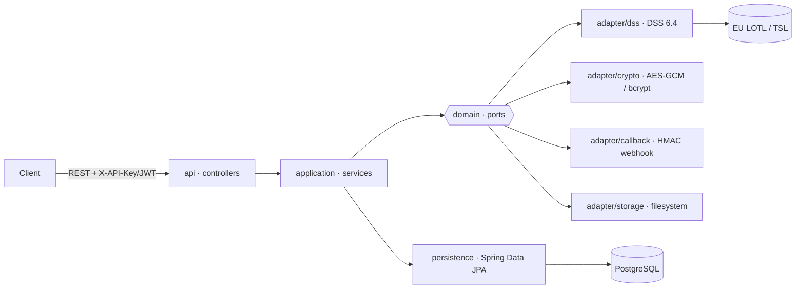

# sign-verify

[](https://github.com/toresoft/sign-verify/actions/workflows/ci.yml)
[](https://gitlab.com/toresoft/sign-verify/-/pipelines)
[](https://gitlab.com/toresoft/sign-verify/-/commits/main)
[](https://hub.docker.com/r/toresoft/sign-verify)
[](https://www.apache.org/licenses/LICENSE-2.0)

> 🇬🇧 **English** · 🇮🇹 [Leggi in italiano](README.it.md)

> REST service for **eIDAS electronic-signature verification** (PAdES, CAdES, XAdES, JAdES, ASiC) built on Spring Boot 3.4 and the EU **DSS 6.4** library, with EU Trusted List (LOTL/TSL) management.

---


## 1. Application overview

`sign-verify` exposes REST APIs to validate digitally signed documents against the eIDAS
standards, returning the outcome (`indication`/`subIndication`) and the DSS validation
reports (Simple, Detailed, Diagnostic, ETSI).

**Key features**

- **Signature verification**, synchronous and **asynchronous** (job + HMAC-signed HTTP
  callback).
- **Verification profiles** (presets `BASIC` / `STANDARD` / `STRICT`) with per-request
  policy overrides.
- **Extraction** of the original document from a signed container.
- **TSL management**: download and mirror of the EU List of Trusted Lists (LOTL),
  scheduled refresh, inspection of trusted certificates.
- **Authentication** via API key (`X-API-Key`) and/or OAuth2 JWT; roles `STANDARD` and
  `PRIVILEGED`.
- **Audit log**, **observability** (health/readiness, Prometheus metrics, JSON logs),
  automatic job retention and cleanup.

**Supported signature formats:** PAdES (PDF), CAdES (CMS), XAdES (XML), JAdES (JSON),
ASiC-S/ASiC-E.

### Architecture

Hexagonal (ports & adapters) architecture, enforced by ArchUnit.



| Layer | Package | Responsibility |
|---|---|---|
| API | `api/` | Thin REST controllers + RFC 9457 error handler (`problem+json`) |
| Application | `application/` | Use-case logic (verification, profiles, async jobs, TSL, audit) |
| Domain | `domain/` | Model, enums, **ports** (interfaces), exceptions |
| Adapter | `adapter/` | Port implementations (DSS, crypto, callback, storage) |
| Persistence | `persistence/` | Spring Data JPA repositories |

---

## 2. Configuration

Configuration follows the Spring Boot model: `application.yaml` (base, **production**-oriented)
plus profile-specific files. Every key can be overridden by environment variables.

### Spring profiles

| Profile | Use | Characteristics |
|---|---|---|
| *(none)* | **Production** | OAuth enabled, data under `/var/lib/sign-verify`, TSL active |
| `dev` | Local host development | In-memory H2, OAuth off, dev master key, data under `./target` |
| `docker` | Containerised development | OAuth off, TSL skipped, data under `/var/lib/sign-verify`, datasource via env |

Activation: `-Dspring.profiles.active=dev` (host) or `SPRING_PROFILES_ACTIVE=docker`
(container).

### Main environment variables

| Variable | Description | Default |
|---|---|---|
| `SPRING_DATASOURCE_URL` | JDBC database URL | in-memory H2 |
| `SPRING_DATASOURCE_USERNAME` / `_PASSWORD` | DB credentials | `sa` / *(empty)* |
| `APP_SECRET_MASTER_KEY` | **Secret-encryption key**, base64 of 32 bytes (256-bit) | *(required)* |
| `APP_SECURITY_OAUTH_ENABLED` | Enable the OAuth2 JWT resource server | `true` |
| `APP_SECURITY_OAUTH_ISSUER_URI` | OIDC issuer (required when OAuth is enabled) | *(empty)* |
| `APP_SECURITY_OAUTH_ROLE_CLAIM` | JWT claim holding the roles | `roles` |
| `APP_SECURITY_OAUTH_PRIVILEGED_VALUES` | Claim values that grant the `PRIVILEGED` role | `admin,privileged` |
| `APP_SECURITY_BOOTSTRAP_KEY_FILE` | Path where the bootstrap key is written at first start | `/var/lib/sign-verify/bootstrap-api-key.txt` |
| `APP_STORAGE_JOBS_DIR` | Async jobs directory | `/var/lib/sign-verify/jobs` |
| `APP_DSS_CACHE_DIR` | DSS cache (TSL, CRL/OCSP) | `/var/lib/sign-verify/dss-cache` |
| `APP_OJ_KEYSTORE_PASSWORD` | EU Official Journal keystore password (LOTL verification) | *(empty)* |
| `SERVER_PORT` | HTTP port | `8080` |
| `JAVA_TOOL_OPTIONS` | Extra JVM flags | container ergonomics |

> **Generate the master key**
> ```bash
> openssl rand -base64 32
> ```

Without a valid `APP_SECRET_MASTER_KEY` (32 bytes) and — when OAuth is enabled — without
`APP_SECURITY_OAUTH_ISSUER_URI`, the application **fails fast at startup**.
The database schema is managed by Flyway (`db/migration`), with Hibernate in
`ddl-auto: validate`.

### Authentication

- **API key**: header `X-API-Key: sv_<prefix>_<body>` (bcrypt-hashed at rest).
  At first start, if no `PRIVILEGED` key exists, a *bootstrap* one is generated and written
  to the file pointed to by `APP_SECURITY_BOOTSTRAP_KEY_FILE` (mode `0600`) — **read it and
  then remove it**.
- **OAuth2 JWT**: enable with `APP_SECURITY_OAUTH_ENABLED=true` + an OIDC issuer.

---

## 3. Running

### Prerequisites

- JDK 21 (e.g. via SDKMAN) and Maven 3.9+
- Docker / Docker Compose (for the containerised stacks)

### a) Local host (in-memory H2)

```bash
mvn clean package
java -Dspring.profiles.active=dev -jar target/sign-verify-2.jar
# bootstrap key → ./target/bootstrap-api-key.txt
```

### b) Development with Docker (app + PostgreSQL)

```bash
docker compose up --build
```

Starts the application (profile `docker`) and a PostgreSQL 16. Swagger UI at
<http://localhost:8080/swagger-ui/index.html>.

### c) Production (hardened image)

```bash
cp .env.example .env      # fill in DB, master key, OAuth issuer, keystore password
docker compose -f docker-compose.prod.yml up -d
```

The image is multi-stage with a **JRE-only non-root** runtime (uid 10001); the production
compose applies `read_only`, `cap_drop: ALL`, `no-new-privileges`, a tmpfs `/tmp`, resource
limits and a readiness healthcheck. It expects an external, managed PostgreSQL.

---

## 4. First try (quick start)

End-to-end example using the Docker development stack and the sample signed PDF bundled in
the repository (`src/test/resources/signatures/sample-pades-valid.pdf`).

**1. Start the stack**

```bash
docker compose up --build -d
```

**2. Fetch the bootstrap API key** (role `PRIVILEGED`, generated at first start)

```bash
KEY=$(docker compose exec -T app cat /var/lib/sign-verify/bootstrap-api-key.txt)
echo "API key: $KEY"
```

**3. Check the service is up**

```bash
curl -s http://localhost:8080/actuator/health/readiness
# {"status":"UP"}
```

**4. Verify a signature (synchronous)**

Multipart request: a required `file` part and an optional `metadata` (JSON) part.
Without `metadata`, the default profile and the `simple` + `etsi` reports are used.

```bash
curl -s -X POST http://localhost:8080/api/v1/verifications \
  -H "X-API-Key: $KEY" \
  -F "file=@src/test/resources/assets/pades/sample-pades-valid.pdf" | jq
```

Response (excerpt):

```json
{
  "verifiedAt": "2026-06-08T10:15:30Z",
  "profileUsed": "STANDARD",
  "overridesApplied": false,
  "signatureFormat": "PAdES-BASELINE-B",
  "indication": "TOTAL_PASSED",
  "subIndication": null,
  "signatureCount": 1,
  "reports": { "simple": { }, "etsi": { } }
}
```

The key field is **`indication`**: `TOTAL_PASSED` (valid), `TOTAL_FAILED` (invalid),
`INDETERMINATE` (undeterminable, e.g. TSL not loaded under the `docker` profile).

**5. (Optional) Pick a profile or specific reports**

List the available profiles and re-run the verification with a chosen id:

```bash
curl -s http://localhost:8080/api/v1/profiles -H "X-API-Key: $KEY" | jq '.[].id,.[].name'

curl -s -X POST http://localhost:8080/api/v1/verifications \
  -H "X-API-Key: $KEY" \
  -F "file=@src/test/resources/signatures/sample-pades-valid.pdf" \
  -F 'metadata={"profileId":"<UUID>","reports":["simple","detailed"]};type=application/json' | jq
```

> **Note on real certificate trust**: under the `docker` profile the TSL is disabled
> (`startup-mode: SKIP`), so chain trust may come back as `INDETERMINATE`. For a full
> verification use the production configuration with the TSL active
> (`APP_OJ_KEYSTORE_PASSWORD` set).

**Cleanup**

```bash
docker compose down -v
```

---

## 5. Tests

```bash
mvn clean verify        # unit + integration tests (Testcontainers) + Spotless + JaCoCo
mvn spotless:apply      # auto-format (Google Java Format) before committing
```

---

## 6. CI/CD — publishing to Docker Hub

Two equivalent pipelines are provided:

- **GitLab CI** — `.gitlab-ci.yml`
- **GitHub Actions** — `.github/workflows/ci.yml`

Stages: `validate → test → build → package → security`. The **package** stage builds and
publishes the image to Docker Hub as `toresoft/sign-verify`:

- every default-branch pipeline → tags `:<short-sha>` and `:latest`
- every git tag `vX.Y.Z` → tags `:<short-sha>` and `:<tag>`

Required credentials — on GitLab as masked CI/CD variables (Settings → CI/CD → Variables),
on GitHub as repository secrets (Settings → Secrets and variables → Actions):

| Name | Value |
|---|---|
| `DOCKERHUB_USERNAME` | Docker Hub account/namespace |
| `DOCKERHUB_TOKEN` | Docker Hub access token (Account → Security) |

The **security** stage scans the image with Trivy (HIGH/CRITICAL) and runs the OWASP
dependency check.

### Build & push manually

```bash
docker build -t toresoft/sign-verify:dev .
echo "$DOCKERHUB_TOKEN" | docker login -u toresoft --password-stdin
docker push toresoft/sign-verify:dev
```

---

## 7. Detailed usage guide

In-depth usage documentation lives under `docs/`, in English (`docs/en/`) and
Italian (`docs/it/`), with Mermaid diagrams. Indexes:
[`docs/en/README.md`](docs/en/README.md) · [`docs/it/README.md`](docs/it/README.md).

| Topic | 🇬🇧 English | 🇮🇹 Italiano |
|-------|------------|-------------|
| Build & configuration | [01](docs/en/01-build-configuration.md) | [01](docs/it/01-build-configurazione.md) |
| Docker & configuration | [02](docs/en/02-docker.md) | [02](docs/it/02-docker.md) |
| Authentication (API keys, OAuth) | [03](docs/en/03-authentication.md) | [03](docs/it/03-autenticazione.md) |
| Trusted Certificates (TSL) | [04](docs/en/04-trusted-certificates.md) | [04](docs/it/04-trusted-certificates.md) |
| Signature verification (sync/async) | [05](docs/en/05-signature-verification.md) | [05](docs/it/05-verifica-firme.md) |
| File extraction | [06](docs/en/06-file-extraction.md) | [06](docs/it/06-estrazione-file.md) |
| Logging & audit | [07](docs/en/07-logging-audit.md) | [07](docs/it/07-log-audit.md) |

## 8. References

- API: OpenAPI contract in `src/main/resources/openapi/openapi.yaml` —
  Swagger UI at `/swagger-ui/index.html`
