# 1. Build and configuration

← [0. Glossary](00-glossary.md) · [Index](README.md) · → [2. Docker](02-docker.md)

## 1.1 Prerequisites

| Requirement | Version | Notes |
|-------------|---------|-------|
| JDK | **21** | `maven.compiler.source`/`target` = 21 in `pom.xml` |
| Maven | 3.9+ | no committed wrapper; use a system `mvn` |
| PostgreSQL | 16 (runtime) | tests/dev use in-memory H2 |
| Docker | optional | for integration tests (Testcontainers) and deployment |

The local toolchain is provided via **SDKMAN** (`mvn`/`java` under `~/.sdkman`).
If `mvn` is not on `PATH`:

```bash
source ~/.sdkman/bin/sdkman-init.sh
```

## 1.2 Build

```bash
# Compile
mvn compile

# Unit + integration tests (Postgres via Testcontainers for ITs)
mvn test

# A single test class / method
mvn test -Dtest=DssValidatorAdapterTest
mvn test -Dtest=ApiKeyServiceTest#create

# Full verify (Failsafe IT + Spotless check + JaCoCo report)
mvn verify

# Format code (Google Java Format)
mvn spotless:apply

# Package the jar
mvn package
```

> **Spotless** (Google Java Format) is enforced in `verify`. Always run
> `mvn spotless:apply` before committing.

### Build pipeline

```mermaid
flowchart LR
    A[openapi.yaml] -->|OpenAPI Generator| B[api.spi interfaces\n+ api.dto DTOs]
    B --> C[mvn compile]
    C --> D[Unit tests]
    D --> E[Failsafe IT\nTestcontainers Postgres]
    E --> F[Spotless check]
    F --> G[JaCoCo report]
    G --> H[sign-verify-2.jar]

    classDef source fill:#dbeeff,stroke:#2f6fbb,color:#0b2e4f
    classDef step fill:#eef1f5,stroke:#5b6b7c,color:#1f2733
    classDef artifact fill:#e1f5e9,stroke:#2f8a4e,color:#0d3a1d
    class A source
    class B,C,D,E,F,G step
    class H artifact
```



The API is **design-first**: the contract lives in
`src/main/resources/openapi/openapi.yaml` and the **OpenAPI Generator** plugin
produces interfaces (`api.spi`) and DTOs (`api.dto`). `OpenApiContractIT` guards
the contract.

## 1.3 Spring profiles

The service loads `application.yaml` (default) plus a per-profile overlay:

| Profile | File | Purpose |
|---------|------|---------|
| _(none)_ | `application.yaml` | Production default: in-memory H2 if `SPRING_DATASOURCE_URL` is unset, OAuth **enabled** |
| `dev` | `application-dev.yaml` | Local dev: OAuth **disabled**, test master-key, TSL refresh **skipped** |
| `docker` | `application-docker.yaml` | Containerised stack: OAuth disabled, TSL refresh skipped, datasource from `SPRING_DATASOURCE_*` |

Run locally with the `dev` profile:

```bash
mvn spring-boot:run -Dspring-boot.run.profiles=dev
```

## 1.4 Configuration parameters

Every parameter is overridable via environment variables (`${VAR:default}`
notation in YAML). Main sections live under the `app:` key.

### Security (`app.security`)

| Key | Env | Default | Description |
|-----|-----|---------|-------------|
| `oauth.enabled` | `APP_SECURITY_OAUTH_ENABLED` | `true` | Enables the JWT resource server |
| `oauth.role-claim` | `APP_SECURITY_OAUTH_ROLE_CLAIM` | `roles` | JWT claim to read roles from |
| `oauth.privileged-values` | `APP_SECURITY_OAUTH_PRIVILEGED_VALUES` | `admin,privileged` | Claim values that grant `PRIVILEGED` |
| `bootstrap-key-file` | `APP_SECURITY_BOOTSTRAP_KEY_FILE` | `/var/lib/sign-verify/bootstrap-api-key.txt` | File where the bootstrap key is written |
| `master-key` | `APP_SECRET_MASTER_KEY` | _(empty)_ | base64 256-bit key encrypting secrets at rest |

JWT issuer (resource server):
`spring.security.oauth2.resourceserver.jwt.issuer-uri` ← `APP_SECURITY_OAUTH_ISSUER_URI`.

### Storage and DSS

| Key | Env | Default |
|-----|-----|---------|
| `storage.jobs-dir` | `APP_STORAGE_JOBS_DIR` | `/var/lib/sign-verify/jobs` |
| `dss.cache-dir` | `APP_DSS_CACHE_DIR` | `/var/lib/sign-verify/dss-cache` |
| `dss.online-mode` | — | `true` |
| `upload.max-size` | — | `50MB` (multipart: 50MB file / 60MB request) |

### Trusted Lists (`app.tsl`)

| Key | Default | Description |
|-----|---------|-------------|
| `sources[0].url` | `https://ec.europa.eu/tools/lotl/eu-lotl.xml` | EU LOTL |
| `sources[0].pivot-support` | `true` | LOTL pivot support |
| `sources[0].oj-keystore-path` | `classpath:keystore/oj-keystore.p12` | Keystore with OJ certificates |
| `refresh.cron` | `0 0 2 * * *` | Daily refresh at 02:00 |
| `refresh.timezone` | `Europe/Rome` | |
| `refresh.startup-mode` | `BACKGROUND` | `BACKGROUND` / `SKIP` |

The OJ keystore password goes in `APP_OJ_KEYSTORE_PASSWORD`.

### Sync / async verification

| Key | Default | Description |
|-----|---------|-------------|
| `verify.max-concurrent` | `8` | Concurrent sync verifications (semaphore) |
| `async.workers` | `4` | Number of validation workers |
| `async.worker.poll-interval` | `5s` | Job polling interval |
| `async.max-pending-per-principal` | `50` | Per-principal backpressure |
| `async.max-pending-global` | `500` | Global backpressure |
| `async.job-ttl` | `7d` | Job TTL |
| `async.input-retention` | `1h` | Input document retention |
| `async.result-retention` | `30d` | Result retention |
| `async.cleanup.cron` | `0 30 3 * * *` | Daily cleanup at 03:30 |

### Callbacks / webhooks (`app.callback`)

| Key | Default | Description |
|-----|---------|-------------|
| `max-attempts` | `3` | Delivery attempts |
| `backoff` | `60s,300s,1800s` | Backoff between attempts |
| `success-statuses` | `200,201,202,204` | HTTP statuses treated as delivered |
| `retryable-statuses` | `408,425,429,500,502,503,504` | Retryable statuses |
| `timeout` | `15s` | Request timeout |
| `allowed-algorithms` | `HmacSHA256,HmacSHA512` | Allowed HMAC algorithms |
| `allow-http` | `false` | If `false`, HTTPS only |
| `block-private-networks` | `true` | Anti-SSRF guard (see [05](05-signature-verification.md)) |

### Database

```yaml
spring.datasource.url: ${SPRING_DATASOURCE_URL:jdbc:h2:mem:dev;...;MODE=PostgreSQL}
spring.datasource.username: ${SPRING_DATASOURCE_USERNAME:sa}
spring.datasource.password: ${SPRING_DATASOURCE_PASSWORD:}
```

The schema is owned by **Flyway** (`db/migration/V*__*.sql`). Hibernate runs
with `ddl-auto: validate`: it does **not** alter the schema. For schema changes,
add a new `V__*.sql` migration.

## 1.5 Minimum production variables

```bash
SPRING_PROFILES_ACTIVE=          # (empty → default; NOT 'dev'/'docker')
SPRING_DATASOURCE_URL=jdbc:postgresql://db:5432/signverify
SPRING_DATASOURCE_USERNAME=signverify
SPRING_DATASOURCE_PASSWORD=********
APP_SECRET_MASTER_KEY=<base64 of 32 random bytes>
APP_OJ_KEYSTORE_PASSWORD=<OJ keystore password>
# if using OAuth:
APP_SECURITY_OAUTH_ISSUER_URI=https://idp.example.org/realms/sign
```

Generate a valid master-key:

```bash
openssl rand -base64 32
```
