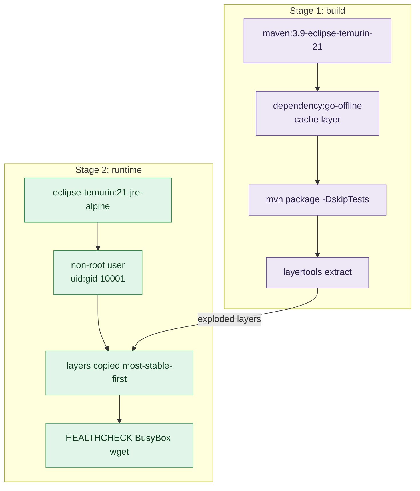
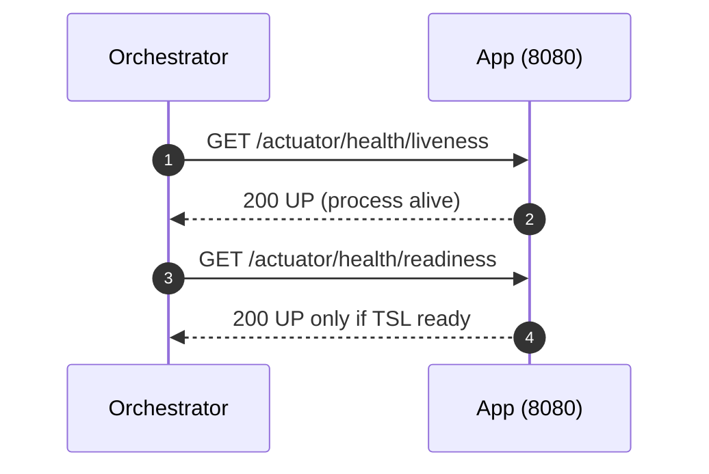
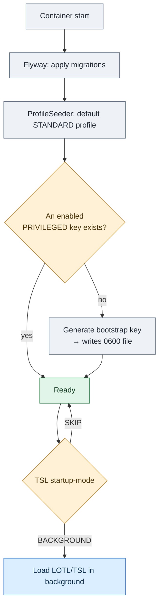

# 1b. Docker and configuration

← [1. Build](01-build-configuration.md) · [Index](README.md) · → [3. Authentication](03-authentication.md)

The service ships as the Docker image
**[`toresoft/sign-verify`](https://hub.docker.com/r/toresoft/sign-verify)**
(registry: Docker Hub). The image is built with a multi-stage `Dockerfile` and a
hardened, non-root **Alpine** runtime.

> **Want a walkthrough?** See [Docker operational guide](02b-docker-operational-guide.md) for a guided path from first run to production.

```bash
docker pull toresoft/sign-verify:latest
```

## 2.1 Image anatomy



`Dockerfile` security features:

- **Alpine runtime** (`eclipse-temurin:21-jre-alpine`): far smaller attack
  surface and CVE count than an Ubuntu/glibc base.
- **Non-root user** `uid:gid = 10001:10001`, declared numerically so
  orchestrators can enforce `runAsNonRoot`.
- **HEALTHCHECK** via BusyBox `wget` → no extra package installed.
- **Layered jar** (extracted with `layertools`): the most stable layers
  (dependencies) come first, optimising cache.
- **Exec-form** entrypoint → the app is PID 1 and receives `SIGTERM` for
  graceful shutdown (`server.shutdown: graceful`).
- `JAVA_TOOL_OPTIONS=-XX:MaxRAMPercentage=75.0 -XX:+ExitOnOutOfMemoryError`;
  JDK 21 honours cgroup limits (`UseContainerSupport`).

The image exposes port **8080** and creates/owns the only writable directory
`/var/lib/sign-verify` (subdirs `dss-cache`, `jobs`).

## 2.2 Local development: `docker-compose.yml`

Development stack: service (built from source) + PostgreSQL 16.

```bash
docker compose up --build

# First boot writes the bootstrap API key into the svdata volume:
docker compose exec app cat /var/lib/sign-verify/bootstrap-api-key.txt
```

Applied configuration (`docker` profile):

| Variable | Value |
|----------|-------|
| `SPRING_PROFILES_ACTIVE` | `docker` |
| `SPRING_DATASOURCE_URL` | `jdbc:postgresql://postgres:5432/signverify` |
| `SPRING_DATASOURCE_USERNAME` / `PASSWORD` | `signverify` / `signverify` |

> In the `docker` profile OAuth is disabled and TSL refresh is **skipped**
> (`startup-mode: SKIP`) to allow offline development. The master-key is a test
> value: **do not use it in production**.

Volumes: `pgdata` (Postgres data) and `svdata` (`/var/lib/sign-verify`).

## 2.3 Production: `docker-compose.prod.yml`

Runs the published image and expects an **external managed PostgreSQL**.

```bash
# Set variables in a .env file (see .env.example), then:
docker compose -f docker-compose.prod.yml up -d
```

Container hardening:

| Directive | Value | Effect |
|-----------|-------|--------|
| `read_only` | `true` | immutable root filesystem |
| `tmpfs` | `/tmp:size=128m,mode=1777` | scratch space for multipart |
| `security_opt` | `no-new-privileges:true` | blocks privilege escalation |
| `cap_drop` | `ALL` | drops all Linux capabilities |
| `volumes` | `svdata:/var/lib/sign-verify` | the only writable persistent path |
| `deploy.resources.limits` | `memory 1g`, `cpus 2.0` | resource limits |
| `logging` | `json-file`, `max-size 10m`, `max-file 3` | container log rotation |

Required production environment variables:

```bash
# Database (external/managed)
SPRING_DATASOURCE_URL=jdbc:postgresql://db.example.org:5432/signverify
SPRING_DATASOURCE_USERNAME=signverify
SPRING_DATASOURCE_PASSWORD=********
# Secrets / auth
APP_SECRET_MASTER_KEY=<base64 32 bytes>
APP_SECURITY_OAUTH_ISSUER_URI=https://idp.example.org/...   # if OAuth enabled
APP_OJ_KEYSTORE_PASSWORD=<OJ keystore password>
```

> Note: `compose.prod` does not set `SPRING_PROFILES_ACTIVE`, so the **default**
> profile applies (OAuth enabled, TSL refresh in `BACKGROUND`).

## 2.4 Health and readiness



- **Liveness** `/actuator/health/liveness`: used by the dev image HEALTHCHECK.
- **Readiness** `/actuator/health/readiness`: used by `compose.prod`; accounts
  for Trusted Lists readiness (`TslReadinessIndicator`).

Exposed `actuator` endpoints: `health`, `info`, `metrics`, `prometheus`.
Only `health/**`, `info`, `prometheus` are public (no authentication).

## 2.5 First boot



On first boot, if no enabled `PRIVILEGED` key exists, the service generates a
**bootstrap API key** and writes it to the file pointed by
`APP_SECURITY_BOOTSTRAP_KEY_FILE` (`0600` permissions). Retrieve it, use it to
create your own keys, then **delete the file**. Details in
[3. Authentication](03-authentication.md).
