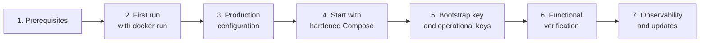

# Step-by-step Docker operational guide

← [2. Docker and configuration](02-docker.md) · [Index](README.md)

This guide walks you through installing and deploying the **`toresoft/sign-verify`**
image distributed on Docker Hub. No repository clone is needed: everything starts
from the pre-built image.

For technical details about the image (anatomy, hardening, Spring profiles), see
the [reference documentation](02-docker.md).

---

## Roadmap overview



---

## Step 1 — Prerequisites

| Requirement | Version | Notes |
|-------------|---------|-------|
| Docker Engine | 20.10+ | Compose V2 included |
| PostgreSQL | 16 (managed) | External instance reachable from the container |
| `openssl` | any | To generate the master key |
| `curl` | any | To verify the API and retrieve the bootstrap key |

Verify Docker:

```bash
docker compose version
# Docker Compose version v2.XX.X
```

Verify PostgreSQL connectivity:

```bash
psql -h db.example.internal -U signverify -d signverify -c 'SELECT 1'
```

> The image does not include a database: you need an **external PostgreSQL**
> (managed, cloud, or on-premise). The development stack with an internal DB
> exists only in the source repository.

---

## Step 2 — First run with `docker run`

For a quick smoke test, run the image directly with `docker run`. This mode
is **not** suitable for production (no hardening), but allows you to verify the
image works correctly.

### 2.1 Pull the image

```bash
docker pull toresoft/sign-verify:latest
```

Available tags:

| Tag | Meaning |
|-----|---------|
| `latest` | Latest build from the default branch |
| `<version>` | Released version (e.g. `0.9.21`) |
| `<short-sha>` | Exact commit build |

### 2.2 Start the container (quick test)

```bash
docker run -d --name sign-verify \
  -p 8080:8080 \
  -e SPRING_DATASOURCE_URL=jdbc:postgresql://db.example.internal:5432/signverify \
  -e SPRING_DATASOURCE_USERNAME=signverify \
  -e SPRING_DATASOURCE_PASSWORD=secret \
  -e APP_SECRET_MASTER_KEY="$(openssl rand -base64 32)" \
  -e APP_SECURITY_OAUTH_ENABLED=false \
  -v svdata:/var/lib/sign-verify \
  toresoft/sign-verify:latest
```

> If you don't have an external PostgreSQL immediately available, you can spin
> up a temporary Docker instance:
>
> ```bash
> docker run -d --name sv-postgres \
>   -e POSTGRES_DB=signverify \
>   -e POSTGRES_USER=signverify \
>   -e POSTGRES_PASSWORD=signverify \
>   -p 5432:5432 \
>   postgres:16-alpine
> ```
>
> Then use `SPRING_DATASOURCE_URL=jdbc:postgresql://sv-postgres:5432/signverify`
> (on Linux with Docker network) or point to `localhost:5432`.

### 2.3 Verify the service responds

```bash
# Liveness (process is alive)
curl -sS http://localhost:8080/actuator/health/liveness | jq .
# → { "status": "UP" }

# Readiness (service is ready, including Trusted Lists)
curl -sS http://localhost:8080/actuator/health/readiness | jq .
# → { "status": "UP" }  (may take a few minutes on first boot)
```

### 2.4 Stop and remove the test container

```bash
docker stop sign-verify && docker rm sign-verify
docker volume rm svdata   # optional: remove persistent test data
```

---

## Step 3 — Production configuration

For production, use `docker-compose.prod.yml`, a Compose file with full
hardening. The complete file content is provided below — no repository clone
is needed.

### 3.1 Create the working directory

```bash
mkdir sign-verify && cd sign-verify
```

### 3.2 Create the `.env` file

Generate the master key:

```bash
openssl rand -base64 32
# e.g. output: "dG9yZXNvZnQtc2lnbi12ZXJpZnktMjU2Yml0LWtleQ=="
```

Create `.env` with real values:

```bash
cat > .env << 'EOF'
# === Image version (pin for reproducible deploys) ===
SIGN_VERIFY_VERSION=0.9.21

# === External database (required) ===
SPRING_DATASOURCE_URL=jdbc:postgresql://db.example.internal:5432/signverify
SPRING_DATASOURCE_USERNAME=signverify
SPRING_DATASOURCE_PASSWORD=<secure-password>

# === Secrets (required) ===
# Master key — base64 of 32 random bytes (generate with: openssl rand -base64 32)
APP_SECRET_MASTER_KEY=<paste-openssl-rand-output>

# === OAuth authentication (conditional) ===
# If OAuth is enabled (default in production), set the OIDC issuer:
APP_SECURITY_OAUTH_ISSUER_URI=https://idp.example.com/realms/signverify
# To disable OAuth (e.g. for testing): APP_SECURITY_OAUTH_ENABLED=false

# === OJ keystore (conditional) ===
# Password for the keystore bundled in the image (for EU LOTL)
APP_OJ_KEYSTORE_PASSWORD=<oj-keystore-password>

# === Sentry (optional — leave SENTRY_DSN empty to disable) ===
SENTRY_DSN=
SENTRY_ENVIRONMENT=production
SENTRY_RELEASE=                 # empty → SDK auto-detects; or set the git tag
SENTRY_BREADCRUMB_LEVEL=INFO    # INFO / WARN / ERROR
EOF
```

> ⚠️ **Never commit `.env`** to a repository — protect it as a secret.

### 3.3 Create `docker-compose.prod.yml`

Save the following file as `docker-compose.prod.yml` in the working directory:

```yaml
# Production — Docker Hub image with full hardening.
# Requires an EXTERNAL managed PostgreSQL (variables in .env).
#
#   docker compose -f docker-compose.prod.yml up -d
name: sign-verify

services:
  app:
    # Pin the version in .env for reproducible deploys and unambiguous rollbacks.
    image: toresoft/sign-verify:${SIGN_VERIFY_VERSION:-latest}
    restart: unless-stopped
    environment:
      # --- Database (external/managed) ---
      SPRING_DATASOURCE_URL: ${SPRING_DATASOURCE_URL}
      SPRING_DATASOURCE_USERNAME: ${SPRING_DATASOURCE_USERNAME}
      SPRING_DATASOURCE_PASSWORD: ${SPRING_DATASOURCE_PASSWORD}
      # --- Secrets / auth ---
      APP_SECRET_MASTER_KEY: ${APP_SECRET_MASTER_KEY}
      APP_SECURITY_OAUTH_ISSUER_URI: ${APP_SECURITY_OAUTH_ISSUER_URI}
      APP_OJ_KEYSTORE_PASSWORD: ${APP_OJ_KEYSTORE_PASSWORD}
      # --- Observability (optional) ---
      SENTRY_DSN: ${SENTRY_DSN:-}
      SENTRY_ENVIRONMENT: ${SENTRY_ENVIRONMENT:-production}
      SENTRY_RELEASE: ${SENTRY_RELEASE:-}
    ports:
      - "8080:8080"
    # --- Hardening ---
    read_only: true                 # immutable root filesystem
    tmpfs:
      - /tmp:size=128m,mode=1777    # multipart uploads / scratch space
    security_opt:
      - no-new-privileges:true       # block privilege escalation (setuid)
    cap_drop:
      - ALL                          # drop all Linux capabilities
    volumes:
      - svdata:/var/lib/sign-verify  # only writable persistent path
    deploy:
      resources:
        limits:
          memory: 1g
          cpus: "2.0"
    healthcheck:
      test: ["CMD", "wget", "-q", "-O", "/dev/null",
             "http://localhost:8080/actuator/health/readiness"]
      interval: 30s
      timeout: 5s
      retries: 3
      start_period: 120s
    logging:
      driver: json-file
      options:
        max-size: "10m"
        max-file: "3"

volumes:
  svdata:
```

### 3.4 Container hardening — summary

The Compose file above applies:

| Directive | Value | Effect |
|-----------|-------|--------|
| `read_only` | `true` | Immutable root filesystem |
| `tmpfs` | `/tmp:size=128m,mode=1777` | Scratch space for multipart |
| `security_opt` | `no-new-privileges:true` | Blocks privilege escalation |
| `cap_drop` | `ALL` | Drops all Linux capabilities |
| `volumes` | `svdata:/var/lib/sign-verify` | Only writable persistent path |
| `deploy.resources.limits` | 1 GB RAM, 2 CPU | Resource limits |
| `logging` | `json-file`, 10 MB × 3 | Container log rotation |
| `healthcheck` | `wget` on `/readiness` | Periodic health check |

The container runs as non-root user (`uid:gid 10001:10001`).

---

## Step 4 — Start with hardened Compose

### 4.1 Start the service

```bash
docker compose -f docker-compose.prod.yml up -d
```

Docker will automatically pull the image the first time (and whenever
`SIGN_VERIFY_VERSION` changes).

### 4.2 Verify the container started

```bash
docker compose -f docker-compose.prod.yml ps
docker compose -f docker-compose.prod.yml logs --tail=50 app
```

### 4.3 Verify readiness

```bash
curl -sS http://localhost:8080/actuator/health/readiness | jq .
# → { "status": "UP", "components": { "readinessState": { "status": "UP" } } }
```

On first boot, downloading the European Trusted Lists may take several minutes.
**Liveness** is immediately `UP` (the process is alive), but **readiness**
becomes `UP` only after loading completes.

### 4.4 Reverse proxy routing

The image does not contain a reverse proxy. In production, place a load
balancer / reverse proxy (Nginx, Traefik, HAProxy) in front of the container:

```
Internet → [Reverse proxy :443 → localhost:8080] → Container
```

Recommended proxy configurations:

- **TLS termination** on the reverse proxy.
- Header `X-Forwarded-Proto: https` so Spring generates correct URLs.
- Sufficiently long timeouts for async verification requests
  (jobs are processed in background; the synchronous response is immediate).
- Maximum body size ≥ 60 MB (`client_max_body_size` in Nginx).

If forwarding headers, add to `.env`:

```bash
SERVER_FORWARD_HEADERS_STRATEGY=native
```

---

## Step 5 — Bootstrap key and operational API keys

On first boot, if no enabled `PRIVILEGED` key exists, the service generates a
**bootstrap key** and writes it to `/var/lib/sign-verify/bootstrap-api-key.txt`
(permissions `0600`).

### 5.1 Retrieve the bootstrap key

```bash
BOOTSTRAP_KEY=$(docker compose -f docker-compose.prod.yml exec -T app \
  cat /var/lib/sign-verify/bootstrap-api-key.txt)
echo "Bootstrap key: $BOOTSTRAP_KEY"
```

### 5.2 Create operational keys

The bootstrap key exists solely to create operational keys. Create at least a
`PRIVILEGED` key and a `STANDARD` key:

```bash
# Administrative key (PRIVILEGED)
curl -sS -X POST http://localhost:8080/api/v1/api-keys \
  -H "X-API-Key: $BOOTSTRAP_KEY" \
  -H "Content-Type: application/json" \
  -d '{"name":"admin-prod","role":"PRIVILEGED"}' | jq .

# Client key (STANDARD), with optional expiry
curl -sS -X POST http://localhost:8080/api/v1/api-keys \
  -H "X-API-Key: $BOOTSTRAP_KEY" \
  -H "Content-Type: application/json" \
  -d '{"name":"ci-pipeline","role":"STANDARD","expiresAt":"2027-01-01T00:00:00Z"}' | jq .
```

The `201` response contains `plaintextKey` — the clear-text value is **returned
only once**. Store it securely (vault, secrets manager).

### 5.3 Delete the bootstrap file

```bash
docker compose -f docker-compose.prod.yml exec app \
  rm /var/lib/sign-verify/bootstrap-api-key.txt
```

> The service prevents disabling or deleting the **last** enabled `PRIVILEGED`
> key to avoid lock-out (error 409).

For more details: [Authentication](03-authentication.md).

---

## Step 6 — Post-deploy functional verification

### 6.1 Verify authentication

```bash
# List keys (requires PRIVILEGED)
curl -sS http://localhost:8080/api/v1/api-keys \
  -H "X-API-Key: $BOOTSTRAP_KEY" | jq .
```

### 6.2 Verify digital signature verification (synchronous)

```bash
# Requires a STANDARD or PRIVILEGED key
curl -sS -X POST http://localhost:8080/api/v1/verifications \
  -H "X-API-Key: $API_KEY" \
  -F file=@document.pdf.p7m \
  | jq .
```

### 6.3 Verify Trusted Lists

```bash
# Manual refresh (requires PRIVILEGED)
curl -sS -X POST http://localhost:8080/api/v1/tsl/refresh \
  -H "X-API-Key: $PRIVILEGED_KEY" | jq .

# Trusted Lists status
curl -sS http://localhost:8080/api/v1/tsl/status \
  -H "X-API-Key: $API_KEY" | jq .
```

### 6.4 Verify Swagger UI

Open in browser: `http://localhost:8080/swagger-ui/index.html`

OpenAPI spec available at: `http://localhost:8080/v3/api-docs`

---

## Step 7 — Observability and maintenance

### 7.1 Actuator endpoints

| Endpoint | Authentication | Purpose |
|----------|---------------|---------|
| `/actuator/health/liveness` | none | Process is alive (Kubernetes `livenessProbe`) |
| `/actuator/health/readiness` | none | Service ready including TSL loaded (`readinessProbe`) |
| `/actuator/info` | none | Build version and Git info |
| `/actuator/prometheus` | none | Prometheus metrics |

Other endpoints (`metrics`, `env`, `beans`…) are **not public** and require
authentication.

### 7.2 Check container health

```bash
# Docker inspect health (readable format)
docker inspect --format='{{json .State.Health}}' sign-verify-app-1 | jq .

# Quick curl check
curl -sfS http://localhost:8080/actuator/health | jq .status
# "UP"

# Readiness only (includes TSL status)
curl -sS http://localhost:8080/actuator/health/readiness | jq .
```

### 7.3 Application logs

Logs go to stdout (structured JSON via Logback). With Docker Compose:

```bash
# Last 100 log lines
docker compose -f docker-compose.prod.yml logs --tail=100 app

# Follow in real time
docker compose -f docker-compose.prod.yml logs -f app
```

Log level is controllable at runtime via environment variables (e.g.
`LOGGING_LEVEL_ORG_TORESOFT_SIGNVERIFY=DEBUG` in `.env`).

### 7.4 Sentry (optional)

Sentry is **fully optional**: if `SENTRY_DSN` is empty (default), the SDK
sends nothing and overhead is zero.

To enable, add to `.env`:

```bash
SENTRY_DSN=https://xxxxx@o123456.ingest.sentry.io/7654321
SENTRY_ENVIRONMENT=production
SENTRY_RELEASE=0.9.21           # git tag for release tracking
SENTRY_BREADCRUMB_LEVEL=INFO    # min level for breadcrumbs
```

Behavior:
- Client errors (4xx, `AppException` with status < 500) are **filtered out** —
  they do not create Sentry issues.
- Server errors (5xx, `AppException` with status ≥ 500) are reported.
- `send-default-pii: false` for GDPR compliance.
- Breadcrumbs are captured at the level configured in
  `SENTRY_BREADCRUMB_LEVEL`.

### 7.5 Updates

**Always pin the image tag** in `.env`:

```bash
SIGN_VERIFY_VERSION=0.9.21   # Do not use :latest in production
```

Update:

```bash
# 1. Update the version in .env
sed -i 's/^SIGN_VERIFY_VERSION=.*/SIGN_VERIFY_VERSION=0.9.22/' .env

# 2. Pull the new image
docker compose -f docker-compose.prod.yml pull app

# 3. Restart with the new image
docker compose -f docker-compose.prod.yml up -d app
```

Rollback:

```bash
sed -i 's/^SIGN_VERIFY_VERSION=.*/SIGN_VERIFY_VERSION=0.9.21/' .env
docker compose -f docker-compose.prod.yml pull app
docker compose -f docker-compose.prod.yml up -d app
```

> If a Flyway migration altered the schema in a non-backward-compatible way,
> rollback may require a database backup restore. Always check release notes
> before upgrading.

### 7.6 Backups

| Where | Contents | Backup strategy |
|-------|----------|-----------------|
| PostgreSQL (external) | Schema, API keys, jobs, audit | Managed backup (e.g. `pg_dump`) |
| `/var/lib/sign-verify/` (`svdata`) | DSS cache, job temp files | Docker volume — recreatable data |

The `svdata` volume contains DSS cache and job temporary files. If deleted,
the service recreates it: re-downloads TSLs and empties pending jobs
(reported as `EXPIRED`).

---

## Troubleshooting

### Container fails to start or restarts in a loop

```bash
docker compose -f docker-compose.prod.yml logs app | tail -100
```

Common causes:

| Symptom | Probable cause | Resolution |
|---------|---------------|------------|
| `ExitOnOutOfMemoryError` | Heap exhausted | Increase `memory` limit or `-XX:MaxRAMPercentage` |
| `Flyway migration failed` | Incompatible schema | Check DB version and migrations |
| Password rejected by DB | Wrong credentials | Verify `SPRING_DATASOURCE_*` in `.env` |
| `APP_SECRET_MASTER_KEY` missing | Variable not set | Generate and set in `.env` |
| `APP_SECRET_MASTER_KEY` empty or invalid | Invalid base64 | Regenerate with `openssl rand -base64 32` |

### Readiness stays `DOWN`

Trusted Lists are downloaded in the background on first boot. If the container
has no connectivity to `ec.europa.eu`, readiness will never reach `UP`.

Test connectivity:

```bash
docker compose -f docker-compose.prod.yml exec app \
  wget -q -O- https://ec.europa.eu/tools/lotl/eu-lotl.xml | head -5
```

### 401 on all requests

- Verify the header is `X-API-Key` (not `Authorization`).
- Check that the key has not expired (`expiresAt`).
- If OAuth is enabled and the issuer is unreachable, all JWT requests fail;
  use a valid API key as fallback.

### Clean slate restart

```bash
docker compose -f docker-compose.prod.yml down -v   # removes containers and volumes
docker compose -f docker-compose.prod.yml up -d      # recreates everything
```

> ⚠️ `down -v` deletes the local `svdata` volume (DSS cache and temp files),
> but **does not touch the external PostgreSQL database**. Data persisted in
> the DB remains intact.

---

## Environment variables — quick reference

### Required in production

| Variable | Description | Example |
|----------|-------------|---------|
| `SPRING_DATASOURCE_URL` | Database JDBC URL | `jdbc:postgresql://db:5432/signverify` |
| `SPRING_DATASOURCE_USERNAME` | Database user | `signverify` |
| `SPRING_DATASOURCE_PASSWORD` | Database password | — |
| `APP_SECRET_MASTER_KEY` | Encryption key (base64 32 bytes) | output of `openssl rand -base64 32` |

### Conditional

| Variable | When needed | Default |
|----------|------------|---------|
| `APP_SECURITY_OAUTH_ISSUER_URI` | If OAuth is enabled (default: yes) | empty |
| `APP_SECURITY_OAUTH_ENABLED` | To disable OAuth in production | `true` |
| `APP_OJ_KEYSTORE_PASSWORD` | To download EU Trusted Lists | empty |

### Optional

| Variable | Description | Default |
|----------|-------------|---------|
| `SIGN_VERIFY_VERSION` | Docker image tag | `latest` |
| `SERVER_PORT` | Container HTTP port | `8080` |
| `SENTRY_DSN` | Sentry DSN (empty = disabled) | empty |
| `SENTRY_ENVIRONMENT` | Sentry environment | `development` |
| `SENTRY_RELEASE` | Sentry release (empty = autodetect) | empty |
| `SENTRY_BREADCRUMB_LEVEL` | Min breadcrumb level (INFO/WARN/ERROR) | `INFO` |
| `APP_STORAGE_JOBS_DIR` | Job temp files directory | `/var/lib/sign-verify/jobs` |
| `APP_DSS_CACHE_DIR` | DSS cache directory | `/var/lib/sign-verify/dss-cache` |

For the complete parameter list, see
[1. Build and configuration](01-build-configuration.md).

---

## Pre-production checklist

Before exposing the service in production, verify:

- [ ] `SIGN_VERIFY_VERSION` is pinned to a specific tag (not `latest`)
- [ ] `.env` contains secure passwords and is not publicly accessible
- [ ] `APP_SECRET_MASTER_KEY` was generated with `openssl rand -base64 32`
- [ ] The reverse proxy terminates TLS and sets `X-Forwarded-Proto: https`
- [ ] The bootstrap key was used to create operational keys, then deleted
- [ ] Readiness passes `UP` (TSLs downloaded)
- [ ] Container hardening is active (`read_only`, `cap_drop: ALL`, etc.)
- [ ] `SENTRY_DSN` is set (or intentionally left empty)
- [ ] Log level is appropriate for production (default `INFO`)
- [ ] PostgreSQL database backup is configured
