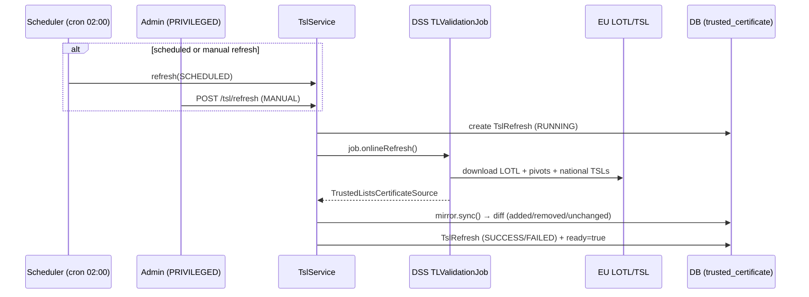

# 3. Trusted Certificates API (TSL)

← [3. Authentication](03-authentication.md) · [Index](README.md) · → [5. Signature verification](05-signature-verification.md)

Certificate trust is rooted in the **EU Trusted Lists**: the service loads the
European **LOTL** (List of the Lists) and the national TSLs through the DSS
library, and **mirrors** their trust-anchor certificates into its own database
so they are queryable via API.

## 3.1 Refresh model



- **Scheduled**: cron `0 0 2 * * *` (timezone `Europe/Rome`).
- **Startup**: `app.tsl.refresh.startup-mode` = `BACKGROUND` (load at start,
  non-blocking) or `SKIP` (for dev/offline).
- **Manual**: `POST /api/v1/tsl/refresh` (`PRIVILEGED` only).

Each refresh records a `TslRefresh` row with outcome and diff (certificates
added / removed / unchanged). Certificates no longer present in the lists are
not deleted but **flagged as removed** (`removedAt`): they remain queryable with
`includeRemoved=true`.

## 3.2 TSL status

`GET /api/v1/tsl/status` — available to any authenticated user.

```bash
curl -sS http://localhost:8080/api/v1/tsl/status -H "X-API-Key: $KEY"
```

```json
{
  "lastRefresh": {
    "id": "…", "trigger": "SCHEDULED",
    "startedAt": "…", "completedAt": "…", "status": "SUCCESS",
    "certificatesAdded": 12, "certificatesRemoved": 3, "certificatesUnchanged": 240
  },
  "currentCertificateCount": 252,
  "ready": true
}
```

`ready` reflects whether the Trusted Lists have been loaded successfully at least
once; it also drives `/actuator/health/readiness`.

## 3.3 Force a refresh

`POST /api/v1/tsl/refresh` — **requires `PRIVILEGED`**.

```bash
curl -sS -X POST http://localhost:8080/api/v1/tsl/refresh -H "X-API-Key: $ADMIN_KEY"
```

```json
{ "refreshId": "…", "status": "SUCCESS" }
```

## 3.4 List trusted certificates

`GET /api/v1/tsl/certificates` — supports many filters and pagination.

| Parameter | Type | Description |
|-----------|------|-------------|
| `ski` | string | Subject Key Identifier (exact match) |
| `aki` | string | Authority Key Identifier (exact match) |
| `subjectCn` / `subjectDn` | string | Subject CN/DN (partial, case-insensitive) |
| `issuerCn` / `issuerDn` | string | Issuer CN/DN (partial match) |
| `country` | string | Country code (exact match) |
| `tspName` | string | Trust Service Provider name (partial match) |
| `tspServiceType` | string | TSP service type (exact match) |
| `tspServiceStatus` | string | TSP service status (exact match) |
| `serialNumber` | string | Serial number (exact match) |
| `validAt` | date-time | Only certificates valid at that instant |
| `includeRemoved` | boolean | Include removed certificates (default `false`) |
| `page` / `size` | integer | Pagination (default `0` / `50`) |

```bash
curl -sS "http://localhost:8080/api/v1/tsl/certificates?country=IT&tspName=Aruba&size=20" \
  -H "X-API-Key: $KEY"
```

Each item contains (`certToMap`): `id`, `ski`, `aki`, `subjectDn`, `subjectCn`,
`issuerDn`, `issuerCn`, `serialNumber`, `country`, `tspName`, `tspServiceType`,
`tspServiceStatus`, `validFrom`, `validTo`, `lastSeenAt`, `removedAt`,
`certificateDerB64` (DER certificate, base64), `tslUrl`.

## 3.5 Certificate detail

`GET /api/v1/tsl/certificates/{id}` — returns the same object as above for the
certificate with that `id`.

```bash
curl -sS http://localhost:8080/api/v1/tsl/certificates/<uuid> -H "X-API-Key: $KEY"
```

## 3.6 Permissions summary

| Endpoint | Required role |
|----------|---------------|
| `GET /api/v1/tsl/status` | authenticated |
| `GET /api/v1/tsl/certificates` | authenticated |
| `GET /api/v1/tsl/certificates/{id}` | authenticated |
| `POST /api/v1/tsl/refresh` | **PRIVILEGED** |
