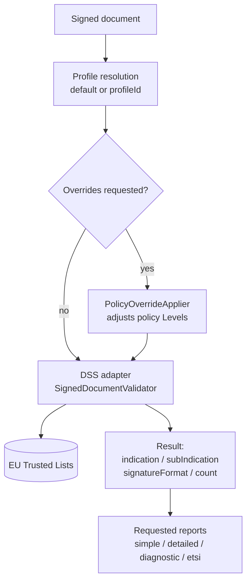
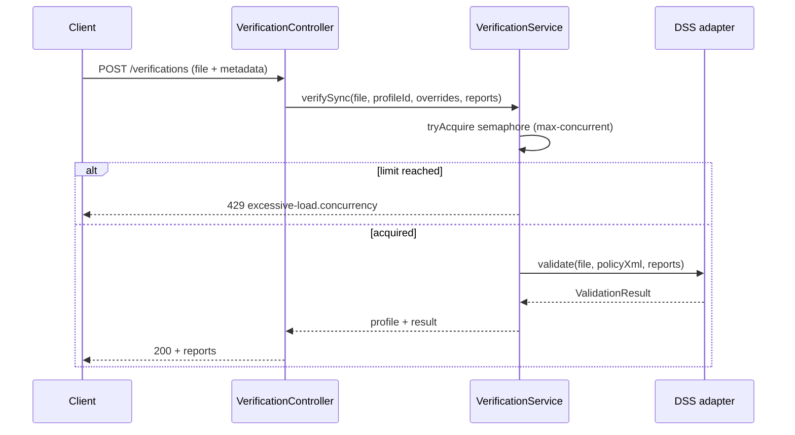
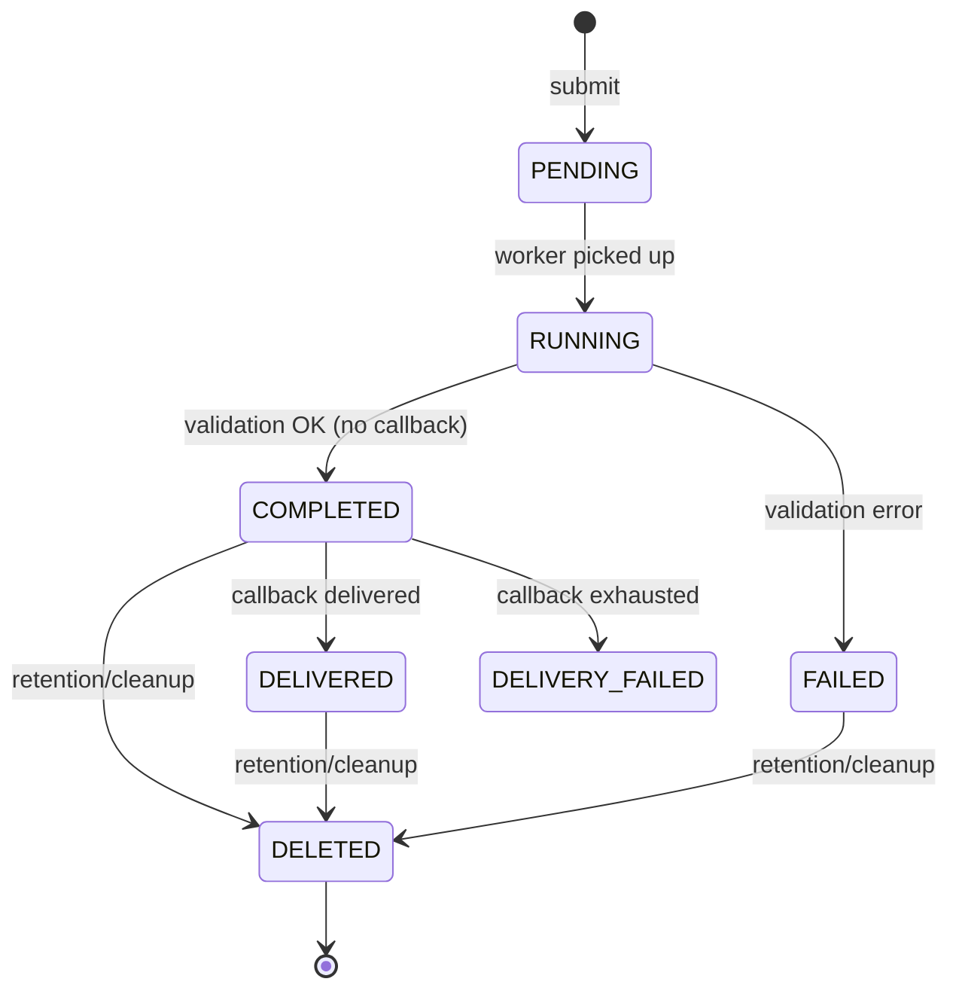
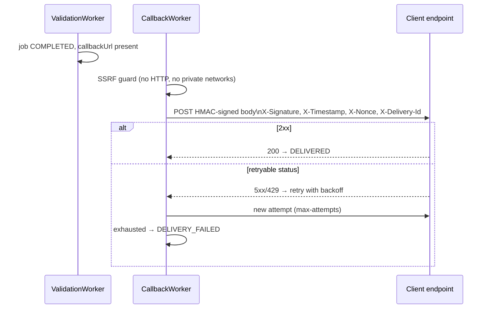

# 4. Signature verification

← [4. Trusted Certificates](04-trusted-certificates.md) · [Index](README.md) · → [6. File extraction](06-file-extraction.md)

- [4.1 Introduction](#41-introduction)
- [4.2 Validation profiles](#42-validation-profiles)
- [4.3 Synchronous verification API](#43-synchronous-verification-api)
- [4.4 Asynchronous verification API](#44-asynchronous-verification-api)

## 4.1 Introduction

The service verifies eIDAS electronic signatures in **PAdES** (PDF), **CAdES**
(`.p7m`), **XAdES** (XML), **JAdES** (JSON) and **ASiC** containers (ASiC-S /
ASiC-E), using the **DSS 6.4** library and the **EU Trusted Lists** as trust
anchors.

### Validation pipeline



DSS's primary outcome is expressed by:

- **`indication`** — overall result: `TOTAL_PASSED`, `TOTAL_FAILED`,
  `INDETERMINATE`.
- **`subIndication`** — detailed reason when not `TOTAL_PASSED` (e.g.
  `SIG_CRYPTO_FAILURE`, `NO_CERTIFICATE_CHAIN_FOUND`, `OUT_OF_BOUNDS_NO_POE`…).
- **`signatureFormat`** — detected format/level (e.g. `PAdES-BASELINE-B`).
- **`signatureCount`** — number of signatures found.

### Report types

| Report | Description |
|--------|-------------|
| `simple` | Concise report (per-signature outcome) |
| `detailed` | Detailed per-constraint report |
| `diagnostic` | Raw diagnostic data collected by DSS |
| `etsi` | ETSI validation report (TS 119 102-2) |

Concurrency: synchronous verifications are bounded by a semaphore
(`app.verify.max-concurrent`, default `8`); beyond the limit you get **429**
(`excessive-load.concurrency`).

## 4.2 Validation profiles

A **profile** wraps a **DSS validation policy** (constraints XML). The profile
determines how strictly constraints (revocation, qualification, timestamp, etc.)
are evaluated.

### Available presets

| Preset | Policy file | Notes |
|--------|-------------|-------|
| `BASIC` | `policy/BASIC.xml` | Minimal constraints |
| `STANDARD` | `policy/STANDARD.xml` | DSS default policy (QES/AES on TSL basis) — **seeded as default** |
| `STRICT` | `policy/STRICT.xml` | Stricter constraints |
| `CUSTOM` | — | User-supplied policy XML |

At startup, if no profile exists, the **STANDARD** profile is seeded
(`isDefault = true`).

### Profile management (API)

| Method | Path | Operation |
|--------|------|-----------|
| `GET` | `/api/v1/profiles?page=&size=` | List |
| `POST` | `/api/v1/profiles` | Create (`name`, `preset`, `policyXml?`) |
| `GET` | `/api/v1/profiles/{id}` | Detail |
| `PUT` | `/api/v1/profiles/{id}` | Update (`description?`, `policyXml?`) |
| `DELETE` | `/api/v1/profiles/{id}` | Delete |
| `POST` | `/api/v1/profiles/{id}/default` | Set as default |

Create a CUSTOM profile:

```bash
curl -sS -X POST http://localhost:8080/api/v1/profiles \
  -H "X-API-Key: $KEY" -H "Content-Type: application/json" \
  -d '{"name":"strict-pades","preset":"CUSTOM","policyXml":"<ConstraintsParameters …>…</…>"}'
```

> `policyXml` is required when `preset = CUSTOM`.

### On-the-fly overrides

Without creating a profile, you can **relax** some checks for a single request
by passing boolean overrides in the metadata. Setting a key to `false` drives
the corresponding policy constraints to `Level=IGNORE`:

| Override key | Affected constraints (Level → IGNORE) |
|--------------|---------------------------------------|
| `checkRevocation` | `RevocationDataAvailable`, `RevocationDataFreshness`, `RevocationCertHashMatch` |
| `checkSignatureIntegrity` | `SignatureIntact`, `SignatureValid` |
| `checkCertificateChain` | `ProspectiveCertificateChain`, `TrustedServiceStatus` |
| `checkTimestamp` | `TimestampDelay`, `MessageImprintDataIntact` |
| `checkQualified` | `QualifiedCertificate` |

Overrides only disable a check (value `false`). The response reports
`overridesApplied: true`.

## 4.3 Synchronous verification API

`POST /api/v1/verifications` — `multipart/form-data`.

| Part | Required | Description |
|------|----------|-------------|
| `file` | yes | The signed document (binary) |
| `metadata` | no | JSON: `profileId?`, `profileOverrides?`, `reports[]?` |

If `metadata` is absent, `simple` and `etsi` reports are produced with the
default profile.

```bash
curl -sS -X POST http://localhost:8080/api/v1/verifications \
  -H "X-API-Key: $KEY" \
  -F 'file=@contract.pdf' \
  -F 'metadata={"reports":["simple","detailed"],"profileOverrides":{"checkRevocation":false}}'
```

`200` response:

```json
{
  "verifiedAt": "2026-06-08T10:15:30Z",
  "profileUsed": "STANDARD",
  "overridesApplied": true,
  "signatureFormat": "PAdES-BASELINE-B",
  "indication": "TOTAL_PASSED",
  "subIndication": null,
  "signatureCount": 1,
  "reports": {
    "simple":   { /* … */ },
    "detailed": { /* … */ }
  }
}
```

Allowed `reports` values: `simple`, `detailed`, `diagnostic`, `etsi`. An unknown
value yields **400** (`unknown report type`). Malformed metadata JSON yields
**400** (`invalid metadata json`).



## 4.4 Asynchronous verification API

For large documents or **webhook** delivery, use the async flow backed by
persisted jobs.

### Submission

`POST /api/v1/verifications/async` — `multipart/form-data` (`file` + `metadata`).

`metadata` fields (JSON): `profileId?`, `profileOverrides?`, `reports[]?`
(default `simple,diagnostic`), `callbackUrl?`, `callbackSecret?`,
`callbackAlgorithm?`.

```bash
curl -sS -X POST http://localhost:8080/api/v1/verifications/async \
  -H "X-API-Key: $KEY" \
  -F 'file=@large.pdf' \
  -F 'metadata={"reports":["simple","etsi"],"callbackUrl":"https://app.example.org/hook","callbackSecret":"s3cr3t","callbackAlgorithm":"HmacSHA256"}'
```

`202` response:

```json
{ "jobId": "…", "status": "PENDING" }
```

with header `Location: /api/v1/verifications/jobs/<jobId>`.

**Backpressure**: if active jobs exceed the per-principal limit
(`max-pending-per-principal`, default 50) or the global limit
(`max-pending-global`, default 500), you get **429**
(`excessive-load.async-backpressure`).

### Job lifecycle



States (`JobStatus`): `PENDING`, `RUNNING`, `COMPLETED`, `FAILED`, `DELIVERED`,
`DELIVERY_FAILED`, `DELETED`.

The **ValidationWorker** polls (`async.worker.poll-interval`, default `5s`),
picks pending jobs and processes them; if the `dssValidator` circuit breaker is
**OPEN**, it skips the cycle. The callback secret is encrypted at rest
(AES-256-GCM) with the master-key.

### Retrieving the result

`GET /api/v1/verifications/jobs/{jobId}`.

- Visible to the job **owner** or a **PRIVILEGED** principal; otherwise **404**
  (to avoid revealing the job's existence).
- If the status is `DELETED`, the result is no longer available: **410 Gone**.

```json
{
  "jobId": "…",
  "status": "DELIVERED",
  "createdAt": "…", "startedAt": "…", "completedAt": "…", "deliveredAt": "…",
  "expiresAt": "…",
  "callbackAttempts": 1,
  "result": { /* report JSON */ }
}
```

### Callback delivery (webhook)



The dispatcher signs the body with HMAC (`HmacSHA256` default, or `HmacSHA512`)
and includes signature and anti-replay headers:

| Header | Meaning |
|--------|---------|
| `X-Signature` | HMAC of the body (+ timestamp/nonce/deliveryId) |
| `X-Signature-Algorithm` | algorithm used |
| `X-Timestamp`, `X-Nonce` | anti-replay |
| `X-Job-Id`, `X-Delivery-Id`, `X-Delivery-Attempt` | correlation |

**Anti-SSRF guard**: by default only **HTTPS** URLs are allowed
(`allow-http=false`), and hosts resolving to **private/non-routable** addresses
are blocked (loopback, link-local incl. `169.254.169.254`, site-local, IPv6 ULA,
multicast). An unresolvable host is treated as private (fail-closed). Retry
policy: `max-attempts` (default 3), backoff `60s,300s,1800s`, success statuses
`200,201,202,204`, retryable statuses `408,425,429,500,502,503,504`.
