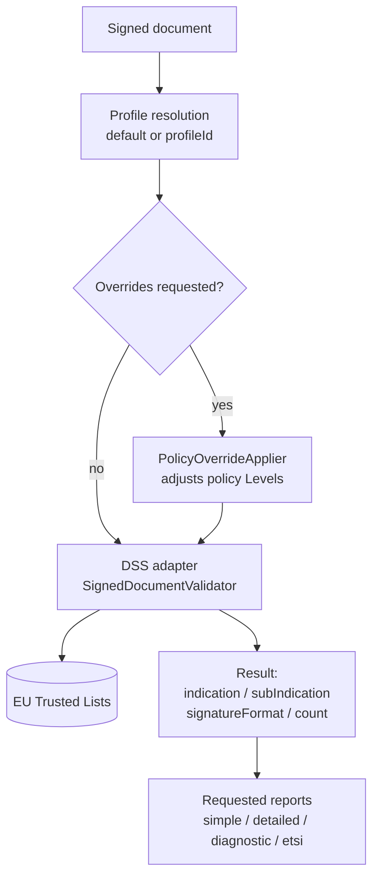
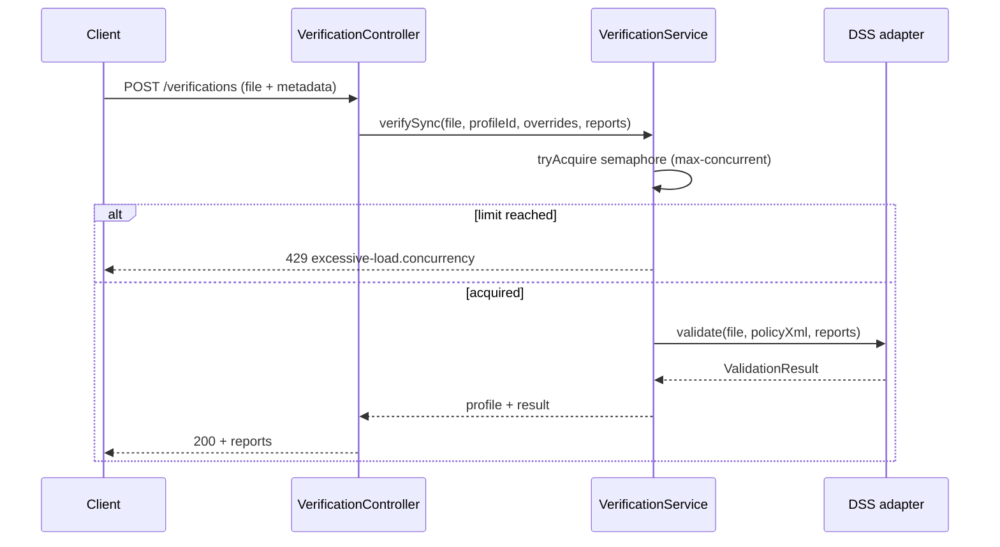
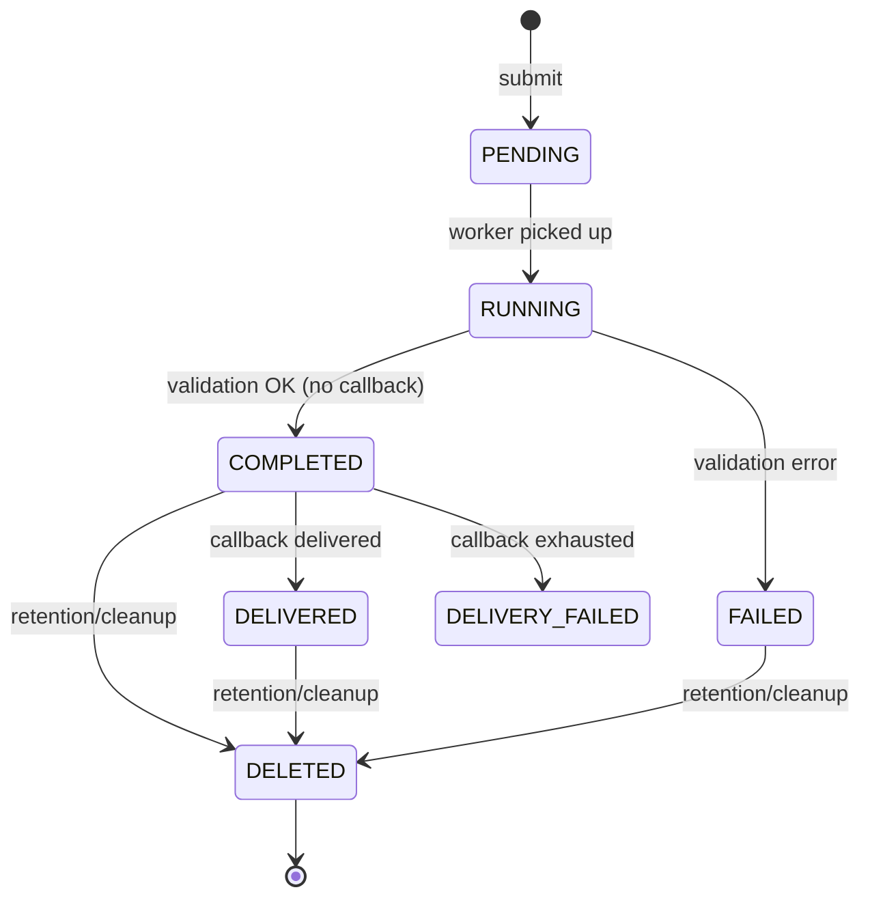
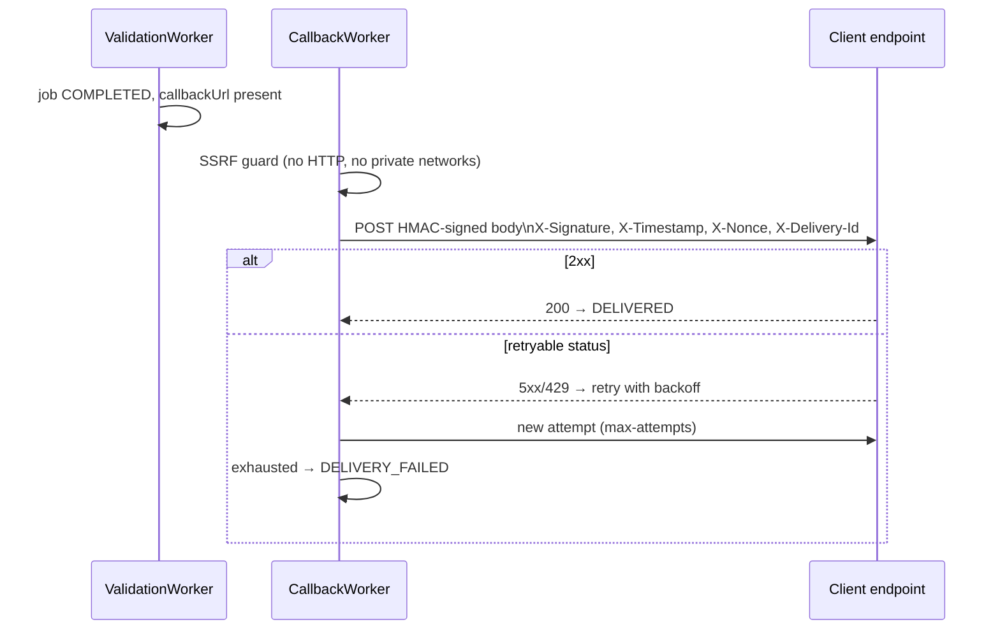

# 4. Signature verification

← [4. Trusted Certificates](04-trusted-certificates.md) · [Index](README.md) · → [6. File extraction](06-file-extraction.md)

- [4.1 Introduction](#41-introduction)
- [4.2 Validation profiles](#42-validation-profiles)
  - [Policy XML format](#policy-xml-format)
- [4.3 Synchronous verification API](#43-synchronous-verification-api)
- [4.4 Asynchronous verification API](#44-asynchronous-verification-api)

## 4.1 Introduction

The service verifies eIDAS electronic signatures in **PAdES** (PDF), **CAdES**
(`.p7m`), **XAdES** (XML), **JAdES** (JSON) and **ASiC** containers (ASiC-S /
ASiC-E), using the **DSS 6.4** library and the **EU Trusted Lists** as trust
anchors.

### Validation pipeline



DSS's primary outcome is expressed by:

- **`indication`** — overall result: `TOTAL_PASSED`, `TOTAL_FAILED`,
  `INDETERMINATE`.
- **`subIndication`** — detailed reason when not `TOTAL_PASSED` (e.g.
  `SIG_CRYPTO_FAILURE`, `NO_CERTIFICATE_CHAIN_FOUND`, `OUT_OF_BOUNDS_NO_POE`…).
- **`signatureFormat`** — detected format/level (e.g. `PAdES-BASELINE-B`).
- **`signatureCount`** — number of signatures found.
- **`signatures[]`** — per-signature detail: `id`, `indication`, `subIndication`,
  `signatureFormat`, **`signatureLevel`** (DSS eIDAS qualification: `QESIG`/`QESEAL`,
  `ADESIG_QC`/…, `NA`, `INDETERMINATE_*` variants; orthogonal to `indication`),
  `signedBy`, `bestSignatureTime`, and that signature's `timestamps[]`.
- **`timestamps[]`** — document timestamps: `id`, `indication`, `subIndication`,
  `productionTime`, `qualification` (`QTSA`/`TSA`/`NA`).

### Report types

| Report | Description |
|--------|-------------|
| `simple` | Concise report (per-signature outcome) |
| `detailed` | Detailed per-constraint report |
| `diagnostic` | Raw diagnostic data collected by DSS |
| `etsi` | ETSI validation report (TS 119 102-2) |

Concurrency: synchronous verifications are bounded by a semaphore
(`app.verify.max-concurrent`, default `8`); beyond the limit you get **429**
(`excessive-load.concurrency`).

## 4.2 Validation profiles

A **profile** wraps a **DSS validation policy** (constraints XML). The profile
determines how strictly constraints (revocation, qualification, timestamp, etc.)
are evaluated.

### Available presets

| Preset | Policy file | Notes |
|--------|-------------|-------|
| `BASIC` | `policy/BASIC.xml` | Minimal constraints |
| `STANDARD` | `policy/STANDARD.xml` | DSS default policy (QES/AES on TSL basis) — **seeded as default** |
| `STRICT` | `policy/STRICT.xml` | Stricter constraints |
| `CUSTOM` | — | User-supplied policy XML |

At startup, if no profile exists, the **STANDARD** profile is seeded
(`isDefault = true`).

### Policy XML format

The policy is an XML document in the **DSS namespace**
`http://dss.esig.europa.eu/validation/policy`, with root
`<ConstraintsParameters>`. It is the same format used by the DSS library (see
*DSS — Validation policy*); the files `policy/BASIC.xml`, `policy/STANDARD.xml`
and `policy/STRICT.xml` are complete examples bundled with the service.

#### The key concept: the `Level` attribute

Almost every constraint carries a `Level` attribute that sets its severity. It
determines **how** a failed check affects the outcome (`indication` /
`subIndication`):

| `Level` | Meaning | Effect on the outcome |
|---------|---------|-----------------------|
| `FAIL` | Mandatory constraint | If not met → `TOTAL_FAILED` / `INDETERMINATE` |
| `WARN` | Warning | Does not block the outcome; reported in the report |
| `INFORM` | Informative | Information only in the report |
| `IGNORE` | Disabled | The check is not executed |

Making a profile stricter means raising the `Level` of some constraints
(e.g. `WARN` → `FAIL`); relaxing it means lowering them (e.g. `FAIL` →
`IGNORE`). That is exactly what the [on-the-fly overrides](#on-the-fly-overrides)
do, selectively driving some constraints to `IGNORE`.

#### Document structure

Constraints are grouped into thematic sections, evaluated by DSS during the
various validation phases:

| Section | Constraints on |
|---------|----------------|
| `<ContainerConstraints>` | ASiC-S / ASiC-E containers (accepted types, manifest, signed files) |
| `<PDFAConstraints>` | PDF/A compliance (for PAdES) |
| `<SignatureConstraints>` | The signature and its certificate chain (main block) |
| `<CounterSignatureConstraints>` | Counter-signatures, if any |
| `<Timestamp>` | Timestamps (TSA) |
| `<Revocation>` | Revocation data (CRL / OCSP) |
| `<EvidenceRecord>` | Evidence records (RFC 4998 / 6283) |
| `<Cryptographic>` | Accepted algorithms and key sizes + expiration |
| `<Model Value="…"/>` | Validation model: `SHELL`, `CHAIN` or `HYBRID` |
| `<eIDAS>` | Trusted List constraints (freshness, signature, TL version) |

Inside `<SignatureConstraints>` the certificate checks are in turn nested under
`<BasicSignatureConstraints>` → `<SigningCertificate>` (the signer's
certificate) and `<CACertificate>` (the chain issuers), plus
`<SignedAttributes>` for the signed attributes (e.g. `SigningTime`).

#### Constraint shapes

- **Simple constraint** — only `Level`:
  ```xml
  <SignatureIntact Level="FAIL" />
  ```
- **Constraint with a list of values** — one or more accepted `<Id>`:
  ```xml
  <AcceptableContainerTypes Level="FAIL">
      <Id>ASiC-S</Id>
      <Id>ASiC-E</Id>
  </AcceptableContainerTypes>
  ```
- **Time-based constraint** — with `Unit` and `Value`:
  ```xml
  <RevocationFreshness Level="IGNORE" Unit="DAYS" Value="0" />
  <TLFreshness Level="WARN" Unit="HOURS" Value="6" />
  ```
- **The `<Cryptographic>` section** — accepted encryption/digest algorithms,
  minimum key sizes and expiration dates (`<AlgoExpirationDate>`), used to
  reject obsolete cryptography (e.g. SHA-1, RSA-1024 past a given date).

#### Minimal commented example

```xml
<ConstraintsParameters Name="minimal example"
    xmlns="http://dss.esig.europa.eu/validation/policy">
  <!-- Only ASiC-E containers allowed -->
  <ContainerConstraints>
    <AcceptableContainerTypes Level="FAIL">
      <Id>ASiC-E</Id>
    </AcceptableContainerTypes>
  </ContainerConstraints>
  <SignatureConstraints>
    <AcceptableFormats Level="FAIL">
      <Id>*</Id> <!-- any signature format -->
    </AcceptableFormats>
    <BasicSignatureConstraints>
      <SignatureIntact Level="FAIL" />          <!-- the signature must be intact -->
      <ProspectiveCertificateChain Level="FAIL" /> <!-- chain up to a TL -->
      <SigningCertificate>
        <NotExpired Level="WARN" />             <!-- non-blocking if expired -->
        <NotRevoked Level="FAIL" />
        <RevocationDataAvailable Level="IGNORE" /> <!-- do not require revocation -->
      </SigningCertificate>
    </BasicSignatureConstraints>
  </SignatureConstraints>
  <Cryptographic Level="FAIL">
    <AcceptableDigestAlgo>
      <Algo>SHA256</Algo>
      <Algo>SHA512</Algo>
    </AcceptableDigestAlgo>
  </Cryptographic>
  <Model Value="SHELL" />
</ConstraintsParameters>
```

> Difference between presets: `BASIC`, `STANDARD` and `STRICT` share the same
> structure but differ in the `Level` assigned to individual constraints —
> `STRICT` promotes to `FAIL` checks that `BASIC` leaves at `WARN`/`IGNORE`.
> For the full grammar refer to the official DSS documentation
> (*Validation policy* / the `policy.xsd` XSD).

### Profile management (API)

| Method | Path | Operation |
|--------|------|-----------|
| `GET` | `/api/v1/profiles?page=&size=` | List |
| `POST` | `/api/v1/profiles` | Create (`name`, `preset`, `policyXml?`) |
| `GET` | `/api/v1/profiles/{id}` | Detail |
| `PUT` | `/api/v1/profiles/{id}` | Update (`description?`, `policyXml?`) |
| `DELETE` | `/api/v1/profiles/{id}` | Delete |
| `POST` | `/api/v1/profiles/{id}/default` | Set as default |

Create a CUSTOM profile:

```bash
curl -sS -X POST http://localhost:8080/api/v1/profiles \
  -H "X-API-Key: $KEY" -H "Content-Type: application/json" \
  -d '{"name":"strict-pades","preset":"CUSTOM","policyXml":"<ConstraintsParameters …>…</…>"}'
```

> `policyXml` is required when `preset = CUSTOM`.

### On-the-fly overrides

Without creating a profile, you can **relax** some checks for a single request
by passing boolean overrides in the metadata. Setting a key to `false` drives
the corresponding policy constraints to `Level=IGNORE`:

| Override key | Affected constraints (Level → IGNORE) |
|--------------|---------------------------------------|
| `checkRevocation` | `RevocationDataAvailable`, `RevocationDataFreshness`, `RevocationCertHashMatch` |
| `checkSignatureIntegrity` | `SignatureIntact`, `SignatureValid` |
| `checkCertificateChain` | `ProspectiveCertificateChain`, `TrustedServiceStatus` |
| `checkTimestamp` | `TimestampDelay`, `MessageImprintDataIntact` |
| `checkQualified` | `QualifiedCertificate` |

Overrides only disable a check (value `false`). The response reports
`overridesApplied: true`.

## 4.3 Synchronous verification API

`POST /api/v1/verifications` — `multipart/form-data`.

| Part | Type | Required | Description |
|------|------|----------|-------------|
| `file` | binary | yes | The signed document to verify |
| `metadata` | application/json | no | JSON object with verification options |
| `metadata.profileId` | `string` | no | UUID of the validation profile; if absent, default profile is used |
| `metadata.profileOverrides` | `object` | no | Key-value map of boolean overrides to relax specific checks (see §4.2) |
| `metadata.profileOverrides.checkRevocation` | `boolean` | no | Drive revocation constraints to `IGNORE` |
| `metadata.profileOverrides.checkSignatureIntegrity` | `boolean` | no | Drive signature integrity constraints to `IGNORE` |
| `metadata.profileOverrides.checkCertificateChain` | `boolean` | no | Drive certificate chain constraints to `IGNORE` |
| `metadata.profileOverrides.checkTimestamp` | `boolean` | no | Drive timestamp constraints to `IGNORE` |
| `metadata.profileOverrides.checkQualified` | `boolean` | no | Drive qualified certificate constraint to `IGNORE` |
| `metadata.reports` | `array[string]` | no | Requested report types; default `["simple","etsi"]` |

If `metadata` is absent, `simple` and `etsi` reports are produced with the
default profile.

```bash
curl -sS -X POST http://localhost:8080/api/v1/verifications \
  -H "X-API-Key: $KEY" \
  -F 'file=@contract.pdf' \
  -F 'metadata={"reports":["simple","detailed"],"profileOverrides":{"checkRevocation":false}}'
```

`200` response:

```json
{
  "verifiedAt": "2026-06-08T10:15:30Z",
  "profileUsed": "STANDARD",
  "overridesApplied": true,
  "signatureFormat": "PAdES-BASELINE-B",
  "indication": "TOTAL_PASSED",
  "subIndication": null,
  "signatureCount": 1,
  "signatures": [
    {
      "id": "S-1",
      "indication": "TOTAL_PASSED",
      "subIndication": null,
      "signatureFormat": "PAdES_BASELINE_B",
      "signatureLevel": "QESIG",
      "signedBy": "CN=Mario Rossi, …",
      "bestSignatureTime": "2026-06-08T10:14:00Z",
      "timestamps": []
    }
  ],
  "timestamps": [],
  "reports": {
    "simple":   { /* … */ },
    "detailed": { /* … */ }
  }
}
```

Allowed `reports` values: `simple`, `detailed`, `diagnostic`, `etsi`. An unknown
value yields **400** (`unknown report type`). Malformed metadata JSON yields
**400** (`invalid metadata json`).

### Document timestamps vs archive timestamps

The response contains two timestamp arrays at the signature level:

- **`timestamps[]`** — Signature timestamps (T/LT level): content timestamps embedded in
  or covering the signature value. They prove the signature existed before the timestamp
  production time, providing evidence at the T (Timestamp) or LT (Long-Term) level.
- **`archiveTimestamps[]`** — Archive timestamps (LTA level): these come from
  **evidence records** (RFC 4998 / 6283) and provide long-term archive (LTA) proof.
  They are populated only when the DSS library detects evidence records in the
  signature.

> **Note:** `archiveTimestamps` may be empty even on LTA signatures if the EU
> Trusted List (TSL) is not active, because DSS requires TSL access to process
> evidence records fully.

### Response fields

| Field | JSON Type | Mandatory | Description | Possible values |
|-------|-----------|-----------|-------------|-----------------|
| `verifiedAt` | `string` | yes | Verification timestamp (ISO-8601 UTC) | e.g. `2026-06-08T10:15:30Z` |
| `profileUsed` | `string` | yes | Name of the validation profile applied | `BASIC`, `STANDARD`, `STRICT`, or a custom name |
| `overridesApplied` | `boolean` | yes | Whether on-the-fly policy overrides were applied | `true`, `false` |
| `signatureFormat` | `string` | yes | Detected signature format/level | e.g. `PAdES-BASELINE-B`, `CAdES-BASELINE-B` |
| `indication` | `string` | yes | Overall validation outcome | `TOTAL_PASSED`, `TOTAL_FAILED`, `INDETERMINATE` |
| `subIndication` | `string` or `null` | yes | Detailed reason when not `TOTAL_PASSED` | `null`, or DSS-defined codes such as `SIG_CRYPTO_FAILURE`, `NO_CERTIFICATE_CHAIN_FOUND`, `OUT_OF_BOUNDS_NO_POE` |
| `signatureCount` | `integer` | yes | Number of signatures found in the document | `0`, `1`, `2`… |
| `signatures` | `array` | yes | Per-signature details | Array of `Signature` objects |
| `signatures[].id` | `string` | yes | Signature identifier | e.g. `S-1` |
| `signatures[].indication` | `string` | yes | Signature-level outcome | `TOTAL_PASSED`, `TOTAL_FAILED`, `INDETERMINATE` |
| `signatures[].subIndication` | `string` or `null` | yes | Signature-level detailed reason | `null`, or DSS-defined codes |
| `signatures[].signatureFormat` | `string` | yes | Signature format detected for this signature | e.g. `PAdES_BASELINE_B` |
| `signatures[].signatureLevel` | `string` | yes | eIDAS qualification of the signature | `QESIG`, `QESEAL`, `ADESIG_QC`, `NA`, `INDETERMINATE_*` |
| `signatures[].signedBy` | `string` | yes | Distinguished Name of the signer | e.g. `CN=Mario Rossi, …` |
| `signatures[].bestSignatureTime` | `string` or `null` | yes | Best proven signing time (ISO-8601 UTC) | e.g. `2026-06-08T10:14:00Z`, or `null` |
| `signatures[].claimedSigningTime` | `string` or `null` | no | Claimed signing time from signed attributes (ISO-8601 UTC) | e.g. `2026-06-08T10:13:00Z`, or `null` |
| `signatures[].timestamps` | `array` | yes | Signature timestamps (T/LT level) | Array of `Timestamp` objects |
| `signatures[].timestamps[].id` | `string` | yes | Timestamp identifier | e.g. `T-1` |
| `signatures[].timestamps[].indication` | `string` | yes | Timestamp validation outcome | `PASSED`, `FAILED`, `INDETERMINATE` |
| `signatures[].timestamps[].subIndication` | `string` or `null` | yes | Timestamp detailed reason | `null`, or DSS-defined codes |
| `signatures[].timestamps[].productionTime` | `string` or `null` | yes | Timestamp production time (ISO-8601 UTC) | e.g. `2026-06-08T10:14:00Z`, or `null` |
| `signatures[].timestamps[].qualification` | `string` | yes | TSA qualification | `QTSA`, `TSA`, `NA` |
| `signatures[].archiveTimestamps` | `array` | yes | Archive timestamps (LTA/evidence-record level) | Array of `ArchiveTimestamp` objects; empty if none |
| `signatures[].archiveTimestamps[].id` | `string` | yes | Archive timestamp identifier | e.g. `A-1` |
| `signatures[].archiveTimestamps[].productionTime` | `string` or `null` | yes | Archive timestamp production time (ISO-8601 UTC) | e.g. `2026-06-08T10:14:00Z`, or `null` |
| `signatures[].certificates` | `array` | yes | Certificates involved in the signature | Array of `Certificate` objects |
| `signatures[].certificates[].id` | `string` | yes | Certificate identifier | e.g. `C-1` |
| `signatures[].certificates[].qualifiedName` | `string` | yes | Qualified name of the certificate subject | e.g. `CN=Mario Rossi, …` |
| `signatures[].certificates[].sunsetDate` | `string` or `null` | yes | Certificate sunset date if applicable (ISO-8601 UTC) | e.g. `2027-12-31T23:59:59Z`, or `null` |
| `timestamps` | `array` | yes | Document-level timestamps | Array of `Timestamp` objects (same schema as `signatures[].timestamps[]`) |
| `reports` | `object` | yes | Requested validation reports | Object with keys `simple`, `detailed`, `diagnostic`, `etsi` |
| `reports.simple` | `object` or `null` | yes* | Simple report (per-signature outcome) | `null` if not requested |
| `reports.detailed` | `object` or `null` | yes* | Detailed per-constraint report | `null` if not requested |
| `reports.diagnostic` | `object` or `null` | yes* | Raw diagnostic data from DSS | `null` if not requested |
| `reports.etsi` | `object` or `null` | yes* | ETSI validation report (TS 119 102-2) | `null` if not requested |

> \* `reports` sub-fields are present but may be `null` when the corresponding report type was not requested.

### Enum values

**`indication`**

| Value | Meaning |
|-------|---------|
| `TOTAL_PASSED` | Signature is valid and all constraints passed |
| `TOTAL_FAILED` | Signature is invalid: at least one FAIL constraint failed |
| `INDETERMINATE` | Outcome cannot be determined (e.g. missing TSL, insufficient information) |

**`signatureLevel`** — DSS eIDAS qualification (ETSI TS 119 102-1); orthogonal to `indication`.

| Value | Meaning |
|-------|---------|
| `QESIG` | Qualified Electronic Signature |
| `QESEAL` | Qualified Electronic Seal |
| `ADESIG_QC` | Advanced Electronic Signature backed by qualified certificate |
| `ADESEAL_QC` | Advanced Electronic Seal backed by qualified certificate |
| `NA` | Not assessed / not applicable |
| `INDETERMINATE_QESIG` | Indeterminate qualified electronic signature |
| `INDETERMINATE_QESEAL` | Indeterminate qualified electronic seal |
| `INDETERMINATE_ADESIG_QC` | Indeterminate AdESig with qualified certificate |
| `INDETERMINATE_ADESEAL_QC` | Indeterminate AdESeal with qualified certificate |

### Error responses

**400 — malformed metadata**

```json
{"type":"about:blank","title":"Bad Request","status":400,"detail":"Invalid metadata JSON","instance":"/api/v1/verifications"}
```

**413 — file too large**

```json
{"type":"about:blank","title":"Payload Too Large","status":413,"detail":"File exceeds maximum allowed size","instance":"/api/v1/verifications"}
```

**429 — concurrency backpressure**

```json
{"type":"about:blank","title":"Too Many Requests","status":429,"detail":"Maximum concurrent verifications reached; try again later","instance":"/api/v1/verifications"}
```

**200 with `INDETERMINATE`**

```json
{
  "verifiedAt": "2026-06-08T10:15:30Z",
  "profileUsed": "STANDARD",
  "overridesApplied": false,
  "signatureFormat": "PAdES-BASELINE-B",
  "indication": "INDETERMINATE",
  "subIndication": "NO_CERTIFICATE_CHAIN_FOUND",
  "signatureCount": 1,
  "signatures": [
    {
      "id": "S-1",
      "indication": "INDETERMINATE",
      "subIndication": "NO_CERTIFICATE_CHAIN_FOUND",
      "signatureFormat": "PAdES_BASELINE_B",
      "signatureLevel": "INDETERMINATE_QESIG",
      "signedBy": "CN=Mario Rossi, …",
      "bestSignatureTime": "2026-06-08T10:14:00Z",
      "claimedSigningTime": null,
      "timestamps": [],
      "archiveTimestamps": [],
      "certificates": []
    }
  ],
  "timestamps": [],
  "reports": { "simple": { }, "etsi": { } }
}
```



## 4.4 Asynchronous verification API

For large documents or **webhook** delivery, use the async flow backed by
persisted jobs.

### Submission

`POST /api/v1/verifications/async` — `multipart/form-data` (`file` + `metadata`).

`metadata` fields (JSON): `profileId?`, `profileOverrides?`, `reports[]?`
(default `simple,diagnostic`), `callbackUrl?`, `callbackSecret?`,
`callbackAlgorithm?`.

```bash
curl -sS -X POST http://localhost:8080/api/v1/verifications/async \
  -H "X-API-Key: $KEY" \
  -F 'file=@large.pdf' \
  -F 'metadata={"reports":["simple","etsi"],"callbackUrl":"https://app.example.org/hook","callbackSecret":"s3cr3t","callbackAlgorithm":"HmacSHA256"}'
```

`202` response:

```json
{ "jobId": "…", "status": "PENDING" }
```

with header `Location: /api/v1/verifications/jobs/<jobId>`.

**Backpressure**: if active jobs exceed the per-principal limit
(`max-pending-per-principal`, default 50) or the global limit
(`max-pending-global`, default 500), you get **429**
(`excessive-load.async-backpressure`).

### Job lifecycle



States (`JobStatus`): `PENDING`, `RUNNING`, `COMPLETED`, `FAILED`, `DELIVERED`,
`DELIVERY_FAILED`, `DELETED`.

### Job status values

| Value | Meaning |
|-------|---------|
| `PENDING` | Job submitted, waiting to be picked up |
| `RUNNING` | Job is being processed |
| `COMPLETED` | Validation finished successfully |
| `FAILED` | Validation failed with an error |
| `DELIVERED` | Result delivered to callback successfully |
| `DELIVERY_FAILED` | Callback delivery exhausted without success |
| `DELETED` | Job expired and cleaned up by retention |

The **ValidationWorker** polls (`async.worker.poll-interval`, default `5s`),
picks pending jobs and processes them; if the `dssValidator` circuit breaker is
**OPEN**, it skips the cycle. The callback secret is encrypted at rest
(AES-256-GCM) with the master-key.

### Retrieving the result

`GET /api/v1/verifications/jobs/{jobId}`.

- Visible to the job **owner** or a **PRIVILEGED** principal; otherwise **404**
  (to avoid revealing the job's existence).
- If the status is `DELETED`, the result is no longer available: **410 Gone**.

```json
{
  "jobId": "…",
  "status": "DELIVERED",
  "createdAt": "…", "startedAt": "…", "completedAt": "…", "deliveredAt": "…",
  "expiresAt": "…",
  "callbackAttempts": 1,
  "result": { /* report JSON */ }
}
```

### Callback delivery (webhook)



The dispatcher signs the body with HMAC (`HmacSHA256` default, or `HmacSHA512`)
and includes signature and anti-replay headers:

| Header | Meaning |
|--------|---------|
| `X-Signature` | HMAC of the body (+ timestamp/nonce/deliveryId) |
| `X-Signature-Algorithm` | algorithm used |
| `X-Timestamp`, `X-Nonce` | anti-replay |
| `X-Job-Id`, `X-Delivery-Id`, `X-Delivery-Attempt` | correlation |

**Anti-SSRF guard**: by default only **HTTPS** URLs are allowed
(`allow-http=false`), and hosts resolving to **private/non-routable** addresses
are blocked (loopback, link-local incl. `169.254.169.254`, site-local, IPv6 ULA,
multicast). An unresolvable host is treated as private (fail-closed). Retry
policy: `max-attempts` (default 3), backoff `60s,300s,1800s`, success statuses
`200,201,202,204`, retryable statuses `408,425,429,500,502,503,504`.
