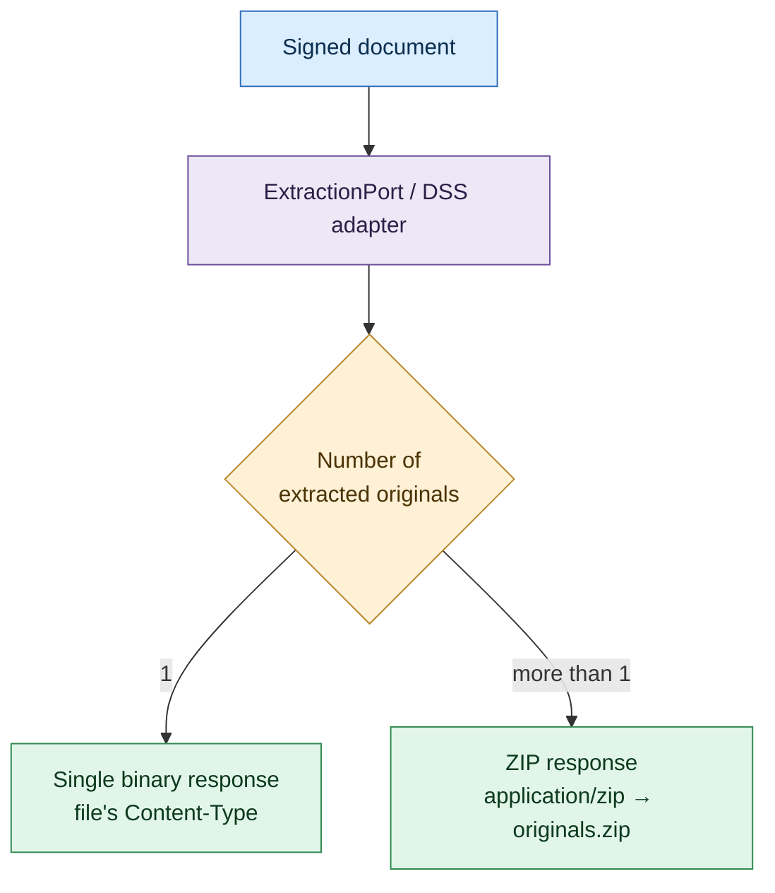

# 5. Original file extraction

← [5. Signature verification](05-signature-verification.md) · [Index](README.md) · → [7. Logging and audit](07-logging-audit.md)

Besides verifying the signature, the service can **extract the original content**
embedded in a signed document, for example the PDF inside a `.p7m` (CAdES) or
the files inside an **ASiC** container.

## 5.1 Endpoint

`POST /api/v1/extractions`: `multipart/form-data`, `file` part required.



## 5.2 Response behaviour

The DSS adapter locates the original documents and infers the signature format:

- **Single original** → the file is returned **directly** as binary, with
  `Content-Type` set to its MIME type and
  `Content-Disposition: attachment; filename="<name>"`.
- **Multiple originals** (typical of ASiC-E) → they are packed into a **ZIP**
  (`application/zip`), named `originals.zip`.

In both cases informational headers are present:

| Header | Meaning |
|--------|---------|
| `X-Signature-Format` | Detected signature format (e.g. `CAdES`, `ASiC-E`) |
| `X-Document-Count` | Number of extracted original documents |

## 5.3 Examples

Extract a single file (e.g. PDF inside a `.p7m`):

```bash
curl -sS -X POST http://localhost:8080/api/v1/extractions \
  -H "X-API-Key: $KEY" \
  -F 'file=@contract.pdf.p7m' \
  -D - -o contract.pdf
# Response headers:
#   X-Signature-Format: CAdES
#   X-Document-Count: 1
#   Content-Disposition: attachment; filename="contract.pdf"
```

Extract a multi-file container (ASiC-E):

```bash
curl -sS -X POST http://localhost:8080/api/v1/extractions \
  -H "X-API-Key: $KEY" \
  -F 'file=@package.asice' \
  -o originals.zip
# X-Document-Count: 3  →  originals.zip
```

## 5.4 Notes

- The endpoint simply requires an authenticated principal (any role).
- An unsigned or unrecognised document yields a `signature.parse-error` error
  (see error handling in [7. Logging and audit](07-logging-audit.md)).
- Extraction is a **stateless** operation: it creates no job and persists no
  content.

## 5.5 TSD extraction

The service supports extraction from **RFC 5544 TimeStampedData** (`.tsd`)
files, commonly produced by Italian PA tools (ArubaSign, GoSign, Namirial).

DSS 6.4 does not natively recognise the TSD format, so the extraction adapter
unwraps the TSD envelope via **Bouncy Castle** (`CMSTimeStampedData`) and
returns the inner content directly. The response carries
`X-Signature-Format: RFC5544_TSD`.

```bash
curl -sS -X POST http://localhost:8080/api/v1/extractions \
  -H "X-API-Key: $KEY" \
  -F 'file=@document.tsd' \
  -D - -o document.pdf
# X-Signature-Format: RFC5544_TSD
# X-Document-Count: 1
```

> **Note:** if the inner content is itself a signed CAdES `.p7m`, the raw
> `.p7m` bytes are returned, not the originals inside it. For full extraction
> from a TSD-wrapped signed document, extract in two steps: first the `.tsd`,
> then the resulting `.p7m`.
