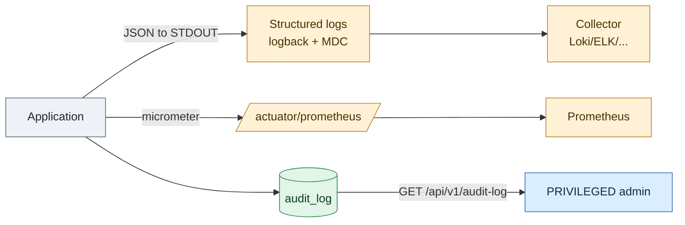
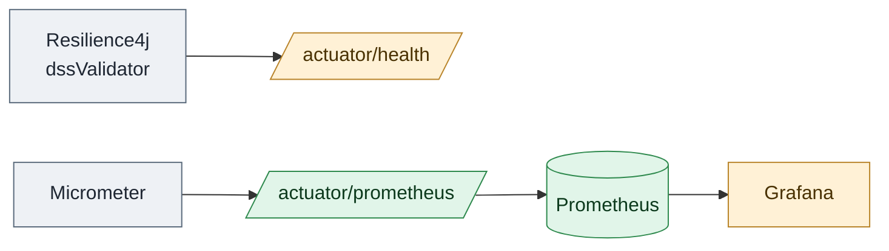

# 6. Logging and audit

← [6. File extraction](06-file-extraction.md) · [Index](README.md)

Service observability rests on three pillars: **structured application logs**,
**metrics** (Actuator/Prometheus) and a persistent **audit log** queryable via
API.



## 6.1 Application logs

Logs are emitted as **JSON** to STDOUT via Logback (`logback-spring.xml`,
logstash `LoggingEventCompositeJsonEncoder`). Each event includes timestamp,
level, thread, logger, message, stacktrace, the `app` field (application name)
and the **MDC** content.

Default levels (`application.yaml`):

| Logger | Level |
|--------|-------|
| root | `INFO` |
| `org.toresoft.signverify` | `INFO` |
| `eu.europa.esig` (DSS) | `WARN` |

### Per-request context (MDC)

`RequestContextFilter` populates the MDC on every request, so each log line is
correlatable:

| MDC key | Content |
|---------|---------|
| `requestId` | UUID generated per request |
| `clientIp` | remote IP address |
| `principalType` | `API_KEY` / `OAUTH_USER` / `SYSTEM` (if authenticated) |
| `principalId` | principal id (if authenticated) |

The MDC is **cleared** at the end of the request (`MDC.clear()`).

### Rotation

The app writes to STDOUT; **rotation** is delegated to the container runtime. In
`docker-compose.prod.yml` the `json-file` driver rotates at `max-size: 10m` with
`max-file: 3`.

## 6.2 Error handling (problem+json)

Application errors derive from `AppException` and are serialised as **RFC 9457**
`application/problem+json` by `GlobalExceptionHandler`. The `type` has the form
`urn:signverify:error:<code>`.

| Error code | HTTP | When |
|------------|------|------|
| `validation.invalid-input` | 400 | invalid input (bean validation, malformed JSON body, bad query param) |
| `auth.invalid-token` | 401 | missing, malformed, unknown, disabled, expired API key, or invalid JWT |
| `authz.forbidden` | 403 | insufficient role (e.g. `STANDARD` calling a `PRIVILEGED` endpoint) |
| `resource.not-found` | 404 | missing (or invisible) resource |
| `resource.conflict` | 409 | conflict (e.g. last privileged key) |
| `payload.too-large` | 413 | upload over limits |
| `signature.parse-error` | 422 | unsigned/unreadable document |
| `excessive-load.async-backpressure` | 429 | async job backpressure |
| `excessive-load.concurrency` | 503 | sync verification semaphore exhausted |
| `tsl.not-ready` | 503 | Trusted Lists not yet loaded |
| `dss.unavailable` | 503 | DSS circuit breaker open |
| `internal-error` | 500 | unexpected error |

> **Reserved, not currently emitted**: `validation.invalid-profile-overrides`,
> `auth.missing-credentials` and `media.unsupported` are declared error codes
> with no live call site today. A missing `X-API-Key`/`Authorization` header
> currently also surfaces as `auth.invalid-token`; an invalid `profileOverrides`
> value is currently swallowed into the generic `internal-error` (500) instead
> of a 400. This is a known gap, not yet fixed.

Every response shares the same envelope; only `type`, `status`, `title` and
`detail` change:

```json
{
  "type": "urn:signverify:error:resource.conflict",
  "title": "Conflict",
  "status": 409,
  "detail": "cannot remove last enabled privileged api key",
  "instance": "/api/v1/api-keys/3f1e..."
}
```

| Error code | Example `detail` |
|------------|-------------------|
| `validation.invalid-input` | `"size must be between 1 and 100"` |
| `auth.invalid-token` | `"invalid credentials"` |
| `authz.forbidden` | `"insufficient role"` |
| `resource.not-found` | `"api key not found"` |
| `resource.conflict` | `"cannot remove last enabled privileged api key"` |
| `payload.too-large` | `"max upload size exceeded"` |
| `signature.parse-error` | `"cannot parse signed document: ..."` |
| `excessive-load.async-backpressure` | `"global async backpressure"` or `"per-principal async backpressure"` |
| `excessive-load.concurrency` | `"verify concurrency limit reached"` |
| `tsl.not-ready` | `"tsl not ready"` |
| `dss.unavailable` | `"dss circuit breaker open: ..."` |
| `internal-error` | `"unexpected error"` |

> By default `server.error.include-message: never` and
> `include-stacktrace: never`: internal details do not leak into responses.

## 6.3 Audit log

There is an **`audit_log`** table and an admin-only read API. Record structure
(`AuditLog`):

| Field | Description |
|-------|-------------|
| `id` | UUID |
| `occurredAt` | event instant |
| `principalType` / `principalId` | actor (or `SYSTEM`) |
| `action` | action (string) |
| `targetType` / `targetId` | affected resource |
| `success` | boolean outcome |
| `details` | free-form JSON |
| `ipAddress` | caller IP |

### Querying

`GET /api/v1/audit-log`: **requires the `PRIVILEGED` role**. Returns the
shared pagination envelope (see [Conventions](README.md#pagination)). Available
filters:

| Parameter | Type |
|-----------|------|
| `principalId` | string |
| `action` | string |
| `from` / `to` | date-time |
| `targetType` / `targetId` | string |
| `success` | boolean |
| `page` / `size` | integer (default `0` / `50`) |

Results are sorted by `occurredAt` descending.

```bash
curl -sS "http://localhost:8080/api/v1/audit-log?action=verify&success=false&size=20" \
  -H "X-API-Key: $ADMIN_KEY"
```

```json
{
  "page": 0, "size": 20, "totalElements": 0, "totalPages": 0,
  "content": [ /* AuditLog[] */ ]
}
```

> **Current implementation status.** The `audit_log` table, the
> `AuditService` (write) component and the read API are present and indexed
> (`occurred_at`, `principal_id`, `action`). In the current code `AuditService`
> is **not yet wired** into the operational paths (verification, key management,
> TSL refresh), so the table may be empty: operational traceability is presently
> provided by the **structured logs** with MDC (§6.1). The persistent audit
> infrastructure exists and can be wired into those operations when needed.

## 6.4 Metrics

Exposed Actuator endpoints: `health`, `info`, `metrics`, `prometheus`.

- `GET /actuator/prometheus`: Prometheus-format metrics (Micrometer), public.
- The `dssValidator` circuit breaker (Resilience4j) publishes a health indicator
  and exposes state metrics (`CLOSED`/`OPEN`/`HALF_OPEN`), useful to monitor DSS
  validation availability.


