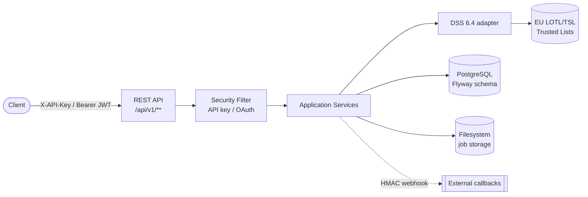

# Usage documentation — sign-verify

Operational guide to the **sign-verify** service: eIDAS digital signature
verification (PAdES / CAdES / XAdES / JAdES / ASiC) built on the **DSS 6.4**
library and the **EU Trusted Lists** (LOTL/TSL).

> 🇮🇹 Versione italiana: [`docs/it/README.md`](../it/README.md)
>
> 🐳 Docker image on the registry: **[`toresoft/sign-verify`](https://hub.docker.com/r/toresoft/sign-verify)** (Docker Hub)

## Table of contents

| # | Topic | File |
|---|-------|------|
| 1 | Build and configuration | [01-build-configuration.md](01-build-configuration.md) |
| 1b | Docker and configuration | [02-docker.md](02-docker.md) |
| 2 | Authentication (overview, API keys, OAuth) | [03-authentication.md](03-authentication.md) |
| 3 | Trusted Certificates API (TSL) | [04-trusted-certificates.md](04-trusted-certificates.md) |
| 4 | Signature verification: intro, profiles, sync, async | [05-signature-verification.md](05-signature-verification.md) |
| 5 | Original file extraction | [06-file-extraction.md](06-file-extraction.md) |
| 6 | Logging and audit | [07-logging-audit.md](07-logging-audit.md) |

## Component map

## Architecture at a glance

The service is a **Spring Boot 3.5 / Java 21** application with a **hexagonal**
(ports & adapters) architecture, enforced by ArchUnit. Root package
`org.toresoft.signverify`:

- `api/` — thin REST controllers + `GlobalExceptionHandler` (RFC 9457 `problem+json`)
- `application/` — services orchestrating use cases
- `domain/` — entities, enums, ports (interfaces), `AppException`
- `adapter/` — port implementations (DSS, crypto, callback, storage)
- `persistence/` — Spring Data JPA repositories
- `security/` — API-key filter, OAuth converter, bootstrap key generator
- `config/` — Security, DSS, metrics, scheduler, TSL configuration

The DB schema is owned by **Flyway** (`src/main/resources/db/migration`);
Hibernate runs with `ddl-auto: validate`.
