# 1. Compilazione e configurazione

← [0. Glossario](00-glossario.md) · [Indice](README.md) · → [2. Docker](02-docker.md)

## 1.1 Prerequisiti

| Requisito | Versione | Note |
|-----------|----------|------|
| JDK | **21** | `maven.compiler.source`/`target` = 21 nel `pom.xml` |
| Maven | 3.9+ | nessun wrapper committato; usare un `mvn` di sistema |
| PostgreSQL | 16 (runtime) | in test/dev si usa H2 in memoria |
| Docker | opzionale | per i test di integrazione (Testcontainers) e per il deploy |

La toolchain locale è fornita via **SDKMAN** (`mvn`/`java` sotto `~/.sdkman`).
Se `mvn` non è nel `PATH`:

```bash
source ~/.sdkman/bin/sdkman-init.sh
```

## 1.2 Build

```bash
# Compilazione
mvn compile

# Test unitari + di integrazione (Postgres via Testcontainers per gli IT)
mvn test

# Una singola classe / un singolo metodo di test
mvn test -Dtest=DssValidatorAdapterTest
mvn test -Dtest=ApiKeyServiceTest#create

# Verify completo (Failsafe IT + Spotless check + report JaCoCo)
mvn verify

# Formattazione del codice (Google Java Format)
mvn spotless:apply

# Packaging del jar
mvn package
```

> **Spotless** (Google Java Format) è applicato in `verify`. Eseguire sempre
> `mvn spotless:apply` prima di committare.

### Pipeline di build

```mermaid
flowchart LR
    A[openapi.yaml] -->|OpenAPI Generator| B[Interfacce api.spi\n+ DTO api.dto]
    B --> C[mvn compile]
    C --> D[Unit test]
    D --> E[Failsafe IT\nTestcontainers Postgres]
    E --> F[Spotless check]
    F --> G[JaCoCo report]
    G --> H[sign-verify-2.jar]

    classDef source fill:#dbeeff,stroke:#2f6fbb,color:#0b2e4f
    classDef step fill:#eef1f5,stroke:#5b6b7c,color:#1f2733
    classDef artifact fill:#e1f5e9,stroke:#2f8a4e,color:#0d3a1d
    class A source
    class B,C,D,E,F,G step
    class H artifact
```



L'API è **design-first**: il contratto vive in
`src/main/resources/openapi/openapi.yaml` e il plugin **OpenAPI Generator**
produce interfacce (`api.spi`) e DTO (`api.dto`). `OpenApiContractIT` fa da
guardiano del contratto.

## 1.3 Profili Spring

Il servizio carica `application.yaml` (default) più un overlay per profilo:

| Profilo | File | Scopo |
|---------|------|-------|
| _(nessuno)_ | `application.yaml` | Default produzione: H2 in memoria se `SPRING_DATASOURCE_URL` non è impostato, OAuth **abilitato** |
| `dev` | `application-dev.yaml` | Sviluppo locale: OAuth **disabilitato**, master-key di test, refresh TSL **saltato** |
| `docker` | `application-docker.yaml` | Stack in container: OAuth disabilitato, refresh TSL saltato, datasource da `SPRING_DATASOURCE_*` |

Avvio locale con profilo `dev`:

```bash
mvn spring-boot:run -Dspring-boot.run.profiles=dev
```

## 1.4 Parametri di configurazione

Tutti i parametri sono sovrascrivibili via variabili d'ambiente (notazione
`${VAR:default}` in YAML). Le sezioni principali sotto la chiave `app:`.

### Sicurezza (`app.security`)

| Chiave | Env | Default | Descrizione |
|--------|-----|---------|-------------|
| `oauth.enabled` | `APP_SECURITY_OAUTH_ENABLED` | `true` | Abilita il resource server JWT |
| `oauth.role-claim` | `APP_SECURITY_OAUTH_ROLE_CLAIM` | `roles` | Claim JWT da cui leggere i ruoli |
| `oauth.privileged-values` | `APP_SECURITY_OAUTH_PRIVILEGED_VALUES` | `admin,privileged` | Valori del claim che concedono `PRIVILEGED` |
| `bootstrap-key-file` | `APP_SECURITY_BOOTSTRAP_KEY_FILE` | `/var/lib/sign-verify/bootstrap-api-key.txt` | File dove viene scritta la chiave di bootstrap |
| `master-key` | `APP_SECRET_MASTER_KEY` | _(vuoto)_ | Chiave base64 a 256 bit per cifrare i segreti a riposo |

Issuer JWT (resource server):
`spring.security.oauth2.resourceserver.jwt.issuer-uri` ← `APP_SECURITY_OAUTH_ISSUER_URI`.

### Storage e DSS

| Chiave | Env | Default |
|--------|-----|---------|
| `storage.jobs-dir` | `APP_STORAGE_JOBS_DIR` | `/var/lib/sign-verify/jobs` |
| `dss.cache-dir` | `APP_DSS_CACHE_DIR` | `/var/lib/sign-verify/dss-cache` |
| `dss.online-mode` | — | `true` |
| `upload.max-size` | — | `50MB` (multipart: file 50MB / richiesta 60MB) |

### Trusted Lists (`app.tsl`)

| Chiave | Default | Descrizione |
|--------|---------|-------------|
| `sources[0].url` | `https://ec.europa.eu/tools/lotl/eu-lotl.xml` | EU LOTL |
| `sources[0].pivot-support` | `true` | Supporto ai pivot LOTL |
| `sources[0].oj-keystore-path` | `classpath:keystore/oj-keystore.p12` | Keystore con i certificati OJ |
| `refresh.cron` | `0 0 2 * * *` | Refresh giornaliero alle 02:00 |
| `refresh.timezone` | `Europe/Rome` | |
| `refresh.startup-mode` | `BACKGROUND` | `BACKGROUND` / `SKIP` |

La password del keystore OJ va in `APP_OJ_KEYSTORE_PASSWORD`.

### Verifica sincrona / asincrona

| Chiave | Default | Descrizione |
|--------|---------|-------------|
| `verify.max-concurrent` | `8` | Verifiche sincrone simultanee (semaforo) |
| `async.workers` | `4` | Numero di worker di validazione |
| `async.worker.poll-interval` | `5s` | Intervallo di polling dei job |
| `async.max-pending-per-principal` | `50` | Backpressure per principal |
| `async.max-pending-global` | `500` | Backpressure globale |
| `async.job-ttl` | `7d` | TTL del job |
| `async.input-retention` | `1h` | Ritenzione del documento di input |
| `async.result-retention` | `30d` | Ritenzione del risultato |
| `async.cleanup.cron` | `0 30 3 * * *` | Pulizia giornaliera alle 03:30 |

### Callback / webhook (`app.callback`)

| Chiave | Default | Descrizione |
|--------|---------|-------------|
| `max-attempts` | `3` | Tentativi di consegna |
| `backoff` | `60s,300s,1800s` | Backoff esponenziale tra i tentativi |
| `success-statuses` | `200,201,202,204` | Stati HTTP considerati consegnati |
| `retryable-statuses` | `408,425,429,500,502,503,504` | Stati ritentabili |
| `timeout` | `15s` | Timeout della richiesta |
| `allowed-algorithms` | `HmacSHA256,HmacSHA512` | Algoritmi HMAC ammessi |
| `allow-http` | `false` | Se `false`, solo HTTPS |
| `block-private-networks` | `true` | Guardia anti-SSRF (vedi [05](05-verifica-firme.md)) |

### Database

```yaml
spring.datasource.url: ${SPRING_DATASOURCE_URL:jdbc:h2:mem:dev;...;MODE=PostgreSQL}
spring.datasource.username: ${SPRING_DATASOURCE_USERNAME:sa}
spring.datasource.password: ${SPRING_DATASOURCE_PASSWORD:}
```

Lo schema è gestito da **Flyway** (`db/migration/V*__*.sql`). Hibernate è in
`ddl-auto: validate`: **non** altera lo schema. Per modifiche allo schema,
aggiungere una nuova migrazione `V__*.sql`.

## 1.5 Variabili minime per la produzione

```bash
SPRING_PROFILES_ACTIVE=          # (vuoto → default; NON 'dev'/'docker')
SPRING_DATASOURCE_URL=jdbc:postgresql://db:5432/signverify
SPRING_DATASOURCE_USERNAME=signverify
SPRING_DATASOURCE_PASSWORD=********
APP_SECRET_MASTER_KEY=<base64 di 32 byte casuali>
APP_OJ_KEYSTORE_PASSWORD=<password keystore OJ>
# se si usa OAuth:
APP_SECURITY_OAUTH_ISSUER_URI=https://idp.example.org/realms/sign
```

Generazione di una master-key valida:

```bash
openssl rand -base64 32
```
