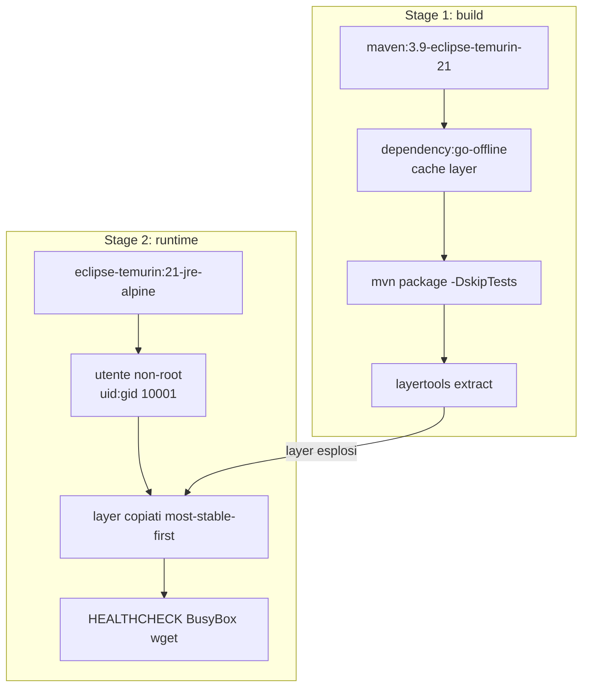
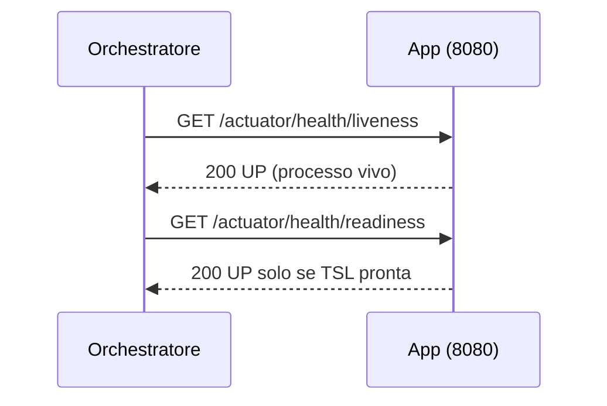
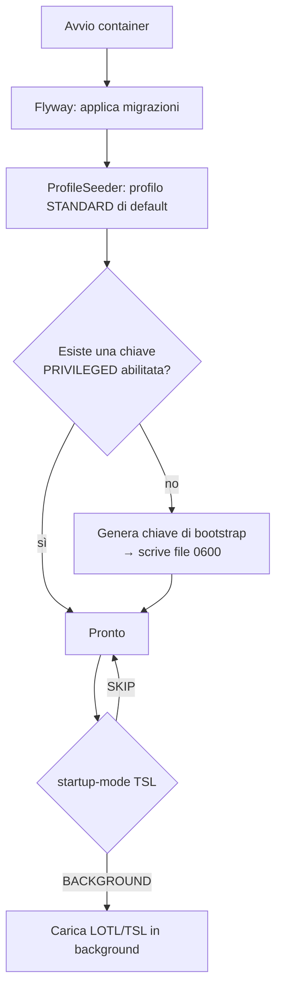

# 1b. Docker e configurazione

← [1. Build](01-build-configurazione.md) · [Indice](README.md) · → [3. Autenticazione](03-autenticazione.md)

Il servizio viene distribuito come immagine Docker
**`toresoft/sign-verify`** (Docker Hub). L'immagine è costruita con un
`Dockerfile` multi-stage e una runtime **Alpine** non-root e hardenizzata.

## 2.1 Anatomia dell'immagine



Caratteristiche di sicurezza del `Dockerfile`:

- **Runtime Alpine** (`eclipse-temurin:21-jre-alpine`): superficie d'attacco e
  numero di CVE molto inferiori rispetto a una base Ubuntu/glibc.
- **Utente non-root** `uid:gid = 10001:10001`, dichiarato in forma numerica così
  che gli orchestratori possano imporre `runAsNonRoot`.
- **HEALTHCHECK** via `wget` di BusyBox → nessun pacchetto extra installato.
- **Layered jar** (estratto con `layertools`): i layer più stabili
  (dipendenze) vengono prima, ottimizzando la cache.
- Avvio in **exec form** → l'app è PID 1 e riceve `SIGTERM` per lo shutdown
  graceful (`server.shutdown: graceful`).
- `JAVA_TOOL_OPTIONS=-XX:MaxRAMPercentage=75.0 -XX:+ExitOnOutOfMemoryError`;
  JDK 21 rispetta i limiti cgroup (`UseContainerSupport`).

L'immagine espone la porta **8080** e crea/possiede l'unica directory
scrivibile `/var/lib/sign-verify` (sottodirectory `dss-cache`, `jobs`).

## 2.2 Sviluppo locale: `docker-compose.yml`

Stack di sviluppo: servizio (build da sorgente) + PostgreSQL 16.

```bash
docker compose up --build

# La prima accensione scrive la chiave API di bootstrap nel volume svdata:
docker compose exec app cat /var/lib/sign-verify/bootstrap-api-key.txt
```

Configurazione applicata (profilo `docker`):

| Variabile | Valore |
|-----------|--------|
| `SPRING_PROFILES_ACTIVE` | `docker` |
| `SPRING_DATASOURCE_URL` | `jdbc:postgresql://postgres:5432/signverify` |
| `SPRING_DATASOURCE_USERNAME` / `PASSWORD` | `signverify` / `signverify` |

> Nel profilo `docker` OAuth è disabilitato e il refresh delle TSL è **saltato**
> (`startup-mode: SKIP`) per consentire lo sviluppo offline. Il master-key è un
> valore di test: **non usarlo in produzione**.

Volumi: `pgdata` (dati Postgres) e `svdata` (`/var/lib/sign-verify`).

## 2.3 Produzione: `docker-compose.prod.yml`

Esegue l'immagine pubblicata e si aspetta un **PostgreSQL esterno gestito**.

```bash
# Impostare le variabili in un file .env (vedi .env.example), poi:
docker compose -f docker-compose.prod.yml up -d
```

Hardening applicato al container:

| Direttiva | Valore | Effetto |
|-----------|--------|---------|
| `read_only` | `true` | filesystem root immutabile |
| `tmpfs` | `/tmp:size=128m,mode=1777` | spazio di scratch per i multipart |
| `security_opt` | `no-new-privileges:true` | blocca l'escalation di privilegi |
| `cap_drop` | `ALL` | rimuove tutte le capability Linux |
| `volumes` | `svdata:/var/lib/sign-verify` | unico path persistente scrivibile |
| `deploy.resources.limits` | `memory 1g`, `cpus 2.0` | limiti di risorse |
| `logging` | `json-file`, `max-size 10m`, `max-file 3` | rotazione log container |

Variabili d'ambiente richieste in produzione:

```bash
# Database (esterno/gestito)
SPRING_DATASOURCE_URL=jdbc:postgresql://db.example.org:5432/signverify
SPRING_DATASOURCE_USERNAME=signverify
SPRING_DATASOURCE_PASSWORD=********
# Segreti / auth
APP_SECRET_MASTER_KEY=<base64 32 byte>
APP_SECURITY_OAUTH_ISSUER_URI=https://idp.example.org/...   # se OAuth attivo
APP_OJ_KEYSTORE_PASSWORD=<password keystore OJ>
```

> Nota: il `compose.prod` non imposta `SPRING_PROFILES_ACTIVE`, quindi vale il
> profilo **default** (OAuth abilitato, refresh TSL in `BACKGROUND`).

## 2.4 Health e prontezza



- **Liveness** `/actuator/health/liveness` — usata dall'HEALTHCHECK
  dell'immagine di sviluppo.
- **Readiness** `/actuator/health/readiness` — usata dal `compose.prod`; tiene
  conto della prontezza delle Trusted Lists (`TslReadinessIndicator`).

Endpoint `actuator` esposti: `health`, `info`, `metrics`, `prometheus`.
Sono pubblici (senza autenticazione) solo `health/**`, `info`, `prometheus`.

## 2.5 Primo avvio



Al primo avvio, se non esiste alcuna chiave `PRIVILEGED` abilitata, il servizio
genera una **chiave API di bootstrap** e la scrive nel file indicato da
`APP_SECURITY_BOOTSTRAP_KEY_FILE` (permessi `0600`). Recuperarla, usarla per
creare le proprie chiavi, quindi **eliminare il file**. Dettagli in
[3. Autenticazione](03-autenticazione.md).
