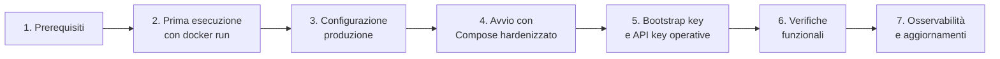

# Guida operativa passo-passo — immagine Docker

← [2. Docker e configurazione](02-docker.md) · [Indice](README.md)

Questa guida accompagna dall'installazione fino alla messa in produzione
dell'immagine **`toresoft/sign-verify`** distribuita su Docker Hub. Non è
necessario clonare il repository: tutto parte dall'immagine pre-costruita.

Per i dettagli tecnici dell'immagine (anatomia, hardening, profili Spring) si
rimanda alla [documentazione di riferimento](02-docker.md).

---

## Panoramica del percorso



---

## Passo 1 — Prerequisiti

| Requisito | Versione | Note |
|-----------|----------|------|
| Docker Engine | 20.10+ | Compose V2 incluso |
| PostgreSQL | 16 (gestito) | Istanza esterna reachabile dal container |
| `openssl` | qualunque | Per generare la master key |
| `curl` | qualunque | Per verificare l'API e recuperare la bootstrap key |

Verificare Docker:

```bash
docker compose version
# Docker Compose version v2.XX.X
```

Verificare che PostgreSQL sia raggiungibile:

```bash
psql -h db.example.internal -U signverify -d signverify -c 'SELECT 1'
```

> L'immagine non include un database: è necessario un **PostgreSQL esterno**
> (gestito, in cloud o on-premise). Lo stack di sviluppo con il DB interno
> esiste solo nel repository sorgente.

---

## Passo 2 — Prima esecuzione con `docker run`

Per un rapido smoke test, avviare l'immagine direttamente con `docker run`.
Questa modalità **non** è adatta alla produzione (manca l'hardening), ma
consente di verificare che l'immagine funzioni correttamente.

### 2.1 Pull dell'immagine

```bash
docker pull toresoft/sign-verify:latest
```

Tag disponibili:

| Tag | Significato |
|-----|-------------|
| `latest` | Ultima build dal branch di default |
| `<versione>` | Versione rilasciata (es. `0.9.21`) |
| `<short-sha>` | Build di un commit specifico |

### 2.2 Avviare il container (test rapido)

```bash
docker run -d --name sign-verify \
  -p 8080:8080 \
  -e SPRING_DATASOURCE_URL=jdbc:postgresql://db.example.internal:5432/signverify \
  -e SPRING_DATASOURCE_USERNAME=signverify \
  -e SPRING_DATASOURCE_PASSWORD=secret \
  -e APP_SECRET_MASTER_KEY="$(openssl rand -base64 32)" \
  -e APP_SECURITY_OAUTH_ENABLED=false \
  -v svdata:/var/lib/sign-verify \
  toresoft/sign-verify:latest
```

> Se non si ha un database PostgreSQL esterno immediatamente disponibile,
> è possibile usare un'istanza temporanea Docker:
>
> ```bash
> docker run -d --name sv-postgres \
>   -e POSTGRES_DB=signverify \
>   -e POSTGRES_USER=signverify \
>   -e POSTGRES_PASSWORD=signverify \
>   -p 5432:5432 \
>   postgres:16-alpine
> ```
>
> A questo punto usare `SPRING_DATASOURCE_URL=jdbc:postgresql://sv-postgres:5432/signverify`
> (su host Linux con Docker network) oppure puntare a `localhost:5432`.

### 2.3 Verificare che il servizio risponda

```bash
# Liveness (il processo è vivo)
curl -sS http://localhost:8080/actuator/health/liveness | jq .
# → { "status": "UP" }

# Readiness (il servizio è pronto, incluse le Trusted Lists)
curl -sS http://localhost:8080/actuator/health/readiness | jq .
# → { "status": "UP" }  (può impiegare alcuni minuti al primo avvio)
```

### 2.4 Fermare e rimuovere il container di test

```bash
docker stop sign-verify && docker rm sign-verify
docker volume rm svdata   # opzionale: cancella i dati persistenti del test
```

---

## Passo 3 — Configurazione per la produzione

Per la produzione si usa `docker-compose.prod.yml`, un file Compose con
hardening completo. Vedere sotto per il contenuto completo del file (non serve
clonare il repository).

### 3.1 Creare la directory di lavoro

```bash
mkdir sign-verify && cd sign-verify
```

### 3.2 Creare il file `.env`

Generare la master key:

```bash
openssl rand -base64 32
# es. output: "dG9yZXNvZnQtc2lnbi12ZXJpZnktMjU2Yml0LWtleQ=="
```

Creare `.env` con i valori reali:

```bash
cat > .env << 'EOF'
# === Versione immagine (fissare per deploy riproducibili) ===
SIGN_VERIFY_VERSION=0.9.21

# === Database esterno (obbligatorio) ===
SPRING_DATASOURCE_URL=jdbc:postgresql://db.example.internal:5432/signverify
SPRING_DATASOURCE_USERNAME=signverify
SPRING_DATASOURCE_PASSWORD=<password-sicura>

# === Segreti (obbligatori) ===
# Master key — base64 di 32 byte casuali (generare con: openssl rand -base64 32)
APP_SECRET_MASTER_KEY=<incollare-loutput-di-openssl-rand>

# === Autenticazione OAuth (condizionale) ===
# Se OAuth è abilitato (default in produzione), indicare l'issuer OIDC:
APP_SECURITY_OAUTH_ISSUER_URI=https://idp.example.com/realms/signverify
# Per disabilitare OAuth (es. per test): APP_SECURITY_OAUTH_ENABLED=false

# === Keystore OJ (condizionale) ===
# Password del keystore bundled nell'immagine (per la LOTL EU)
APP_OJ_KEYSTORE_PASSWORD=<password-keystore-oj>

# === Sentry (opzionale — lasciare SENTRY_DSN vuoto per disabilitare) ===
SENTRY_DSN=
SENTRY_ENVIRONMENT=production
SENTRY_RELEASE=                 # vuoto → l'SDK autodetect; oppure il git tag
SENTRY_BREADCRUMB_LEVEL=INFO    # INFO / WARN / ERROR
EOF
```

> ⚠️ **Non committare mai `.env`** nel repository — È già in `.gitignore` se si
> usa il repo, e in ogni caso va protetto come segreto.

### 3.3 Creare `docker-compose.prod.yml`

Salvare il seguente file come `docker-compose.prod.yml` nella directory di
lavoro:

```yaml
# Produzione — immagine Docker Hub con hardening completo.
# Richiede un PostgreSQL ESTERNO gestito (variabili in .env).
#
#   docker compose -f docker-compose.prod.yml up -d
name: sign-verify

services:
  app:
    # Fissare la versione in .env per deploy riproducibili e rollback univoci.
    image: toresoft/sign-verify:${SIGN_VERIFY_VERSION:-latest}
    restart: unless-stopped
    environment:
      # --- Database (esterno/gestito) ---
      SPRING_DATASOURCE_URL: ${SPRING_DATASOURCE_URL}
      SPRING_DATASOURCE_USERNAME: ${SPRING_DATASOURCE_USERNAME}
      SPRING_DATASOURCE_PASSWORD: ${SPRING_DATASOURCE_PASSWORD}
      # --- Segreti / auth ---
      APP_SECRET_MASTER_KEY: ${APP_SECRET_MASTER_KEY}
      APP_SECURITY_OAUTH_ISSUER_URI: ${APP_SECURITY_OAUTH_ISSUER_URI}
      APP_OJ_KEYSTORE_PASSWORD: ${APP_OJ_KEYSTORE_PASSWORD}
      # --- Osservabilità (opzionale) ---
      SENTRY_DSN: ${SENTRY_DSN:-}
      SENTRY_ENVIRONMENT: ${SENTRY_ENVIRONMENT:-production}
      SENTRY_RELEASE: ${SENTRY_RELEASE:-}
    ports:
      - "8080:8080"
    # --- Hardening ---
    read_only: true                 # filesystem root immutabile
    tmpfs:
      - /tmp:size=128m,mode=1777    # spazio di scratch per multipart
    security_opt:
      - no-new-privileges:true       # blocca escalation di privilegi (setuid)
    cap_drop:
      - ALL                          # rimuove tutte le capability Linux
    volumes:
      - svdata:/var/lib/sign-verify  # unico path persistente scrivibile
    deploy:
      resources:
        limits:
          memory: 1g
          cpus: "2.0"
    healthcheck:
      test: ["CMD", "wget", "-q", "-O", "/dev/null",
             "http://localhost:8080/actuator/health/readiness"]
      interval: 30s
      timeout: 5s
      retries: 3
      start_period: 120s
    logging:
      driver: json-file
      options:
        max-size: "10m"
        max-file: "3"

volumes:
  svdata:
```

### 3.4 Hardening del container — riepilogo

Il file Compose sopra applica:

| Direttiva | Valore | Effetto |
|-----------|--------|---------|
| `read_only` | `true` | Filesystem root immutabile |
| `tmpfs` | `/tmp:size=128m,mode=1777` | Spazio di scratch per multipart |
| `security_opt` | `no-new-privileges:true` | Blocca l'escalation di privilegi |
| `cap_drop` | `ALL` | Rimuove tutte le capability Linux |
| `volumes` | `svdata:/var/lib/sign-verify` | Unico path persistente scrivibile |
| `deploy.resources.limits` | 1 GB RAM, 2 CPU | Limiti di risorsa |
| `logging` | `json-file`, 10 MB × 3 | Rotazione log container |
| `healthcheck` | `wget` su `/readiness` | Controllo di salute periodico |

Il container gira come utente non-root (`uid:gid 10001:10001`).

---

## Passo 4 — Avvio con Compose hardenizzato

### 4.1 Avviare il servizio

```bash
docker compose -f docker-compose.prod.yml up -d
```

Docker pullerà automaticamente l'immagine la prima volta (e ogni volta che
`SIGN_VERIFY_VERSION` cambia).

### 4.2 Verificare che il container sia partito

```bash
docker compose -f docker-compose.prod.yml ps
docker compose -f docker-compose.prod.yml logs --tail=50 app
```

### 4.3 Verificare la readiness

```bash
curl -sS http://localhost:8080/actuator/health/readiness | jq .
# → { "status": "UP", "components": { "readinessState": { "status": "UP" } } }
```

Al primo avvio il download delle Trusted Lists europee può impiegare alcuni
minuti. La **liveness** è subito `UP` (il processo è vivo), ma la **readiness**
diventa `UP` solo al termine del caricamento.

### 4.4 Routing con reverse proxy

L'immagine non contiene un reverse proxy. In produzione posizionare un load
balancer / reverse proxy (Nginx, Traefik, HAProxy) davanti al container:

```
Internet → [Reverse proxy :443 → localhost:8080] → Container
```

Configurazioni consigliate per il proxy:

- **Terminazione TLS** sul reverse proxy.
- Header `X-Forwarded-Proto: https` affinché Spring generi URL corretti.
- Time-out sufficientemente lunghi per le richieste di verifica asincrona
  (i job sono processati in background, la risposta sincrona è immediata).
- Dimensione massima del body ≥ 60 MB (`client_max_body_size` in Nginx).

Se si espongono header di inoltro, aggiungere in `.env`:

```bash
SERVER_FORWARD_HEADERS_STRATEGY=native
```

---

## Passo 5 — Chiave di bootstrap e API key operative

Al primo avvio, se non esiste alcuna chiave `PRIVILEGED` abilitata, il servizio
genera una **chiave di bootstrap** e la scrive nel file
`/var/lib/sign-verify/bootstrap-api-key.txt` (permessi `0600`).

### 5.1 Recuperare la chiave di bootstrap

```bash
BOOTSTRAP_KEY=$(docker compose -f docker-compose.prod.yml exec -T app \
  cat /var/lib/sign-verify/bootstrap-api-key.txt)
echo "Chiave di bootstrap: $BOOTSTRAP_KEY"
```

### 5.2 Creare chiavi operative

La chiave di bootstrap serve solo per creare le chiavi operative. Creare almeno
una chiave `PRIVILEGED` e una `STANDARD`:

```bash
# Chiave amministrativa (PRIVILEGED)
curl -sS -X POST http://localhost:8080/api/v1/api-keys \
  -H "X-API-Key: $BOOTSTRAP_KEY" \
  -H "Content-Type: application/json" \
  -d '{"name":"admin-prod","role":"PRIVILEGED"}' | jq .

# Chiave per i client (STANDARD), con scadenza opzionale
curl -sS -X POST http://localhost:8080/api/v1/api-keys \
  -H "X-API-Key: $BOOTSTRAP_KEY" \
  -H "Content-Type: application/json" \
  -d '{"name":"ci-pipeline","role":"STANDARD","expiresAt":"2027-01-01T00:00:00Z"}' | jq .
```

La risposta `201` contiene `plaintextKey` — il valore in chiaro **viene restituito
una sola volta**. Conservarlo in modo sicuro (vault, secrets manager).

### 5.3 Eliminare il file di bootstrap

```bash
docker compose -f docker-compose.prod.yml exec app \
  rm /var/lib/sign-verify/bootstrap-api-key.txt
```

> Il servizio impedisce di disabilitare o eliminare l'**ultima** chiave
> `PRIVILEGED` abilitata, per evitare lock-out (errore 409).

Per approfondire: [Autenticazione](03-autenticazione.md).

---

## Passo 6 — Verifiche funzionali post-deploy

### 6.1 Verificare l'autenticazione

```bash
# Elenco chiavi (richiede PRIVILEGED)
curl -sS http://localhost:8080/api/v1/api-keys \
  -H "X-API-Key: $BOOTSTRAP_KEY" | jq .
```

### 6.2 Verificare la firma digitale (sincrona)

```bash
# Richiede una chiave con ruolo STANDARD o PRIVILEGED
curl -sS -X POST http://localhost:8080/api/v1/verifications \
  -H "X-API-Key: $API_KEY" \
  -F file=@documento.pdf.p7m \
  | jq .
```

### 6.3 Verificare le Trusted Lists

```bash
# Refresh manuale (richiede PRIVILEGED)
curl -sS -X POST http://localhost:8080/api/v1/tsl/refresh \
  -H "X-API-Key: $PRIVILEGED_KEY" | jq .

# Stato delle Trusted Lists
curl -sS http://localhost:8080/api/v1/tsl/status \
  -H "X-API-Key: $API_KEY" | jq .
```

### 6.4 Verificare Swagger UI

Aprire nel browser: `http://localhost:8080/swagger-ui/index.html`

Le specifiche OpenAPI sono disponibili a: `http://localhost:8080/v3/api-docs`

---

## Passo 7 — Osservabilità e manutenzione

### 7.1 Endpoint Actuator

| Endpoint | Autenticazione | Scopo |
|----------|---------------|-------|
| `/actuator/health/liveness` | nessuna | Il processo è vivo (Kubernetes `livenessProbe`) |
| `/actuator/health/readiness` | nessuna | Il servizio è pronto anche con le TSL caricate (`readinessProbe`) |
| `/actuator/info` | nessuna | Versione build e info Git |
| `/actuator/prometheus` | nessuna | Metriche Prometheus |

Gli altri endpoint (`metrics`, `env`, `beans`…) **non sono pubblici** e
richiedono autenticazione.

### 7.2 Controllare la salute del container

```bash
# Docker inspect health (formato leggibile)
docker inspect --format='{{json .State.Health}}' sign-verify-app-1 | jq .

# Controllo rapido con curl
curl -sfS http://localhost:8080/actuator/health | jq .status
# "UP"

# Solo readiness (include lo stato TSL)
curl -sS http://localhost:8080/actuator/health/readiness | jq .
```

### 7.3 Log applicativi

I log vanno su stdout (JSON strukturato tramite Logback). Con Docker Compose:

```bash
# Ultimi 100 log del container
docker compose -f docker-compose.prod.yml logs --tail=100 app

# Seguire in tempo reale
docker compose -f docker-compose.prod.yml logs -f app
```

Il livello di log è controllabile a runtime tramite variabili d'ambiente
(es. `LOGGING_LEVEL_ORG_TORESOFT_SIGNVERIFY=DEBUG` in `.env`).

### 7.4 Sentry (opzionale)

Sentry è **completamente opzionale**: se `SENTRY_DSN` è vuoto (default), l'SDK
non invia nulla e l'overhead è zero.

Per attivare, aggiungere in `.env`:

```bash
SENTRY_DSN=https://xxxxx@o123456.ingest.sentry.io/7654321
SENTRY_ENVIRONMENT=production
SENTRY_RELEASE=0.9.21           # git tag per tracciamento release
SENTRY_BREADCRUMB_LEVEL=INFO    # min livello per i breadcrumb
```

Comportamento:
- Gli errori client (4xx, `AppException` con status < 500) sono **filtrati** —
  non creano issue Sentry.
- Gli errori server (5xx, `AppException` con status ≥ 500) sono segnalati.
- `send-default-pii: false` per conformità GDPR.
- I breadcrumb catturati sono al livello configurato in
  `SENTRY_BREADCRUMB_LEVEL`.

### 7.5 Aggiornamenti

**Fissare sempre il tag dell'immagine** in `.env`:

```bash
SIGN_VERIFY_VERSION=0.9.21   # Non usare :latest in produzione
```

Aggiornamento:

```bash
# 1. Modificare la versione in .env
sed -i 's/^SIGN_VERIFY_VERSION=.*/SIGN_VERIFY_VERSION=0.9.22/' .env

# 2. Pull della nuova immagine
docker compose -f docker-compose.prod.yml pull app

# 3. Riavviare con la nuova immagine
docker compose -f docker-compose.prod.yml up -d app
```

Rollback:

```bash
sed -i 's/^SIGN_VERIFY_VERSION=.*/SIGN_VERIFY_VERSION=0.9.21/' .env
docker compose -f docker-compose.prod.yml pull app
docker compose -f docker-compose.prod.yml up -d app
```

> Se una migrazione Flyway ha alterato lo schema in modo non retrocompatibile,
> il rollback potrebbe richiedere un ripristino del backup del database.
> Consultare le note di release prima di aggiornare.

### 7.6 Backup

| Dove | Contenuto | Strategia di backup |
|------|-----------|---------------------|
| PostgreSQL (esterno) | Schema, API key, job, audit | Backup gestito (es. `pg_dump`) |
| `/var/lib/sign-verify/` (`svdata`) | Cache DSS, file temporanei job | Volume Docker — dati ricreabili |

Il volume `svdata` contiene cache DSS e file temporanei dei job. Se cancellato,
il servizio lo ricrea: scarica nuovamente le TSL e svuota i job pending
(rispediti come `EXPIRED`).

---

## Troubleshooting

### Il container non parte o si riavvia a loop

```bash
docker compose -f docker-compose.prod.yml logs app | tail -100
```

Cause comuni:

| Sintomo | Causa probabile | Risoluzione |
|---------|-----------------|-------------|
| `ExitOnOutOfMemoryError` | Heap esaurito | Aumentare il limite `memory` in Compose o `-XX:MaxRAMPercentage` |
| `Flyway migration failed` | Schema incompatibile | Controllare la versione DB e le migrazioni |
| Password rifiutata dal DB | Credenziali errate | Verificare `SPRING_DATASOURCE_*` in `.env` |
| `APP_SECRET_MASTER_KEY` mancante | Variabile non impostata | Generare e impostare in `.env` |
| `APP_SECRET_MASTER_KEY` vuoto o non valido | Base64 non valido | Rigenerare con `openssl rand -base64 32` |

### La readiness rimane `DOWN`

Le Trusted Lists vengono scaricate in background al primo avvio. Se il container
non ha connettività verso `ec.europa.eu`, la readiness non passa mai a `UP`.

Verificare la connettività:

```bash
docker compose -f docker-compose.prod.yml exec app \
  wget -q -O- https://ec.europa.eu/tools/lotl/eu-lotl.xml | head -5
```

### Errore 401 su tutte le richieste

- Verificare che l'header sia `X-API-Key` (non `Authorization`).
- Verificare che la chiave non sia scaduta (`expiresAt`).
- Se OAuth è abilitato e l'issuer non è raggiungibile, tutte le richieste
  JWT falliscono; usare una API key valida come fallback.

### Pulire e ripartire da zero

```bash
docker compose -f docker-compose.prod.yml down -v   # cancella container e volumi
docker compose -f docker-compose.prod.yml up -d      # ricrea tutto
```

> ⚠️ `down -v` cancella il volume `svdata` locale (cache DSS e temp file), ma
> **non tocca il database PostgreSQL esterno**. I dati persistiti nel DB
> rimangono intatti.

---

## Variabili d'ambiente — riferimento rapido

### Obbligatorie in produzione

| Variabile | Descrizione | Esempio |
|-----------|-------------|---------|
| `SPRING_DATASOURCE_URL` | URL JDBC del database | `jdbc:postgresql://db:5432/signverify` |
| `SPRING_DATASOURCE_USERNAME` | Utente del database | `signverify` |
| `SPRING_DATASOURCE_PASSWORD` | Password del database | — |
| `APP_SECRET_MASTER_KEY` | Chiave di cifratura (base64 32 byte) | output di `openssl rand -base64 32` |

### Condizionali

| Variabile | Quando serve | Default |
|-----------|-------------|---------|
| `APP_SECURITY_OAUTH_ISSUER_URI` | Se OAuth è abilitato (default: sì) | vuoto |
| `APP_SECURITY_OAUTH_ENABLED` | Per disabilitare OAuth in produzione | `true` |
| `APP_OJ_KEYSTORE_PASSWORD` | Per scaricare le EU Trusted Lists | vuoto |

### Opzionali

| Variabile | Descrizione | Default |
|-----------|-------------|---------|
| `SIGN_VERIFY_VERSION` | Tag immagine Docker | `latest` |
| `SERVER_PORT` | Porta HTTP del container | `8080` |
| `SENTRY_DSN` | DSN Sentry (vuoto = disabilitato) | vuoto |
| `SENTRY_ENVIRONMENT` | Ambiente Sentry | `development` |
| `SENTRY_RELEASE` | Release Sentry (vuoto = autodetect) | vuoto |
| `SENTRY_BREADCRUMB_LEVEL` | Livello minimo breadcrumb (INFO/WARN/ERROR) | `INFO` |
| `APP_STORAGE_JOBS_DIR` | Directory file temporanei job | `/var/lib/sign-verify/jobs` |
| `APP_DSS_CACHE_DIR` | Directory cache DSS | `/var/lib/sign-verify/dss-cache` |

Per la lista completa dei parametri, vedi
[1. Compilazione e configurazione](01-build-configurazione.md).

---

## Checklist pre-produzione

Prima di esporre il servizio in produzione, verificare:

- [ ] `SIGN_VERIFY_VERSION` è fissato a un tag specifico (non `latest`)
- [ ] `.env` contiene password sicure e non è accessibile pubblicamente
- [ ] `APP_SECRET_MASTER_KEY` è stato generato con `openssl rand -base64 32`
- [ ] Il reverse proxy termina TLS e imposta `X-Forwarded-Proto: https`
- [ ] La chiave di bootstrap è stata usata per creare chiavi operative e poi eliminata
- [ ] La readiness passa `UP` (TSL scaricate)
- [ ] L'hardening del container è attivo (`read_only`, `cap_drop: ALL`, ecc.)
- [ ] `SENTRY_DSN` è impostato (o intenzionalmente lasciato vuoto)
- [ ] Il log level è appropriato per la produzione (default `INFO`)
- [ ] Il backup del database PostgreSQL è configurato
