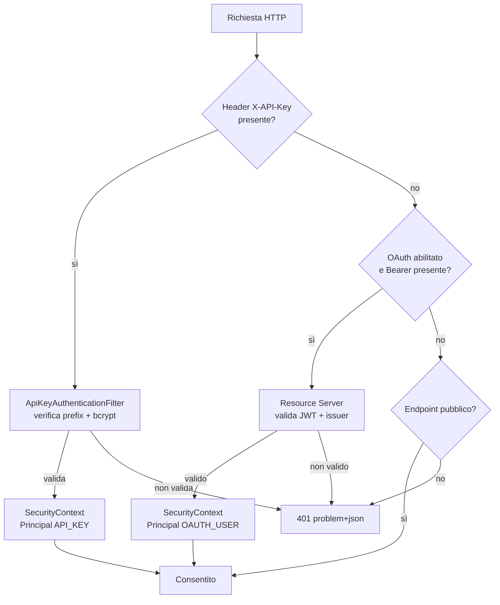
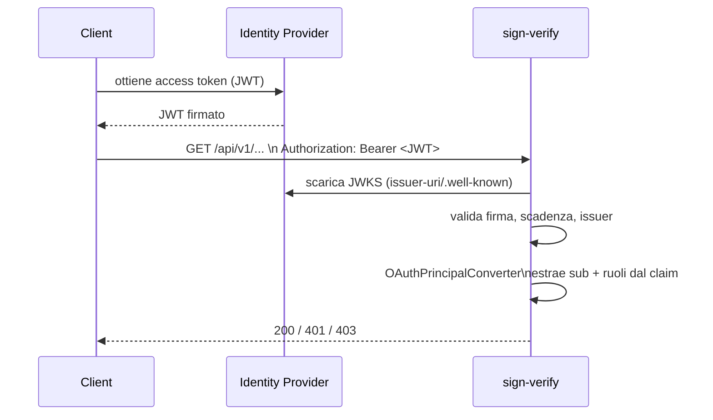

# 2. Autenticazione e autorizzazione

← [2. Docker](02-docker.md) · [Indice](README.md) · → [4. Trusted Certificates](04-trusted-certificates.md)

- [2.1 Panoramica](#21-panoramica)
- [2.2 Uso delle API key](#22-uso-delle-api-key)
- [2.3 Configurazione e uso di OAuth](#23-configurazione-e-uso-di-oauth)

## 2.1 Panoramica

Il servizio è **stateless** (nessuna sessione, CSRF disabilitato perché è una
API pura). Supporta **due meccanismi di autenticazione**, applicati nello stesso
filter chain:

1. **API key** — header `X-API-Key: sv_<prefix>_<body>` (sempre attiva).
2. **OAuth2 JWT** — header `Authorization: Bearer <jwt>` (attivabile con
   `app.security.oauth.enabled`).



### Endpoint pubblici (senza autenticazione)

- `/actuator/health/**`, `/actuator/prometheus`
- `/v3/api-docs/**`, `/swagger-ui/**`

`/actuator/info` (dettagli build + git) ora **richiede autenticazione**.
`/actuator/health` è pubblico ma agli anonimi mostra solo lo `status` aggregato;
i dettagli per-componente (conteggi TSL, coda job, DB, disco) sono visibili solo
a un chiamante autenticato **PRIVILEGED** (`show-details: when-authorized`).

Tutto il resto richiede autenticazione (`anyRequest().authenticated()`).
Un fallimento produce **401** con corpo `application/problem+json`.

```json
{
  "type": "about:blank",
  "title": "Unauthorized",
  "status": 401,
  "detail": "Invalid or missing API key",
  "instance": "/api/v1/verifications"
}
```

### Ruoli e Principal

Ogni richiesta autenticata produce un `Principal` con un ruolo:

| Ruolo | Authority Spring | Significato |
|-------|------------------|-------------|
| `PRIVILEGED` | `ROLE_PRIVILEGED` | Accesso amministrativo (gestione chiavi, audit, refresh TSL) |
| `STANDARD` | `ROLE_STANDARD` | Operazioni di verifica/estrazione |

Gli endpoint amministrativi sono protetti via `@EnableMethodSecurity` +
`@PreAuthorize("hasRole('PRIVILEGED')")`. Esempi: `/api/v1/audit-log`,
`POST /api/v1/tsl/refresh`.

Tipi di `Principal` (`PrincipalType`): `API_KEY`, `OAUTH_USER`, `SYSTEM`.

**403 Forbidden** (ruolo insufficiente):

```json
{
  "type": "about:blank",
  "title": "Forbidden",
  "status": 403,
  "detail": "Access denied: PRIVILEGED role required",
  "instance": "/api/v1/tsl/refresh"
}
```

## 2.2 Uso delle API key

### Formato

```
sv_<prefix>_<body>
   └─8 char─┘ └─ corpo casuale (base64url, 36 byte) ─┘
```

- Il **prefix** (8 caratteri) è indicizzato e **univoco**: serve a individuare
  la chiave senza scorrere tutta la tabella.
- Il **body** completo è verificato con **bcrypt**: nel database è memorizzato
  solo l'hash, mai il valore in chiaro.
- Una chiave può avere una **scadenza** (`expiresAt`) opzionale.

### Chiave di bootstrap (primo avvio)

Al primo avvio, se non esiste alcuna chiave `PRIVILEGED` **abilitata**, viene
generata una chiave di bootstrap (`name = bootstrap-<epoch>`, `role = PRIVILEGED`,
`bootstrap = true`) e scritta nel file `APP_SECURITY_BOOTSTRAP_KEY_FILE`
(permessi `0600`).

```bash
# In container compose di sviluppo:
docker compose exec app cat /var/lib/sign-verify/bootstrap-api-key.txt
```

Recuperare la chiave, creare le proprie chiavi operative, poi **eliminare il
file** di bootstrap.

### Invariante "ultima chiave privilegiata"

Non è possibile eliminare **né disabilitare** l'ultima chiave `PRIVILEGED`
abilitata: l'operazione fallisce con **409 Conflict**
(`cannot remove last enabled privileged api key`). Questo previene il lock-out.
Il controllo usa un lock pessimistico per evitare race condition (TOCTOU).

```json
{
  "type": "about:blank",
  "title": "Conflict",
  "status": 409,
  "detail": "Cannot remove the last enabled privileged API key",
  "instance": "/api/v1/api-keys/..."
}
```

### Gestione delle chiavi (API)

Tutti gli endpoint sotto `/api/v1/api-keys` richiedono ruolo `PRIVILEGED`.

| Metodo | Path | Operazione |
|--------|------|-----------|
| `GET` | `/api/v1/api-keys?page=&size=` | Elenco (paginato) |
| `POST` | `/api/v1/api-keys` | Crea una chiave |
| `PATCH` | `/api/v1/api-keys/{id}` | Abilita/disabilita (`{"enabled": false}`) |
| `DELETE` | `/api/v1/api-keys/{id}` | Elimina |

**Creazione:**

```bash
curl -sS -X POST http://localhost:8080/api/v1/api-keys \
  -H "X-API-Key: $BOOTSTRAP_KEY" \
  -H "Content-Type: application/json" \
  -d '{"name":"ci-pipeline","role":"STANDARD","expiresAt":"2027-01-01T00:00:00Z"}'
```

Risposta `201` — il valore in chiaro `plaintextKey` è restituito **una sola
volta**:

```json
{
  "id": "…", "name": "ci-pipeline", "keyPrefix": "Ab3xY9_z",
  "role": "STANDARD", "enabled": true, "bootstrap": false,
  "createdAt": "…", "expiresAt": "2027-01-01T00:00:00Z",
  "plaintextKey": "sv_Ab3xY9_z_…"
}
```

Campi di `ApiKeyCreateRequest`: `name` (1–120 char, univoco), `role`
(`PRIVILEGED`/`STANDARD`), `expiresAt` (opzionale).

### Uso di una chiave in una richiesta

```bash
curl -sS -X POST http://localhost:8080/api/v1/verifications \
  -H "X-API-Key: sv_Ab3xY9_z_…" \
  -F file=@documento.pdf.p7m
```

Il filtro rifiuta la chiave (401, `auth.invalid-token`) se: formato non valido,
prefix sconosciuto, chiave disabilitata, chiave scaduta, o hash non
corrispondente.

## 2.3 Configurazione e uso di OAuth

> ✅ OAuth2 (resource server JWT) è **implementato**. È controllato dal flag
> `app.security.oauth.enabled` (default `true` nel profilo di produzione,
> `false` nei profili `dev`/`docker`).

### Come funziona

Quando abilitato, il servizio agisce da **OAuth2 Resource Server**: valida i JWT
in ingresso contro l'**issuer** configurato e ne deriva il `Principal`.



### Configurazione

| Parametro | Env | Default | Descrizione |
|-----------|-----|---------|-------------|
| `app.security.oauth.enabled` | `APP_SECURITY_OAUTH_ENABLED` | `true` | Attiva il resource server |
| `spring…jwt.issuer-uri` | `APP_SECURITY_OAUTH_ISSUER_URI` | _(vuoto)_ | URI dell'issuer (per scoprire JWKS/metadata) |
| `app.security.oauth.role-claim` | `APP_SECURITY_OAUTH_ROLE_CLAIM` | `roles` | Claim del JWT contenente i ruoli |
| `app.security.oauth.privileged-values` | `APP_SECURITY_OAUTH_PRIVILEGED_VALUES` | `admin,privileged` | Valori del claim che concedono `PRIVILEGED` |

Esempio (Keycloak/generico OIDC):

```bash
APP_SECURITY_OAUTH_ENABLED=true
APP_SECURITY_OAUTH_ISSUER_URI=https://idp.example.org/realms/sign
APP_SECURITY_OAUTH_ROLE_CLAIM=roles
APP_SECURITY_OAUTH_PRIVILEGED_VALUES=admin,sign-admin
```

### Mappatura del Principal dal JWT

`OAuthPrincipalConverter`:

- **id** del principal = `sub` del token.
- **displayName** = claim `preferred_username` (fallback su `sub`).
- **ruolo** = `PRIVILEGED` se il claim `role-claim` contiene almeno uno dei
  `privileged-values`, altrimenti `STANDARD`.
- Il claim dei ruoli può essere una **lista** (es. `["admin","user"]`) oppure
  una **stringa** separata da spazi/virgole (es. `"admin user"`).

### Uso

```bash
curl -sS -X POST http://localhost:8080/api/v1/verifications \
  -H "Authorization: Bearer eyJhbGciOi…" \
  -F file=@documento.pdf
```

### API key e OAuth insieme

Entrambi i meccanismi coesistono. Il filtro API key è valutato **prima** della
catena OAuth: se è presente un `X-API-Key` valido, il principal è di tipo
`API_KEY`; altrimenti, se OAuth è abilitato e arriva un Bearer valido, il
principal è `OAUTH_USER`. Le verifiche di ruolo (`PRIVILEGED`/`STANDARD`)
funzionano in modo identico per entrambi.
