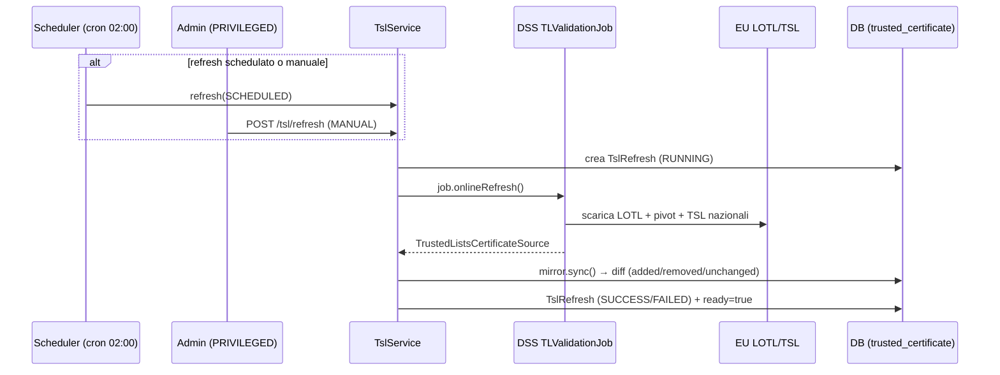

# 3. API Trusted Certificates (TSL)

← [3. Autenticazione](03-autenticazione.md) · [Indice](README.md) · → [5. Verifica firme](05-verifica-firme.md)

La fiducia nei certificati si basa sulle **EU Trusted Lists**: il servizio carica
la **LOTL** (List of the Lists) europea e le TSL nazionali tramite la libreria
DSS, e ne **specchia** (mirror) i certificati di ancoraggio nel proprio database
per renderli interrogabili via API.

## 3.1 Modello di refresh



- **Schedulato**: cron `0 0 2 * * *` (timezone `Europe/Rome`).
- **Avvio**: `app.tsl.refresh.startup-mode` = `BACKGROUND` (carica all'avvio,
  senza bloccare) o `SKIP` (per dev/offline).
- **Manuale**: `POST /api/v1/tsl/refresh` (solo `PRIVILEGED`).

Ogni refresh registra un record `TslRefresh` con esito e differenziale
(certificati aggiunti / rimossi / invariati). I certificati non più presenti
nelle liste non vengono cancellati ma **marcati come rimossi** (`removedAt`):
restano consultabili con `includeRemoved=true`.

## 3.2 Stato della TSL

`GET /api/v1/tsl/status` — pubblico per gli utenti autenticati.

```bash
curl -sS http://localhost:8080/api/v1/tsl/status -H "X-API-Key: $KEY"
```

```json
{
  "lastRefresh": {
    "id": "…", "trigger": "SCHEDULED",
    "startedAt": "…", "completedAt": "…", "status": "SUCCESS",
    "certificatesAdded": 12, "certificatesRemoved": 3, "certificatesUnchanged": 240
  },
  "currentCertificateCount": 252,
  "ready": true
}
```

Il campo `ready` riflette se le Trusted Lists sono state caricate con successo
almeno una volta; alimenta anche `/actuator/health/readiness`.

## 3.3 Forzare un refresh

`POST /api/v1/tsl/refresh` — **richiede `PRIVILEGED`**.

```bash
curl -sS -X POST http://localhost:8080/api/v1/tsl/refresh -H "X-API-Key: $ADMIN_KEY"
```

```json
{ "refreshId": "…", "status": "SUCCESS" }
```

## 3.4 Elenco dei certificati di fiducia

`GET /api/v1/tsl/certificates` — supporta numerosi filtri e la paginazione.

| Parametro | Tipo | Descrizione |
|-----------|------|-------------|
| `ski` | string | Subject Key Identifier (match esatto) |
| `aki` | string | Authority Key Identifier (match esatto) |
| `subjectCn` / `subjectDn` | string | Subject CN/DN (match parziale, case-insensitive) |
| `issuerCn` / `issuerDn` | string | Issuer CN/DN (match parziale) |
| `country` | string | Codice paese (match esatto) |
| `tspName` | string | Nome del Trust Service Provider (match parziale) |
| `tspServiceType` | string | Tipo di servizio TSP (match esatto) |
| `tspServiceStatus` | string | Stato del servizio TSP (match esatto) |
| `serialNumber` | string | Numero di serie (match esatto) |
| `validAt` | date-time | Solo certificati validi a quella data |
| `includeRemoved` | boolean | Includi i certificati rimossi (default `false`) |
| `page` / `size` | integer | Paginazione (default `0` / `50`) |

```bash
curl -sS "http://localhost:8080/api/v1/tsl/certificates?country=IT&tspName=Aruba&size=20" \
  -H "X-API-Key: $KEY"
```

Ogni elemento contiene (`certToMap`): `id`, `ski`, `aki`, `subjectDn`,
`subjectCn`, `issuerDn`, `issuerCn`, `serialNumber`, `country`, `tspName`,
`tspServiceType`, `tspServiceStatus`, `validFrom`, `validTo`, `lastSeenAt`,
`removedAt`, `certificateDerB64` (certificato DER in base64), `tslUrl`.

## 3.5 Dettaglio di un certificato

`GET /api/v1/tsl/certificates/{id}` — restituisce lo stesso oggetto del
dettaglio sopra per il certificato con quell'`id`.

```bash
curl -sS http://localhost:8080/api/v1/tsl/certificates/<uuid> -H "X-API-Key: $KEY"
```

## 3.6 Riepilogo permessi

| Endpoint | Ruolo richiesto |
|----------|-----------------|
| `GET /api/v1/tsl/status` | autenticato |
| `GET /api/v1/tsl/certificates` | autenticato |
| `GET /api/v1/tsl/certificates/{id}` | autenticato |
| `POST /api/v1/tsl/refresh` | **PRIVILEGED** |

## 3.7 OJ keystore (ancora di fiducia della LOTL)

Per validare la **firma della LOTL**, DSS ha bisogno dei certificati di firma
**annunciati nella Gazzetta Ufficiale UE (Official Journal, OJ)**. Questi
certificati sono caricati da un keystore PKCS#12 configurato in
`application.yaml`:

```yaml
app:
  tsl:
    sources:
      - id: eu-lotl
        type: LOTL
        oj-keystore-path: classpath:keystore/oj-keystore.p12
        oj-keystore-password-env: APP_OJ_KEYSTORE_PASSWORD
        oj-url: https://eur-lex.europa.eu/legal-content/EN/TXT/?uri=uriserv:OJ.C_.2019.276.01.0001.01.ENG
```

> ⚠️ **Sintomo di keystore mancante/placeholder**: se il keystore non contiene
> certificati OJ reali, ogni pivot fallisce con
> `INDETERMINATE/NO_CERTIFICATE_CHAIN_FOUND` e **nessuna TSL viene caricata**.
> All'avvio il servizio logga un WARN esplicito:
> `OJ keystore '...' contains no X.509 certificate ...`. In condizioni normali
> logga invece `Loaded N OJ signing certificate(s) ...`.

### Rigenerare il keystore

1. Procurarsi i certificati di firma della LOTL come file `*.pem`/`*.crt`/`*.der`.
   La fonte autorevole è la pagina DSS
   <https://ec.europa.eu/digital-building-blocks/DSS/webapp-demo/oj-certificates>,
   che elenca i certificati OJ correnti con il loro **SHA256** e l'OJ di
   sincronizzazione (attualmente `OJ C/2026/1944`). I byte si estraggono dalla
   catena dei **pivot LOTL** (`eu-lotl.xml` + `eu-lotl-pivot-*.xml`, campo
   `<ds:X509Certificate>`) tenendo solo quelli il cui SHA256 **combacia** con i
   fingerprint pubblicati su quella pagina (verifica anti-manomissione).
   > Il keystore versionato nel repo è già stato popolato così (6 certificati,
   > OJ C/2026/1944); va ripetuto quando l'OJ pubblica un aggiornamento.
2. Metterli in una cartella (default `./oj-certs`) e lanciare lo script:

   ```bash
   OJ_KEYSTORE_PASSWORD=changeit \
   scripts/update-oj-keystore.sh ./oj-certs src/main/resources/keystore/oj-keystore.p12
   ```

   Lo script importa tutti i certificati in `oj-keystore.p12` (come
   `TrustedCertificateEntry`) e stampa il contenuto finale. La password deve
   coincidere con `APP_OJ_KEYSTORE_PASSWORD` usata a runtime.
3. **Ricostruire l'immagine / riavviare** il servizio e forzare un refresh
   (`POST /api/v1/tsl/refresh`); verificare in `GET /api/v1/tsl/status` che
   `ready=true`.

> Nota: i certificati **A-Trust legacy** con encoding RSA non standard vengono
> caricati grazie al provider **BouncyCastle**, registrato automaticamente
> all'avvio.

### TSL nazionali che falliscono con `PKIX path building failed`

Alcuni endpoint TSL nazionali (es. `eidas.gov.ie`) servono in HTTPS **solo il
certificato foglia**, senza l'intermedio: la JVM non riesce a costruire la
catena di fiducia e DSS non scarica quella lista. Il **root** è già nel
truststore (es. *DigiCert Global Root G2*); manca solo l'**intermedio**.

La soluzione è importare gli intermedi pubblici mancanti nel truststore della
JRE. Quelli noti sono versionati in **`docker/tls-certs/`** e importati nel
`cacerts` a build time dal `Dockerfile`. Per aggiungerne uno nuovo:

```bash
host=nuovo.host.tsl
# 1. trova l'URL "CA Issuers" (AIA) del foglia
openssl s_client -connect $host:443 -servername $host </dev/null 2>/dev/null \
  | openssl x509 -noout -ext authorityInfoAccess
# 2. scarica l'intermedio e salvalo come PEM in docker/tls-certs/
curl -s http://.../intermediate.crt | openssl x509 -inform DER \
  -out docker/tls-certs/<nome>.pem
# 3. ricostruisci l'immagine
```

> Il flag JVM `-Dcom.sun.security.enableAIAcaIssuers=true` **non** è affidabile
> per questo caso: non si attiva nel TrustManager TLS durante l'handshake, per
> cui si preferisce l'import esplicito dell'intermedio.
