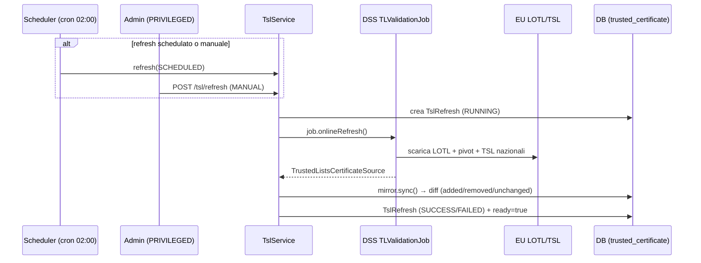

# 3. API Trusted Certificates (TSL)

← [3. Autenticazione](03-autenticazione.md) · [Indice](README.md) · → [5. Verifica firme](05-verifica-firme.md)

La fiducia nei certificati si basa sulle **EU Trusted Lists**: il servizio carica
la **LOTL** (List of the Lists) europea e le TSL nazionali tramite la libreria
DSS, e ne **specchia** (mirror) i certificati di ancoraggio nel proprio database
per renderli interrogabili via API.

## 3.1 Modello di refresh



- **Schedulato**: cron `0 0 2 * * *` (timezone `Europe/Rome`).
- **Avvio**: `app.tsl.refresh.startup-mode` = `BACKGROUND` (carica all'avvio,
  senza bloccare) o `SKIP` (per dev/offline).
- **Manuale**: `POST /api/v1/tsl/refresh` (solo `PRIVILEGED`).

Ogni refresh registra un record `TslRefresh` con esito e differenziale
(certificati aggiunti / rimossi / invariati). I certificati non più presenti
nelle liste non vengono cancellati ma **marcati come rimossi** (`removedAt`):
restano consultabili con `includeRemoved=true`.

## 3.2 Stato della TSL

`GET /api/v1/tsl/status` — pubblico per gli utenti autenticati.

```bash
curl -sS http://localhost:8080/api/v1/tsl/status -H "X-API-Key: $KEY"
```

```json
{
  "lastRefresh": {
    "id": "…", "trigger": "SCHEDULED",
    "startedAt": "…", "completedAt": "…", "status": "SUCCESS",
    "certificatesAdded": 12, "certificatesRemoved": 3, "certificatesUnchanged": 240
  },
  "currentCertificateCount": 252,
  "ready": true
}
```

Il campo `ready` riflette se le Trusted Lists sono state caricate con successo
almeno una volta; alimenta anche `/actuator/health/readiness`.

## 3.3 Forzare un refresh

`POST /api/v1/tsl/refresh` — **richiede `PRIVILEGED`**.

```bash
curl -sS -X POST http://localhost:8080/api/v1/tsl/refresh -H "X-API-Key: $ADMIN_KEY"
```

```json
{ "refreshId": "…", "status": "SUCCESS" }
```

## 3.4 Elenco dei certificati di fiducia

`GET /api/v1/tsl/certificates` — supporta numerosi filtri e la paginazione.

| Parametro | Tipo | Descrizione |
|-----------|------|-------------|
| `ski` | string | Subject Key Identifier (match esatto) |
| `aki` | string | Authority Key Identifier (match esatto) |
| `subjectCn` / `subjectDn` | string | Subject CN/DN (match parziale, case-insensitive) |
| `issuerCn` / `issuerDn` | string | Issuer CN/DN (match parziale) |
| `country` | string | Codice paese (match esatto) |
| `tspName` | string | Nome del Trust Service Provider (match parziale) |
| `tspServiceType` | string | Tipo di servizio TSP (match esatto) |
| `tspServiceStatus` | string | Stato del servizio TSP (match esatto) |
| `serialNumber` | string | Numero di serie (match esatto) |
| `validAt` | date-time | Solo certificati validi a quella data |
| `includeRemoved` | boolean | Includi i certificati rimossi (default `false`) |
| `page` / `size` | integer | Paginazione (default `0` / `50`) |

```bash
curl -sS "http://localhost:8080/api/v1/tsl/certificates?country=IT&tspName=Aruba&size=20" \
  -H "X-API-Key: $KEY"
```

Ogni elemento contiene (`certToMap`): `id`, `ski`, `aki`, `subjectDn`,
`subjectCn`, `issuerDn`, `issuerCn`, `serialNumber`, `country`, `tspName`,
`tspServiceType`, `tspServiceStatus`, `validFrom`, `validTo`, `lastSeenAt`,
`removedAt`, `certificateDerB64` (certificato DER in base64), `tslUrl`.

## 3.5 Dettaglio di un certificato

`GET /api/v1/tsl/certificates/{id}` — restituisce lo stesso oggetto del
dettaglio sopra per il certificato con quell'`id`.

```bash
curl -sS http://localhost:8080/api/v1/tsl/certificates/<uuid> -H "X-API-Key: $KEY"
```

## 3.6 Riepilogo permessi

| Endpoint | Ruolo richiesto |
|----------|-----------------|
| `GET /api/v1/tsl/status` | autenticato |
| `GET /api/v1/tsl/certificates` | autenticato |
| `GET /api/v1/tsl/certificates/{id}` | autenticato |
| `POST /api/v1/tsl/refresh` | **PRIVILEGED** |
