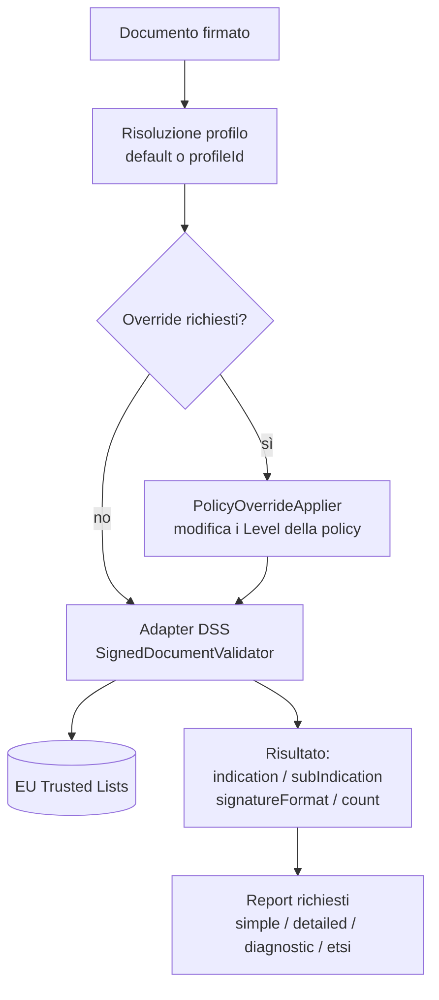
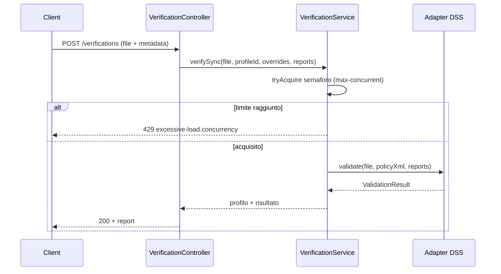
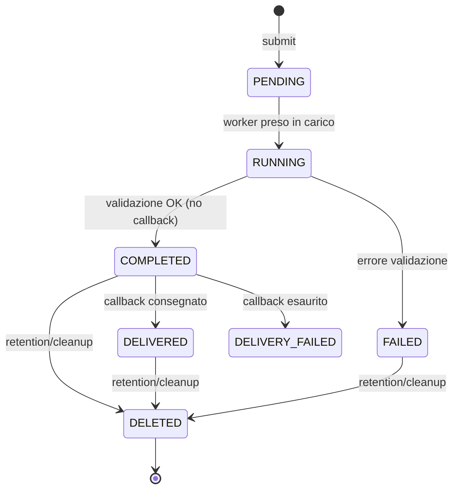
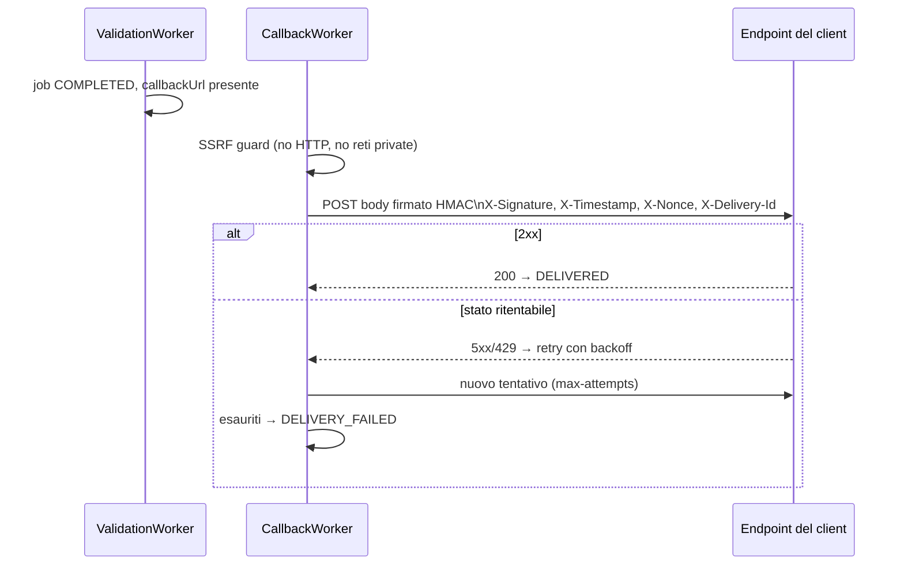

# 4. Verifica delle firme

← [4. Trusted Certificates](04-trusted-certificates.md) · [Indice](README.md) · → [6. Estrazione file](06-estrazione-file.md)

- [4.1 Introduzione](#41-introduzione)
- [4.2 Profili di validazione](#42-profili-di-validazione)
- [4.3 API di verifica sincrona](#43-api-di-verifica-sincrona)
- [4.4 API di verifica asincrona](#44-api-di-verifica-asincrona)

## 4.1 Introduzione

Il servizio verifica firme elettroniche eIDAS nei formati **PAdES** (PDF),
**CAdES** (`.p7m`), **XAdES** (XML), **JAdES** (JSON) e contenitori **ASiC**
(ASiC-S / ASiC-E), usando la libreria **DSS 6.4** e le **EU Trusted Lists** come
ancore di fiducia.

### Pipeline di validazione



L'esito principale di DSS è espresso da:

- **`indication`** — esito complessivo: `TOTAL_PASSED`, `TOTAL_FAILED`,
  `INDETERMINATE`.
- **`subIndication`** — motivazione di dettaglio quando non è `TOTAL_PASSED`
  (es. `SIG_CRYPTO_FAILURE`, `NO_CERTIFICATE_CHAIN_FOUND`, `OUT_OF_BOUNDS_NO_POE`…).
- **`signatureFormat`** — formato/livello rilevato (es. `PAdES-BASELINE-B`).
- **`signatureCount`** — numero di firme trovate.

### Tipi di report

| Report | Descrizione |
|--------|-------------|
| `simple` | Report sintetico (esito per firma) |
| `detailed` | Report dettagliato dei singoli vincoli di policy |
| `diagnostic` | Dati grezzi (diagnostic data) raccolti da DSS |
| `etsi` | Validation report ETSI (TS 119 102-2) |

Concorrenza: le verifiche sincrone sono limitate da un semaforo
(`app.verify.max-concurrent`, default `8`); oltre il limite si ottiene **429**
(`excessive-load.concurrency`).

## 4.2 Profili di validazione

Un **profilo** incapsula una **policy di validazione DSS** (XML dei vincoli). Il
profilo determina con quale severità vengono valutati i vincoli (revoca,
qualificazione, timestamp, ecc.).

### Preset disponibili

| Preset | File policy | Note |
|--------|-------------|------|
| `BASIC` | `policy/BASIC.xml` | Vincoli minimi |
| `STANDARD` | `policy/STANDARD.xml` | Policy DSS di default (QES/AES su base TSL) — **seminato come default** |
| `STRICT` | `policy/STRICT.xml` | Vincoli più severi |
| `CUSTOM` | — | Policy XML fornita dall'utente |

All'avvio, se non esiste alcun profilo, viene seminato il profilo **STANDARD**
(`isDefault = true`).

### Gestione dei profili (API)

| Metodo | Path | Operazione |
|--------|------|-----------|
| `GET` | `/api/v1/profiles?page=&size=` | Elenco |
| `POST` | `/api/v1/profiles` | Crea (`name`, `preset`, `policyXml?`) |
| `GET` | `/api/v1/profiles/{id}` | Dettaglio |
| `PUT` | `/api/v1/profiles/{id}` | Aggiorna (`description?`, `policyXml?`) |
| `DELETE` | `/api/v1/profiles/{id}` | Elimina |
| `POST` | `/api/v1/profiles/{id}/default` | Imposta come default |

Creazione di un profilo CUSTOM:

```bash
curl -sS -X POST http://localhost:8080/api/v1/profiles \
  -H "X-API-Key: $KEY" -H "Content-Type: application/json" \
  -d '{"name":"strict-pades","preset":"CUSTOM","policyXml":"<ConstraintsParameters …>…</…>"}'
```

> `policyXml` è obbligatorio quando `preset = CUSTOM`.

### Override al volo

Senza creare un profilo, si può **rilassare** alcuni controlli per la singola
richiesta passando override booleani nei metadati. Impostando una chiave a
`false`, i corrispondenti vincoli della policy vengono portati a `Level=IGNORE`:

| Chiave override | Vincoli interessati (Level → IGNORE) |
|-----------------|--------------------------------------|
| `checkRevocation` | `RevocationDataAvailable`, `RevocationDataFreshness`, `RevocationCertHashMatch` |
| `checkSignatureIntegrity` | `SignatureIntact`, `SignatureValid` |
| `checkCertificateChain` | `ProspectiveCertificateChain`, `TrustedServiceStatus` |
| `checkTimestamp` | `TimestampDelay`, `MessageImprintDataIntact` |
| `checkQualified` | `QualifiedCertificate` |

Gli override si applicano solo per disabilitare un controllo (valore `false`).
La risposta segnala `overridesApplied: true`.

## 4.3 API di verifica sincrona

`POST /api/v1/verifications` — `multipart/form-data`.

| Parte | Obbligatoria | Descrizione |
|-------|--------------|-------------|
| `file` | sì | Il documento firmato (binario) |
| `metadata` | no | JSON: `profileId?`, `profileOverrides?`, `reports[]?` |

Se `metadata` è assente, vengono prodotti i report `simple` ed `etsi` con il
profilo di default.

```bash
curl -sS -X POST http://localhost:8080/api/v1/verifications \
  -H "X-API-Key: $KEY" \
  -F 'file=@contratto.pdf' \
  -F 'metadata={"reports":["simple","detailed"],"profileOverrides":{"checkRevocation":false}}'
```

Risposta `200`:

```json
{
  "verifiedAt": "2026-06-08T10:15:30Z",
  "profileUsed": "STANDARD",
  "overridesApplied": true,
  "signatureFormat": "PAdES-BASELINE-B",
  "indication": "TOTAL_PASSED",
  "subIndication": null,
  "signatureCount": 1,
  "reports": {
    "simple":   { /* … */ },
    "detailed": { /* … */ }
  }
}
```

Valori ammessi per `reports`: `simple`, `detailed`, `diagnostic`, `etsi`.
Un valore sconosciuto produce **400** (`unknown report type`). Un JSON di
metadata malformato produce **400** (`invalid metadata json`).



## 4.4 API di verifica asincrona

Per documenti grandi o per consegna tramite **webhook**, si usa il flusso
asincrono basato su job persistiti.

### Sottomissione

`POST /api/v1/verifications/async` — `multipart/form-data` (`file` + `metadata`).

Campi di `metadata` (JSON): `profileId?`, `profileOverrides?`, `reports[]?`
(default `simple,diagnostic`), `callbackUrl?`, `callbackSecret?`,
`callbackAlgorithm?`.

```bash
curl -sS -X POST http://localhost:8080/api/v1/verifications/async \
  -H "X-API-Key: $KEY" \
  -F 'file=@grande.pdf' \
  -F 'metadata={"reports":["simple","etsi"],"callbackUrl":"https://app.example.org/hook","callbackSecret":"s3cr3t","callbackAlgorithm":"HmacSHA256"}'
```

Risposta `202`:

```json
{ "jobId": "…", "status": "PENDING" }
```

con header `Location: /api/v1/verifications/jobs/<jobId>`.

**Backpressure**: se i job attivi superano il limite per principal
(`max-pending-per-principal`, default 50) o globale (`max-pending-global`,
default 500), si ottiene **429** (`excessive-load.async-backpressure`).

### Ciclo di vita del job



Stati (`JobStatus`): `PENDING`, `RUNNING`, `COMPLETED`, `FAILED`, `DELIVERED`,
`DELIVERY_FAILED`, `DELETED`.

Il **ValidationWorker** fa polling (`async.worker.poll-interval`, default `5s`),
preleva i job pending e li elabora; se il circuit breaker `dssValidator` è
**OPEN**, salta il ciclo. Il segreto del callback è cifrato a riposo
(AES-256-GCM) con la master-key.

### Recupero del risultato

`GET /api/v1/verifications/jobs/{jobId}`.

- Visibile al **proprietario** del job o a un principal **PRIVILEGED**;
  altrimenti **404** (per non rivelare l'esistenza del job).
- Se lo stato è `DELETED`, il risultato non è più disponibile: **410 Gone**.

```json
{
  "jobId": "…",
  "status": "DELIVERED",
  "createdAt": "…", "startedAt": "…", "completedAt": "…", "deliveredAt": "…",
  "expiresAt": "…",
  "callbackAttempts": 1,
  "result": { /* report JSON */ }
}
```

### Consegna via callback (webhook)



Il dispatcher firma il corpo con HMAC (`HmacSHA256` default, o `HmacSHA512`) e
include header di firma e anti-replay:

| Header | Significato |
|--------|-------------|
| `X-Signature` | HMAC del corpo (+ timestamp/nonce/deliveryId) |
| `X-Signature-Algorithm` | algoritmo usato |
| `X-Timestamp`, `X-Nonce` | anti-replay |
| `X-Job-Id`, `X-Delivery-Id`, `X-Delivery-Attempt` | correlazione |

**Guardia anti-SSRF**: di default sono ammessi solo URL **HTTPS**
(`allow-http=false`) e sono bloccati gli host che risolvono a indirizzi
**privati/non instradabili** (loopback, link-local incl. `169.254.169.254`,
site-local, ULA IPv6, multicast). Un host non risolvibile è trattato come
privato (fail-closed). Politica di retry: `max-attempts` (default 3), backoff
`60s,300s,1800s`, stati di successo `200,201,202,204`, stati ritentabili
`408,425,429,500,502,503,504`.
