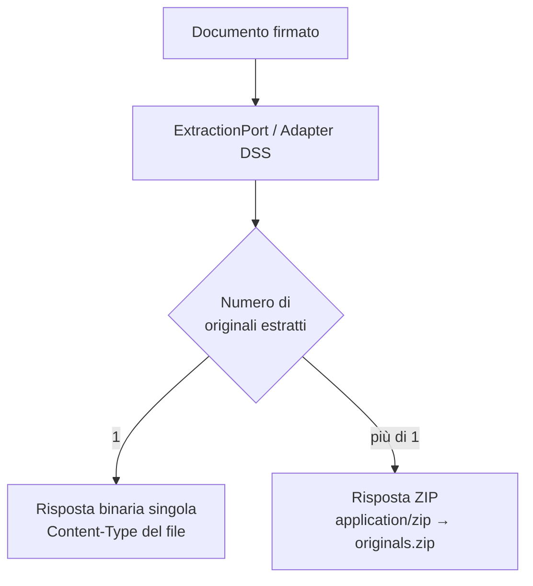

# 5. Estrazione dei file originali

← [5. Verifica firme](05-verifica-firme.md) · [Indice](README.md) · → [7. Log e audit](07-log-audit.md)

Oltre a verificare la firma, il servizio può **estrarre il contenuto originale**
incapsulato in un documento firmato — per esempio il PDF dentro un `.p7m`
(CAdES) o i file all'interno di un contenitore **ASiC**.

## 5.1 Endpoint

`POST /api/v1/extractions` — `multipart/form-data`, parte `file` obbligatoria.



## 5.2 Comportamento della risposta

L'adattatore DSS individua i documenti originali e ne deduce il formato di firma:

- **Un solo originale** → il file è restituito **direttamente** come binario,
  con `Content-Type` pari al suo MIME type e
  `Content-Disposition: attachment; filename="<nome>"`.
- **Più originali** (tipico degli ASiC-E) → vengono impacchettati in un **ZIP**
  (`application/zip`), nome `originals.zip`.

In entrambi i casi sono presenti gli header informativi:

| Header | Significato |
|--------|-------------|
| `X-Signature-Format` | Formato di firma rilevato (es. `CAdES`, `ASiC-E`) |
| `X-Document-Count` | Numero di documenti originali estratti |

## 5.3 Esempi

Estrazione di un singolo file (es. PDF dentro un `.p7m`):

```bash
curl -sS -X POST http://localhost:8080/api/v1/extractions \
  -H "X-API-Key: $KEY" \
  -F 'file=@contratto.pdf.p7m' \
  -D - -o contratto.pdf
# Header di risposta:
#   X-Signature-Format: CAdES
#   X-Document-Count: 1
#   Content-Disposition: attachment; filename="contratto.pdf"
```

Estrazione di un contenitore con più file (ASiC-E):

```bash
curl -sS -X POST http://localhost:8080/api/v1/extractions \
  -H "X-API-Key: $KEY" \
  -F 'file=@pacchetto.asice' \
  -o originals.zip
# X-Document-Count: 3  →  originals.zip
```

## 5.4 Note

- L'endpoint richiede semplicemente un principal autenticato (qualsiasi ruolo).
- Un documento non firmato o non riconosciuto produce un errore
  `signature.parse-error` (vedi gestione errori in [7. Log e audit](07-log-audit.md)).
- L'estrazione è un'operazione **stateless**: non crea job né persiste il
  contenuto.
