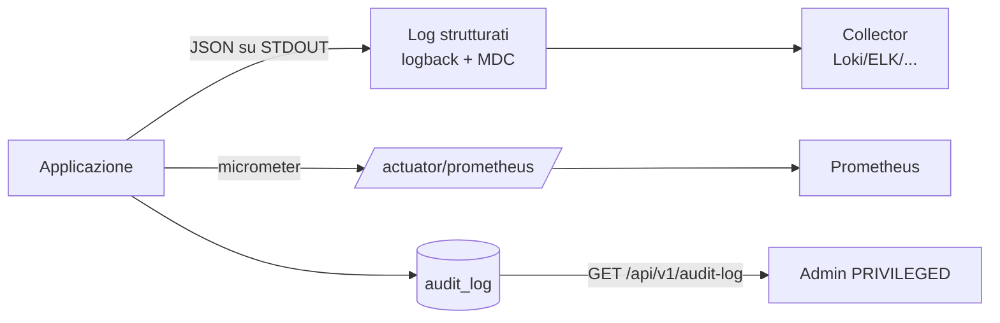
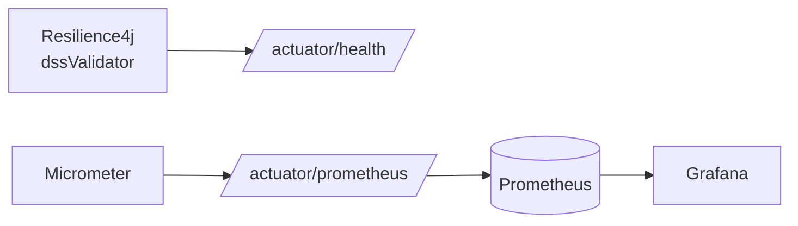

# 6. Log e audit

← [6. Estrazione file](06-estrazione-file.md) · [Indice](README.md)

L'osservabilità del servizio poggia su tre pilastri: **log applicativi
strutturati**, **metriche** (Actuator/Prometheus) e un **audit log** persistente
interrogabile via API.



## 6.1 Log applicativi

I log sono emessi in **JSON** su STDOUT tramite Logback
(`logback-spring.xml`, encoder `LoggingEventCompositeJsonEncoder` di
logstash). Ogni evento include timestamp, livello, thread, logger, messaggio,
stacktrace, il campo `app` (nome applicazione) e il contenuto **MDC**.

Livelli di default (`application.yaml`):

| Logger | Livello |
|--------|---------|
| root | `INFO` |
| `org.toresoft.signverify` | `INFO` |
| `eu.europa.esig` (DSS) | `WARN` |

### Contesto per richiesta (MDC)

`RequestContextFilter` popola l'MDC a ogni richiesta, così ogni riga di log è
correlabile:

| Chiave MDC | Contenuto |
|------------|-----------|
| `requestId` | UUID generato per la richiesta |
| `clientIp` | indirizzo IP remoto |
| `principalType` | `API_KEY` / `OAUTH_USER` / `SYSTEM` (se autenticato) |
| `principalId` | id del principal (se autenticato) |

L'MDC viene **azzerato** al termine della richiesta (`MDC.clear()`).

### Rotazione

L'app scrive su STDOUT; la **rotazione** è demandata al runtime container. Nel
`docker-compose.prod.yml` il driver `json-file` ruota a `max-size: 10m` con
`max-file: 3`.

## 6.2 Gestione degli errori (problem+json)

Gli errori applicativi derivano da `AppException` e sono serializzati come
**RFC 9457** `application/problem+json` dal `GlobalExceptionHandler`. Il `type`
ha forma `urn:signverify:error:<codice>`.

| Codice errore | HTTP | Quando |
|---------------|------|--------|
| `validation.invalid-input` | 400 | input non valido |
| `validation.invalid-profile-overrides` | 400 | override di policy non validi |
| `auth.missing-credentials` | 401 | credenziali assenti |
| `auth.invalid-token` | 401 | API key/JWT non valido |
| `authz.forbidden` | 403 | ruolo insufficiente |
| `resource.not-found` | 404 | risorsa inesistente (o non visibile) |
| `resource.gone` | 410 | risultato job non più disponibile |
| `resource.conflict` | 409 | conflitto (es. ultima chiave privilegiata) |
| `payload.too-large` | 413 | upload oltre i limiti |
| `media.unsupported` | 415 | media type non supportato |
| `signature.parse-error` | — | documento non firmato/illeggibile |
| `excessive-load.concurrency` | 429 | limite di verifiche sincrone |
| `excessive-load.async-backpressure` | 429 | backpressure dei job asincroni |
| `tsl.not-ready` | — | Trusted Lists non ancora caricate |
| `dss.unavailable` | — | circuito DSS aperto/indisponibile |
| `internal-error` | 500 | errore non previsto |

> Per default `server.error.include-message: never` e
> `include-stacktrace: never`: i dettagli interni non trapelano nelle risposte.

## 6.3 Audit log

Esiste una tabella **`audit_log`** e un'API di consultazione riservata agli
amministratori. Struttura del record (`AuditLog`):

| Campo | Descrizione |
|-------|-------------|
| `id` | UUID |
| `occurredAt` | istante dell'evento |
| `principalType` / `principalId` | autore (o `SYSTEM`) |
| `action` | azione (stringa) |
| `targetType` / `targetId` | risorsa interessata |
| `success` | esito booleano |
| `details` | JSON libero |
| `ipAddress` | IP del chiamante |

### Consultazione

`GET /api/v1/audit-log` — **richiede ruolo `PRIVILEGED`**. Filtri disponibili:

| Parametro | Tipo |
|-----------|------|
| `principalId` | string |
| `action` | string |
| `from` / `to` | date-time |
| `targetType` / `targetId` | string |
| `success` | boolean |
| `page` / `size` | integer (default `0` / `50`) |

I risultati sono ordinati per `occurredAt` decrescente.

```bash
curl -sS "http://localhost:8080/api/v1/audit-log?action=verify&success=false&size=20" \
  -H "X-API-Key: $ADMIN_KEY"
```

```json
{
  "page": 0, "size": 20, "totalElements": 0, "totalPages": 0,
  "content": [ /* AuditLog[] */ ]
}
```

> ℹ️ **Stato attuale dell'implementazione.** La tabella `audit_log`, il
> componente `AuditService` (scrittura) e l'API di lettura sono presenti e
> indicizzati (`occurred_at`, `principal_id`, `action`). Nel codice corrente
> `AuditService` **non è ancora collegato** ai percorsi operativi (verifica,
> gestione chiavi, refresh TSL), quindi la tabella può risultare vuota: la
> tracciabilità operativa è oggi garantita dai **log strutturati** con MDC
> (§6.1). L'infrastruttura di audit persistente è pronta per essere agganciata
> alle operazioni che la richiedono.

## 6.4 Metriche

Endpoint Actuator esposti: `health`, `info`, `metrics`, `prometheus`.

- `GET /actuator/prometheus` — metriche in formato Prometheus (Micrometer),
  pubblico.
- Il circuit breaker `dssValidator` (Resilience4j) pubblica un health indicator
  ed espone metriche sullo stato (`CLOSED`/`OPEN`/`HALF_OPEN`), utili per
  monitorare la disponibilità della validazione DSS.


