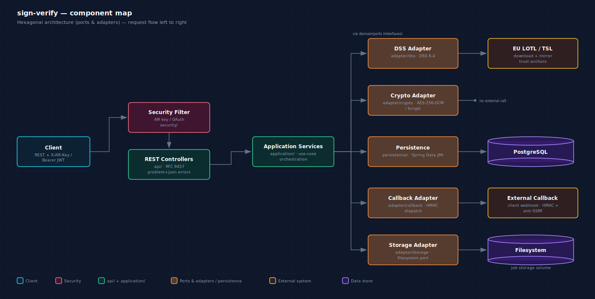

# Documentazione d'uso: sign-verify

Guida operativa al servizio **sign-verify**: verifica di firme digitali eIDAS
(PAdES / CAdES / XAdES / JAdES / ASiC) basata sulla libreria **DSS 6.4** e sulle
**EU Trusted Lists** (LOTL/TSL).

> Versione inglese: [`docs/en/README.md`](../en/README.md)
>
> Immagine Docker sul registry: **[`toresoft/sign-verify`](https://hub.docker.com/r/toresoft/sign-verify)** (Docker Hub)
>
> Contratto API: [`openapi/openapi.yaml`](../../src/main/resources/openapi/openapi.yaml) · documentazione interattiva su `/swagger-ui/index.html` a servizio avviato

## Indice

| # | Argomento | File |
|---|-----------|------|
| 0 | Glossario (termini eIDAS / DSS) | [00-glossario.md](00-glossario.md) |
| 1 | Compilazione e configurazione | [01-build-configurazione.md](01-build-configurazione.md) |
| 1b | Docker e configurazione | [02-docker.md](02-docker.md) |
| 1c | **Guida operativa Docker (passo-passo)** | [02b-guida-operativa-docker.md](02b-guida-operativa-docker.md) |
| 2 | Autenticazione (panoramica, API key, OAuth) | [03-autenticazione.md](03-autenticazione.md) |
| 3 | API Trusted Certificates (TSL) | [04-trusted-certificates.md](04-trusted-certificates.md) |
| 4 | Verifica firme: introduzione, profili, sync, async | [05-verifica-firme.md](05-verifica-firme.md) |
| 5 | Estrazione file originali | [06-estrazione-file.md](06-estrazione-file.md) |
| 6 | Log e audit | [07-log-audit.md](07-log-audit.md) |

## Mappa dei componenti



## Convenzioni

### Paginazione

Ogni endpoint di elenco (`GET /api/v1/api-keys`, `/api/v1/profiles`,
`/api/v1/tsl/certificates`, `/api/v1/audit-log`) accetta gli stessi due
parametri di query e restituisce la stessa busta:

| Parametro | Default | Significato |
|-----------|---------|--------------|
| `page` | `0` | indice di pagina, base zero |
| `size` | `50` | dimensione della pagina |

```json
{
  "page": 0,
  "size": 50,
  "totalElements": 252,
  "totalPages": 6,
  "content": [ /* le risorse richieste */ ]
}
```

### Versioning delle API

Il contratto vive sotto `/api/v1/**`. All'interno di `v1` le modifiche sono
solo additive (nuovi campi opzionali, nuovi endpoint): i campi esistenti e le
forme delle richieste obbligatorie non vengono rimossi né riutilizzati con
altro significato. Un cambio breaking verrebbe pubblicato sotto un nuovo path
(`/api/v2/**`), mantenendo `v1` attivo per una finestra di deprecazione.

## Architettura in breve

Il servizio è un'applicazione **Spring Boot 3.5 / Java 21** con architettura
**esagonale** (ports & adapters), verificata da ArchUnit. Package radice
`org.toresoft.signverify`:

- `api/`: controller REST sottili + `GlobalExceptionHandler` (RFC 9457 `problem+json`)
- `application/`: servizi che orchestrano i casi d'uso
- `domain/`: entità, enum, porte (interfacce), `AppException`
- `adapter/`: implementazioni delle porte (DSS, crypto, callback, storage)
- `persistence/`: repository Spring Data JPA
- `security/`: filtro API key, converter OAuth, generatore chiave di bootstrap
- `config/`: configurazione Security, DSS, metriche, scheduler, TSL

Lo schema DB è di proprietà di **Flyway** (`src/main/resources/db/migration`);
Hibernate gira con `ddl-auto: validate`.
